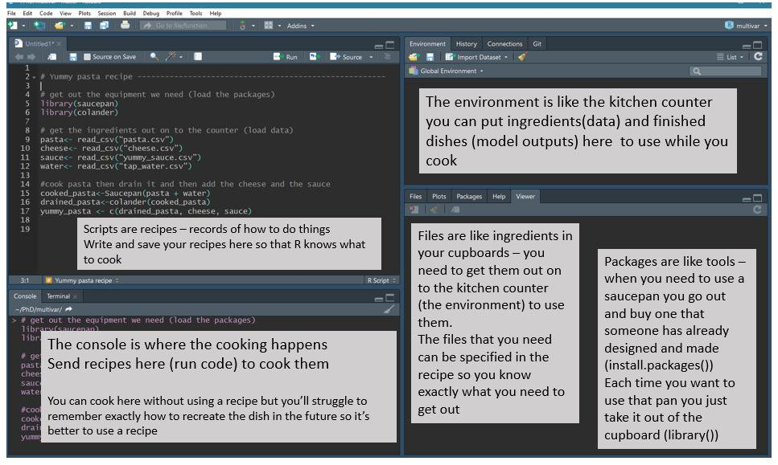
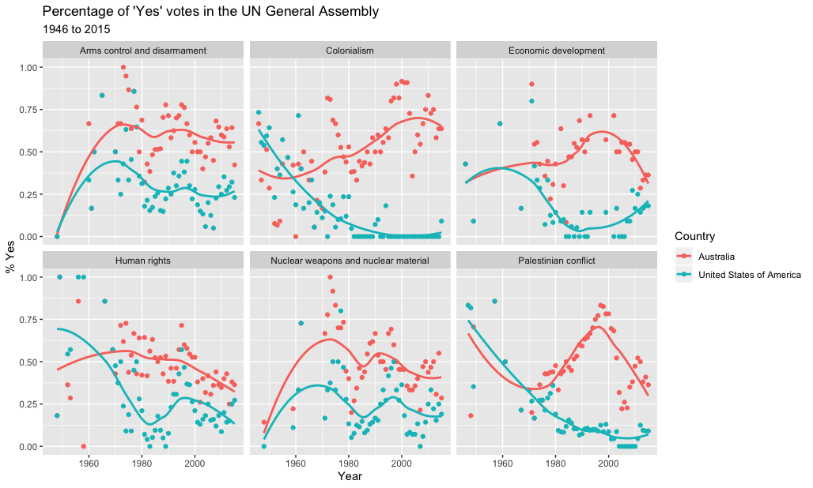
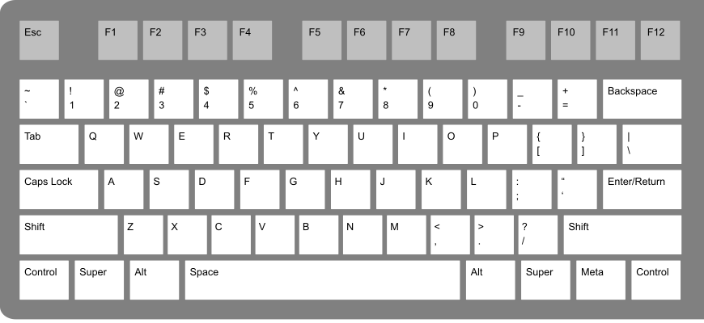

```{r setup, include=FALSE}
library(tidyverse)
library(knitr)
library(kableExtra)
opts_chunk$set(echo = FALSE,   
               message = FALSE,
               warning = FALSE,
               collapse = TRUE,
               fig.height = 4,
               fig.width = 8,
               fig.align = "center",
               cache = FALSE)
```

```{r titleslide, child="components/titleslide.Rmd"}
```

---

```{r show-cooking-example, out.width = "90%"}

```

.small.bottom[
From Jessica Ward (@JKRWard) of R Ladies Newcaslte (UK) - @RLadiesNCL
https://twitter.com/RLadiesNCL/status/1138812826917724160
]

---
background-image: url(images/unvotes-oz-usa.png)
background-size: contain
background-position: 50% 50%
class: refresher center, bottom


---
background-image: url(images/edstem.png)
background-size: contain
background-position: 50% 50%
class: refresher, center, bottom

---
class: refresher
# R essentials: A short list (for now)

- Functions are (most often) verbs, followed by what they will be applied to in parentheses:


```{r eval=FALSE, echo = TRUE}
do_this(to_this)
```

--

- Columns (variables) in data frames are accessed with `$`:


```{r eval=FALSE, echo = TRUE}
dataframe$var_name
```

--

- Packages are installed with `install.packages`, and loaded with `library` , once per session:


```{r eval=FALSE, echo = TRUE}
install.packages("package_name")
library(package_name)
```

---

# Today: Outline

- Why we care about Reproducibility
- R + markdown = Rmarkdown 
- Controling output and input of rmarkdown
- Exercises on creating rmarkdown reports on the humble platypus
- Form up assignment groups
- Quiz
- Assignment 1 released next week.

---
class: transition

# We are in a tight spot with reproducibility

.blockquote[
Only 6 out of 53 landmark results could be reproduced

-- [Amgen, 2014*](https://www.nature.com/articles/483531a)
]

--

.blockquote[
An estimated 75% - 90% of preclinical results cannot be reproduced

-- [Begley, 2015*](https://www.ncbi.nlm.nih.gov/pubmed/25552691)
]

--

.blockquote[
Estimated **annual** cost of irreproducibility for biomedical industry = 28 Billion USD

-- [Freedman, 2015*](https://journals.plos.org/plosbiology/article?id=10.1371/journal.pbio.1002165)
]
 

.footnote[`*` Heard via Garret Grolemund's [great talk](https://www.youtube.com/watch?v=HVlwNayog-k)]

---
background-image: url(gifs/njt-gif-jaws-dolly-zoom.gif)
background-size: contain
background-position: 50% 50%
class: center, bottom, white

---
background-image: url(gifs/ice-climber-fall.gif)
background-size: contain
background-position: 50% 50%
class: center, bottom, white

---

background-image: url("images/open-science-berg.jpeg")
background-size: contain
background-position: 50% 50%
class: center, bottom, white

---
class: transition

# So what can we do about it?

---

# Reproducibility checklist

Near-term goals:

- Are the tables and figures reproducible from the code and data?
- Does the code actually do what you think it does?
- In addition to what was done, is it clear **why** it was done? 
(e.g., how were parameter settings chosen?)

--


Long-term goals:

- Can the code be used for other data?
- Can you extend the code to do other things?

---

# Literate programming is a partial solution

- Literate programming shines some light on this dark area of science. 

- An idea from [Donald Knuth](https://en.wikipedia.org/wiki/Donald_Knuth) where you combine your text with your code output to create a document. 

- A _blend_ of your literature (**text**), and your programming (**code**), to create something you can read from top to bottom. 

---

# So

--

## Imagine a report:

Introduction, methods, results, discussion, and conclusion,

--

All the bits of code that make each section. 

--

With rmarkdown, you can see all the pieces of your data analysis all together.

--

Each time you knit the analysis is ran from the beginning

---
# Markdown as a new player to legibility

--

In 2004, [John Gruber](https://en.wikipedia.org/wiki/John_Gruber), of [daring fireball](https://daringfireball.net/) created [markdown](https://en.wikipedia.org/wiki/Markdown), a simple way to create text that rendered into a HTML webpage.

---
# Markdown as a new player to legibility

.pull-left[
```
- bullet list
- bullet list
- bullet list
```
]

--

.pull-right[

- bullet list
- bullet list
- bullet list

]

---
# Markdown as a new player to legibility

.pull-left[
```
1. numbered list
2. numbered list
3. numbered list

__bold__, **bold**, 

_italic_, *italic*

> quote of something profound

```
]

--

.pull-right[


1. numbered list
2. numbered list
3. numbered list

__bold__, **bold**, 

_italic_, *italic*

> quote of something profound

]

---
# Markdown as a new player to legibility

With very little marking up, we can create rich text, that **actually resembles** the text that we want to see.

--

**Learn to use markdown** Spend five minutes working through [markdowntutorial.com](https://www.markdowntutorial.com/)

```{r cdown-md}
library(countdown)
countdown(minutes = 5)
```

--

##  This the end of part 1 of lecture 1b

---
class: transition

#  Start of part 2 of lecture 1b

---
# Rmarkdown helps address the reproducibility problem

* Q: How do we take `markdown` + `R code` = "literate programming environment"

* A: `Rmarkdown` 

---

# Rmarkdown...

--

Provides an environment where you can write your complete analysis, and marries your text, and code together into a rich document. 

--

You write your code as code chunks, put your text around that, and then hey presto, you have a document you can reproduce.

---
# Reminder: You've already used rmarkdown!

```{r remind-unvotes, out.width = "90%"}

```


---

# How will we use R Markdown?

- Every assignment + project /  is an R Markdown document
- You'll always have a template R Markdown document to start with
- The amount of scaffolding in the template will decrease over the semester
- These lecture notes are created using R Markdown (!)

---

# The anatomy of an rmarkdown document

There are three parts to an rmarkdown document.

- Metadata (YAML)
- Text (markdown formatting)
- Code (code formatting)

--

.vhuge.center[DEMO]

---
# Metadata: YAML  (YAML Ain't Markup Language) 

- The metadata of the document tells you how it is formed - what the **title** is, what **date** to put, and other control information.  

- If you're familiar with $\LaTeX$, this is similar to how you specify document type, styles, fonts, options, etc in the front matter / preamble.

---
# Metadata: YAML

- Rmarkdown documents use YAML to provide the metadata. It looks like this:

```YAML
---
title: "An example document"
author: "Nicholas Tierney"
output: html_document
---
```

It starts an ends with three dashes `---`, and has fields like the following: `title`, `author`, and `output`.

---
# Text

Is markdown, as we discussed in the earlier section,

It provides a simple way to mark up text

.pull-left[

```
1. bullet list
2. bullet list
3. bullet list
```

]

.pull-right[

1. bullet list
1. bullet list
1. bullet list

]

---
# Code

We refer to code in an rmarkdown document in two ways:

1. Code chunks, and 
2. Inline code.

---

# Code: Code chunks

`Code chunks` are marked by three backticks and curly braces with `r` inside them:

````markdown
```{r chunk-name}`r ''`
# a code chunk
```
````

---
# Code: backtick?

**A backtick** is a special character you might not have seen before, it is typically located under the tilde key (`~`). On USA / Australia keyboards, is under the escape key:


```{r show-backtick, out.width = "80%", echo = FALSE}

```

.small[
image from https://commons.wikimedia.org/wiki/File:ANSI_Keyboard_Layout_Diagram_with_Form_Factor.svg
]

---
# Code: Inline code

Sometimes you want to run the code inside a sentence. This is called running the code "inline".

--

You might want to run the code inline to name the number of variables or rows in a dataset in a sentence like:

> There are XXX observations in the airquality dataset, and XXX variables.

---

# Code: Inline code

You can call code "inline"  like so:


````markdown

There are `r "\u0060r nrow(airquality) \u0060"` observations in the airquality dataset, 
and `r "\u0060r ncol(airquality) \u0060"` variables.

````

Which gives you the following sentence

--


> There are `r nrow(airquality)` observations in the airquality dataset, and `r ncol(airquality)` variables.

---


# Code: Inline code

- If your data changes upstream

--

- You don't need to work out where you mentioned your data

--

- You just update the document. `r emo::ji("tada")`
 
---
# Your Turn: Put it together

Go to `rstudio.cloud` and go to "ida-exercise-1b"

* open the document "01-oz-atlas.Rmd"
* knit the document 
* Change the data section at the top to be from a different state instead of "New South Wales"
* knit the document again
* How do the text and figures in the document change?

```{r cdown-rmd-inline}
countdown(minutes = 5)
```

---
class: transition center bottom
background-image: url(https://imgs.xkcd.com/comics/art_project.png)
background-size: contain
background-position: 50% 50%

---
class: transition
# End of part 2 of Lecture 1B
Make sure you finish the exercise on the rstudio.cloud

---
class: transition
# Start of part 3 of Lecture 1B

---
# Code: Chunk names

Straight after the ` ```{r ` you can use a text string to name the chunk:

````markdown
```{r read-crime-data}`r ''`
crime <- read_csv("data/crime-data.csv")
```
````

---
# Code: Chunk names

Naming code chunks has three advantages:

1. Navigate to specific chunks using the drop-down code navigator in the bottom-left of the script editor.
2. Graphics produced by chunks now have useful names.
3. You can set up networks of cached chunks to avoid re-performing expensive computations on every run.

---
# Code: Chunk names

Every chunk should ideally have a name.

Naming things is hard, but follow these rules and you'll be fine:

1. One word that describes the action (e.g., "read")
2. One word that describes the thing inside the code (e.g, "gapminder")
3. Separate words with "-" (e.g., `read-gapminder`)

---
# Code: Chunk options

You can control how the code is output by changing the code chunk options which follow the title. 

````markdown
```{r read-gapminder, eval = FALSE, echo = TRUE}`r ''`
gap <- read_csv("gapminder.csv")
```
````

What do you think this does?

```{r countdown-chunk}
countdown(minutes = 0, seconds = 30)
```


---
# Code: Chunk options

The code chunk options you need to know about right now are:

  * `cache`: TRUE / FALSE. Do you want to save the output of the chunk so it doesn't have to run next time?
  * `eval`: TRUE / FALSE Do you want to evaluate the code?
  * `echo`: TRUE / FALSE Do you want to print the code?
  * `include`: TRUE / FALSE Do you want to include code output in the final output document? Setting to `FALSE` means nothing is put into the output document, but the code is still run.

You can read more about the options at the official documentation: https://yihui.name/knitr/options/#code-evaluation

---
# Your turn

* go to `rstudio.cloud`, open document `01-oz-atlas.Rmd` and change the document so that the code output is hidden, but the graphics are shown. (Hint: Google "rstudio rmarkdown cheatsheet" for some tips!)
* Re-Knit the document.
* Take a look at the [R Markdown Gallery](https://rmarkdown.rstudio.com/gallery.html).

```{r cdown-rmd-chunk-opts}
countdown(minutes = 5)
```

---
class: transition
# End of Part 3 of Lecture 1B

---
class: transition
# Start of Part 4 of Lecture 1B

---
# Global options: Set and forget

You can set the default chunk behaviour once at the top of the `.Rmd` file using a chunk like:

```r
knitr::opts_chunk$set(
  echo = FALSE,
  cache = TRUE
)
```

then you will only need to add chunk options when you have the occasional one that you'd like to behave differently.

---
# Your turn

* Go to your `01-oz-atlas.Rmd` document on `rstudio.cloud` and change the global settings at the top of the rmarkdown document to `echo = FALSE`, and `cache = TRUE`

```r
knitr::opts_chunk$set(
  echo = FALSE,
  cache = TRUE
)
```

- Update the other code chunks by removing the code chunk options.


```{r countdown-cloud}
countdown(minutes = 5,
          left = 0, 
          right = 0,
          padding = "15px",
          margin = "3%",
          font_size = "4em",
          play_sound = TRUE)
```


---
class: transition

# End of part 4 of lecture 1b

---
class: transition

# Start of part 5 of lecture 1b

---
class: transition middle

# DEMO

The many different outputs of rmarkdown

---
# Your turn: Different types of documents 

1. Change the output of your current R Markdown file to produce a **Word document**. Now try to produce pdf - this may not work! That's OK, we do'nt need it right now.
2. Create a new document that will produce a slide show `File > New R Markdown > Presentation`
3. Create a flexdashboard document - see this option in the `File > New R Markdown > From template` list.

---

# Recap:

- There is a Reproducibility Crisis
- rmarkdown = YAML + text + code
- rmarkdown has many different output types
- Platypus are interesting!
- Assignment will be announced next week

---

# Learning more:

- [R Markdown cheat sheet](https://github.com/rstudio/cheatsheets/raw/master/rmarkdown-2.0.pdf) and Markdown Quick Reference (Help -> Markdown Quick Reference) handy, we'll refer to it often as the course progresses

---
class: transition
# Your Turn

- Go to rstudio.cloud to `oz-atlas-final.Rmd`
- Follow prompts and questions to learn more about the Australian native platypus - (copy content over from previous doc)
- Take the Ed lab quiz for today.

---

```{r endslide, child="components/endslide.Rmd"}
```

???

*Note on ethics:* When you use someone else's work, you need to (1) check if it's allowed, that it has a [creative commons license](http://creativecommons.org/licenses/by/4.0/), (2) reference them as the source.

- If you have a big document, build it up in pieces. You can run just one code chunk at a time, or the past several, or even one line of code. The "Run" button has a menu of options of doing the coding in pieces.
 
- The workspace of your R Markdown document is separate from the Console

- rmarkdown runs code from the start to finish in a new environment

???

* Reproducibility: Why we care
* Rmarkdown 
  * YAML
  * Code
  * text
* markdown (online quiz)
* rmarkdown - edit the existing one on platypus!
* code chunks
* code chunk names
* chunk options
* exercise on this
* setting different chunk options globally
* exercise extending the platypus report
* make assignment groups
* release assignment
* quiz

Should be able to answer the questions:

How should I start an rmarkdown document?
What do I put in the YAML metadata?
How do I create a code chunk?
What sort of options to I need to worry about for my code?
What is the value in a reproducible report?
What is markdown?
Can I combine my software and my writing?
