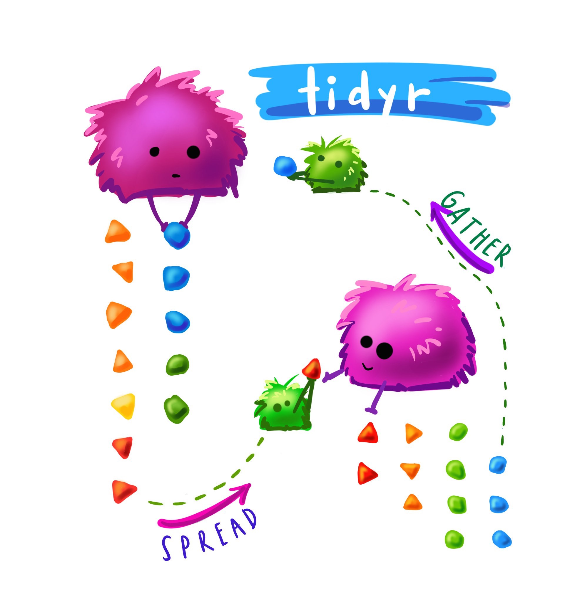

  
```{r setup, include=FALSE}
library(knitr)
library(kableExtra)
library(emo)
library(countdown)
opts_chunk$set(echo = TRUE,   
               message = FALSE,
               warning = FALSE,
               collapse = TRUE,
               fig.height = 4,
               fig.width = 8,
               fig.retina = 3,
               fig.align = "center",
               cache = FALSE)
```


```{r titleslide, child="components/titleslide.Rmd"}
```

---
class: transition

# What is this song?

(you can use your phone!)


---
class: transition
# Your Turn: complete class survey
Available now on Ed

---
class: transition
# How to learn

I want to some time to discuss ideas on learning, and how it ties into the course.


---
background-image: url(images/how-to-learn-img-page-1.jpg)
background-size: contain
background-position: 50% 50%
class: center, bottom, white


---
background-image: url(images/how-to-learn-img-page-2.jpg)
background-size: contain
background-position: 50% 50%
class: center, bottom, white


---
background-image: url(images/how-to-learn-img-page-3.jpg)
background-size: contain
background-position: 50% 50%
class: center, bottom, white


---
background-image: url(images/how-to-learn-img-page-4.jpg)
background-size: contain
background-position: 50% 50%
class: center, bottom, white


---
background-image: url(images/how-to-learn-img-page-5.jpg)
background-size: contain
background-position: 50% 50%
class: center, bottom, white


---
background-image: url(images/how-to-learn-img-page-6.jpg)
background-size: contain
background-position: 50% 50%
class: center, bottom, white


---
background-image: url(images/how-to-learn-img-page-7.jpg)
background-size: contain
background-position: 50% 50%
class: center, bottom, white


---
background-image: url(images/how-to-learn-img-page-8.jpg)
background-size: contain
background-position: 50% 50%
class: center, bottom, white


---
background-image: url(images/how-to-learn-img-page-9.jpg)
background-size: contain
background-position: 50% 50%
class: center, bottom, white


---
background-image: url(images/how-to-learn-img-page-10.jpg)
background-size: contain
background-position: 50% 50%
class: center, bottom, white


---
background-image: url(images/how-to-learn-img-page-11.jpg)
background-size: contain
background-position: 50% 50%
class: center, bottom, white


---
background-image: url(images/how-to-learn-img-page-12.jpg)
background-size: contain
background-position: 50% 50%
class: center, bottom, white

---
class: refresher
# recap

.pull-left[
- Traffic Light System: .green[Green = "good!"] ; .red[Red = "Help!"]
- R + Rstudio
- Tower of babel analogy for writing R code
- Functions are  ___
- columns in data frames are accessed with ___ ?
- packages are installed with ___ ?
- packages are loaded with ___ ?
]

.pull-right[
- Why do we care about Reproducibility?
- Output + input of rmarkdown
- I have an assignment group
- I have made contact with my assignment group
]

---
class: transition
# (demo)

---
# Style guide

> "Good coding style is like correct punctuation: you can manage without it, butitsuremakesthingseasiertoread." -- Hadley Wickham

- Style guide for this course is based on the Tidyverse style guide: http://style.tidyverse.org/
- There's more to it than what we'll cover today, we'll mention more as we introduce more functionality, and do a recap later in the semester

---
# File names and code chunk labels

- Do not use spaces in file names, use `-` or `_` to separate words
- Use all lowercase letters

```{r eval = FALSE}
# Good
ucb-admit.csv

# Bad
UCB Admit.csv
```

---
# Object names

- Use `_` to separate words in object names
- Use informative but short object names
- Do not reuse object names within an analysis

```{r eval = FALSE}
# Good
acs_employed

# Bad
acs.employed
acs2
acs_subset
acs_subsetted_for_males
```

---
# Spacing


- Put a space before and after all infix operators (=, +, -, <-, etc.), and when naming arguments in function calls. 
- Always put a space after a comma, and never before (just like in regular English).

```{r eval = FALSE}
# Good
average <- mean(feet / 12 + inches, na.rm = TRUE)

# Bad
average<-mean(feet/12+inches,na.rm=TRUE)
```

---
# ggplot

- Always end a line with `+`
- Always indent the next line

```{r eval = FALSE}
# Good
ggplot(diamonds, mapping = aes(x = price)) +
  geom_histogram()

# Bad
ggplot(diamonds,mapping=aes(x=price))+geom_histogram()
```

---
# Long lines

- Limit your code to 80 characters per line. This fits comfortably on a printed page with a reasonably sized font.
- Take advantage of RStudio editor's auto formatting for indentation at line breaks.

---
# Assignment

- Use `<-` not `=`

```{r eval = FALSE}
# Good
x <- 2

# Bad
x = 2
```

---
# Quotes

Use `"`, not `'`, for quoting text. The only exception is when the text already contains double quotes and no single quotes.

```{r eval = FALSE}
ggplot(diamonds, mapping = aes(x = price)) +
  geom_histogram() +
  # Good
  labs(title = "`Shine bright like a diamond`",
  # Good
       x = "Diamond prices",
  # Bad
       y = 'Frequency')
```

---
background-image: url(images/allison-horst-dplyr-wrangling.png)
background-size: contain
background-position: 50% 50%
class: center, bottom, white

.black.large[
Source: Artwork by @allison_horst
]

---
# Overview

.pull-left[
- `filter()`
- `select()`
- `mutate()`
- `arrange()`

]

.pull-right[
- `group_by()`
- `summarise()`
- `count()`
]

---
background-image: url(images/allison-horst-tidyverse-celestial.png)
background-size: contain
background-position: 50% 50%
class: center, bottom, bg-black

.left.white.large[
Artwork by @allison_horst
]

---
class: transition
# R Packages

```{r avail-pkg}
avail_pkg <- available.packages()
dim(avail_pkg)
```

As of `r Sys.Date()` there are `r nrow(avail_pkg)` R packages available

---

# Name clashes

```{r print-tidyverse, message = TRUE, include = TRUE, echo = TRUE}
library(tidyverse)
```

---
# Many R packages

- A blessing & a curse! 
- So many packages available, it can make it hard to choose!
- Many of the packages are designed to solve a specific problem
- The tidyverse is designed to work with many other packages following a consistent philosophy
- What this means is that you shouldn't notice it!


???

Extra reading:

We have been loading the `tidyverse` package. Its actually a suite of packages, and you can learn more about the individual packages at https://www.tidyverse.org. You could load each individually.

Because so many people contribute packages to R, it is a blessing and a curse. 

???

The best techniques are available, but there can be conflicts between function names. When you load tidyverse it prints a great summary of conflicts that it knows about, between its functions and others.


For example, there is a `filter` function in the `stats` package that comes with the R distribution. This can cause confusion when you want to use the filter function in `dplyr` (part of tidyverse). To be sure the function you use is the one you want to use, you can prefix it with the package name, `dplyr::filter()`.
---
class: transition

# Let's talk about data

---
background-image: url(images/french_fries.png)
background-size: contain
background-position: 50% 50%
class: center, bottom, white

???

This was an actual experiment in Food Sciences at Iowa State University. The goal was to find out if some cheaper oil options could be used to make hot chips: that people would not be able to distinguish the difference between chips fried in the new oils relative to those fried in the current market leader.

Twelve tasters were recruited to sample two chips from each batch, over a period of ten weeks. The same oil was kept for a period of 10 weeks! May be a bit gross by the end!

This data set was brought to R by Hadley Wickham, and was one of the problems that inspired the thinking about tidy data, and the evolution of the `tidyverse` tools. 


---

# Example: french fries

- Experiment in Food Sciences at Iowa State University. 
- Aim: find if cheaper oil could be used to make hot chips
- Question: Can people distinguish between chips fried in the new oils relative to those current market leader oil.
- 12 tasters recruited 
- Each sampled two chips from each batch
- Over a period of ten weeks.

Same oil kept for a period of 10 weeks! May be a bit gross!


---
# Example: french-fries - pivoting into long form

```{r ff-echo, echo = TRUE, eval = FALSE}
french_fries <- read_csv("data/french_fries.csv")
french_fries
```

```{r ff-print, echo = FALSE, eval = TRUE}
# french_fries <- read_csv("data/french_fries.csv")
french_fries <- read_csv(here::here("slides/data/french_fries.csv"))
head(french_fries)
```

--

This data set was brought to R by Hadley Wickham, and was one of the problems that inspired the thinking about tidy data and the plyr tools. 

---
# Example: french-fries - pivoting into long form

```{r create-ff-long, echo = FALSE}
fries_long <- french_fries %>% 
  pivot_longer(cols = potato:painty,
               names_to = "type", 
               values_to = "rating") %>%
  mutate(type = as.factor(type))
```

..pull-left[
```{r name, eval = FALSE}
fries_long <- french_fries %>% 
  pivot_longer(cols = potato:painty,
               names_to = "type", 
               values_to = "rating")
fries_long
```  
]

.pull-right[
```{r name-out, ref.label = 'create-ff-long', echo = FALSE}
```
]
---
class: transition
# `filter()`

choose observations from your data

---
# `filter()`: example

```{r ff-filter-subj}
fries_long %>%
  filter(subject == 10)
```


---
# `filter()`: details

Filtering requires comparison to find the subset of observations of interest.  What do you think the following mean?

- `subject != 10` 
- `x > 10` 
- `x >= 10` 
- `class %in% c("A", "B")` 
- `!is.na(y)`

```{r cd, echo = FALSE}
countdown(minutes = 3, play_sound = TRUE)
```


---
# `filter()`: details

`subject != 10`

--

Find rows corresponding to all subjects except subject 10

--

 `x > 10` 

--

find all rows where variable `x` has values bigger than 10

`x >= 10` 

--

 finds all rows variable `x` is greater than or equal to 10.

`class %in% c("A", "B")`

--

 finds all rows where variable `class` is either A or B

`!is.na(y)` 

--

finds all rows that *DO NOT* have a missing value for variable `y`

---
# Your turn: open french-fries.Rmd

Filter the french fries data to have:

- only week 1
- oil type 1 (oil type is called treatment)
- oil types 1 and 3 but not 2
- weeks 1-4 only

---
# French Fries Filter: only week 1

```{r french-fries-filter-t1}
fries_long %>% filter(time == 1)
```


---
# French Fries Filter: oil type 1

```{r french-fries-filter-treatment-eq}
fries_long %>% filter(treatment == 1)
```

---
# French Fries Filter: oil types 1 and 3 but not 2

```{r french-fries-filter-treatment-neq}
fries_long %>% filter(treatment != 2)
```

---
# French Fries Filter: weeks 1-4 only

```{r french-fries-filter-time-in}
fries_long %>% filter(time %in% c("1", "2", "3", "4"))
```


---
class: transition

# about  `%in%`

[demo]

---
# `select()`

--

- Chooses which variables to keep in the data set. 
- Useful when there are many variables but you only need some of them for an analysis. 

---
# `select()`: a comma separated list of variables, by name. 


```{r ff-select-many}
french_fries %>% 
  select(time, 
         treatment, 
         subject)
```

---
# `select()`: **drop** selected variables by prefixing with `-`

--

```{r ff-un-select-many}
french_fries %>% 
  select(-time, 
         -treatment, 
         -subject)
```

---
# `select()`

.left-code[
Inside `select()` you can use text-matching of the names like `starts_with()`, `ends_with()`, `contains()`, `matches()`, or `everything()`
]

--

.right-plot[
```{r ff-select-contains}
french_fries %>% 
  select(contains("e"))
```
]

---
# `select()`: Using it

.left-code[
You can use the colon, `:`, to choose variables in order of the columns
]

--

.right-plot[
```{r ff-select-order}
french_fries %>% 
  select(time:subject)
```
]

---
class: transition
# Your turn: back to the french fries data

- `select()` time, treatment and rep
- `select()` subject through to rating
- drop subject

```{r cd-select, echo = FALSE}
countdown(minutes = 3, play_sounds = TRUE)
```


```{r ff-example-select, eval=FALSE, echo=FALSE}
fries_long %>% select(time, treatment, rep)
fries_long %>%
  select(subject:rating)
fries_long %>%
  select(-subject)
```

---
background-image: url(images/allison-horst-dplyr-mutate.png)
background-size: contain
background-position: 50% 50%
class: center, bottom, white

.purple.large.right[
Artwork by @allison_horst
]

---
# `mutate()`: create a new variable; keep existing ones

```{r ff-mutate}
french_fries 
```

---
# `mutate()`: create a new variable; keep existing ones

```{r ff-mutate-show}
french_fries %>% 
  mutate(rainty = rancid + painty) #<<
```

---
class: transition

# Your turn: french fries

Compute a new variable called `lrating` by taking a log of the rating

```{r ff-mutate-log, eval=FALSE, echo=FALSE}
fries_long %>%
  mutate(lrating=log10(rating))
```

```{r cd-mutate, echo = FALSE}
countdown(minutes = 2, play_sounds = TRUE)
```


---
# `summarise()`: boil data down to one row observation 

```{r fries-print-it, eval = FALSE}
fries_long
```

```{r fries-print-head, echo = FALSE}
head(fries_long)
```

--

```{r fries-summarise}
fries_long %>% 
  summarise(rating = mean(rating, na.rm = TRUE))
```

---
class: transition
# What if we want a summary for each `type`?

--

use `group_by()`

---
# Using `summarise()` + `group_by()`

Produce summaries for every group:

```{r fries-group-type-summary}
fries_long %>% 
  group_by(type) %>%
  summarise(rating = mean(rating, na.rm=TRUE))
```

---
class: transition
# Your turn: Back to french-fries.Rmd

- Compute the average rating by subject
- Compute the average rancid rating per week

```{r cd-summarise, echo = FALSE}
countdown(minutes = 3, play_sounds = TRUE)
```


---
# french fries answers

```{r ff-grouped-summary}
fries_long %>% 
  group_by(subject) %>%
  summarise(rating = mean(rating, na.rm=TRUE))
```

---
# french fries answers

```{r ff-grouped-summary-time}
fries_long %>% 
  filter(type == "rancid") %>%
  group_by(time) %>%
  summarise(rating = mean(rating, na.rm=TRUE))
```

---
# `arrange()`: orders data by a given variable. 

--

Useful for display of results (but there are other uses!)

```{r fries-group-summary}
fries_long %>% 
  group_by(type) %>%
  summarise(rating = mean(rating, na.rm=TRUE)) 
```

---
# `arrange()`

```{r fries-group-arrange}
fries_long %>% 
  group_by(type) %>%
  summarise(rating = mean(rating, na.rm=TRUE)) %>%
  arrange(rating)
```

---
class: transition
# Your turn: french-fries.Rmd - arrange

- Arrange the average rating by type in decreasing order
- Arrange the average subject rating in order lowest to highest.

```{r cd-arrange, echo = FALSE}
countdown(minutes = 2, play_sounds = TRUE)
```

---
# `arrange()` answers

```{r fries-arrange-summarise}
fries_long %>% 
  group_by(type) %>%
  summarise(rating = mean(rating, na.rm=TRUE)) %>%
  arrange(desc(rating))
```

---
# `arrange()` answers

```{r fries-arrange-summarise-subject}
fries_long %>% 
  group_by(subject) %>%
  summarise(rating = mean(rating, na.rm=TRUE)) %>%
  arrange(rating)
```

---
# `count()` the number of things in a given column

```{r count-sort}
fries_long %>% 
  count(type, sort = TRUE)
```

---
class: transition left
# Your turn: `count()`

- count the number of subjects
- count the number of types

```{r cd-count, echo = FALSE}
countdown(minutes = 2, play_sounds = TRUE)
```


---
class: transition
# French Fries: Putting it together to problem solve

---
# French Fries: Are ratings similar?

.pull-left[
```{r fries-similar-ratings}
fries_long %>% 
  group_by(type) %>%
  summarise(
    m = mean(rating, 
             na.rm = TRUE), 
    sd = sd(rating, 
            na.rm = TRUE)) %>%
  arrange(-m)
```
]

--

.pull-right[

The scales of the ratings are quite different. Mostly the chips are rated highly on potato'y, but low on grassy. 

]

---
# French Fries: Are ratings similar?

```{r plot-fries-type-rating}
ggplot(fries_long,
       aes(x = type, 
           y = rating)) +
  geom_boxplot()
```

---
# French Fries: Are reps like each other?

```{r fries-longer}
fries_spread <- fries_long %>% 
  pivot_wider(names_from = rep, 
              values_from = rating)
  
fries_spread
```

---
# French Fries: Are reps like each other?

```{r fries-spread-summarise}
summarise(fries_spread,
          r = cor(`1`, `2`, use = "complete.obs"))
```

---
# French Fries:

```{r fries-spread-plot, out.width= "80%"}
  ggplot(fries_spread,
         aes(x = `1`, 
             y = `2`)) + 
  geom_point() + 
  labs(title = "Data is poor quality: the replicates do not look like each other!")
```

---
# French Fries:

```{r fries-spread-plot-out, echo = FALSE}
  ggplot(fries_spread,
         aes(x = `1`, 
             y = `2`)) + 
  geom_point() + 
  labs(title = "Data is poor quality: the replicates do not look like each other!")
```

---
# French Fries: Replicates by rating type

```{r fries-group-summarise-cor}
fries_spread %>%
  group_by(type) %>%
  summarise(r = cor(x = `1`, 
                    y = `2`, 
                    use = "complete.obs"))
```

---

# French Fries: Replicates by rating type

```{r plot-fries-facet-type, out.width = "90%"}
ggplot(fries_spread, aes(x=`1`, y=`2`)) + 
  geom_point() + facet_wrap(~type, ncol = 5)
```

--

Potato'y and buttery have better replication than the other scales, but there is still a lot of variation from rep 1 to 2.


---
<iframe width="1040" height="650" src="https://www.youtube.com/embed/i4RGqzaNEtg" frameborder="0" allow="accelerometer; autoplay; encrypted-media; gyroscope; picture-in-picture" allowfullscreen></iframe>

---
# Lab exercise: Exploring data PISA data

Open `pisa.Rmd` on rstudio cloud.

---
class: transition
# Lab Quiz

Time to take the lab quiz.

???

# `select()` example

```{r select-tb-example}
tb <- read_csv("data/TB_notifications_2018-03-18.csv") %>%
  select(country, year, starts_with("new_sp_")) 
tb %>% top_n(20)
```

---
  
```{r endslide, child="components/endslide.Rmd"}
```

???

```{r allison-tidy-img, echo = FALSE, out.width = "50%"}

```

Source: A drawing made by Alison Horst [@allison_horst](https://twitter.com/allison_horst?lang=en) 


# Learning is where you:

1. Receive information accurately
2. Remember the information (long term memory)
3. In such a way that you can reapply the information when appropriate

# Your Turn:

Go to the data source at this link: [bit.ly/dmac-noaa-data](https://bit.ly/dmac-noaa-data) 
- "Which is the best description of the temperature units?"
- "What is the best description of the precipitation units"
- "What does -9999 mean?"


???

- "Which is the best description of the temperature units?"

- degrees farehnheit F
- degrees Kelvin K
- "degrees C x10"

"What is the best description of the precipitation units"

- "mm x10"
- inches

"What does -9999 mean?"

- it was really cold
- the keyboard got stuck
- "the value was missing"
