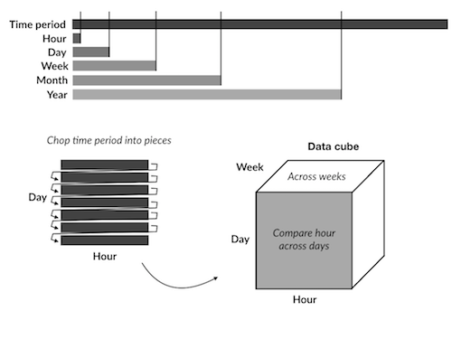

  
```{r titleslide, child="components/titleslide.Rmd"}
```


```{r setup, include=FALSE}
library(tidyverse)
library(knitr)
library(kableExtra)
library(lubridate)
opts_chunk$set(echo = TRUE,   
               message = FALSE,
               warning = FALSE,
               collapse = TRUE,
               fig.height = 4,
               fig.width = 8,
               fig.retina = 3,
               fig.align = "center",
               cache = FALSE)

as_table <- function(...) knitr::kable(..., format='html', digits = 3)
```

---
background-image: url(images/allison-horst-ggplot2-masterpiece.png)
background-size: contain
background-position: 50% 50%
class: center, bottom, white

.right.purple.small[
Art by Allison Horst
]

---
class: refresher
# Try drawing a mental model of last lecture's material on ggplot2

---
background-image: url(images/allison-horst-lubridate.png)
background-size: contain
background-position: 50% 50%
class: center, bottom, white
.right.purple.small[
Art by Allison Horst
]

---
class: transition
# Overview

- Working with dates
- Constructing graphics

---
# Reminder re the assignment:

- Due 5pm **April 8th**
- Submit by **one person** in the assignment group
- ED > assessments > upload your `Rmd`, and `html`, files. 
- **One per group**
- **Remember to name your files**
- E.g., "etc1010-assignment-1-group-name.Rmd"

---
# The challenges of working with dates and times

- Conventional order of day, month, year is different across location
  - Australia: DD-MM-YYYY
    - "21-02-2020"
  - America: MM-DD-YYYY
    - "02-21-2020"
  - [ISO 8601](https://en.wikipedia.org/wiki/ISO_8601): YYYY-MM-DD
    - "2020-02-21"

---
background-image: url(https://imgs.xkcd.com/comics/iso_8601.png)
background-size: contain
background-position: 50% 50%
class: center, bottom, white


---
# The challenges of working with dates and times

- Number of units change:
    - Years do not have the same number of days (leap years)
    - Months have differing numbers of days. (January vs February vs September)
    - Not every minute has 60 seconds (leap seconds!)
- Times are local, for us. Where are you?
- Timezones!!!

--

- Representing time relative to it's type:
   - What day of the week is it? 
   - Day of the month? 
   - Week in the year?
- Years start on different days (Monday, Sunday, ...)

---
# The challenges of working with dates and times

- Representing time relative to it's type:
  - Months could be numbers or names. (1st month, January)
  - Days could be numbers of names. (1st day....Sunday? Monday?)
  - Days and Months have abbreviations. (Mon, Tue, Jan, Feb)

--

- Time can be relative: 
  - How many days until we go on holidays?
  - How many working days?

---
background-image: url(images/allison-horst-lubridate.png)
background-size: contain
background-position: 50% 50%
class: center, bottom, white

.right.purple.small[
Art by Allison Horst
]
---
# Lubridate

.left-code[

- Simplifies date/time by helping you:
  - Parse values
  - Create new variables based on components like month, day, year
  - Do algebra on time
  
]

.right-plot[

```{r show-lubridate, echo = FALSE, out.width = "50%"}
include_graphics("images/lubridate.png")
```
]

---

background-image: url(images/allison-horst-lubridate-ymd.png)
background-size: contain
background-position: 50% 50%
class: center, bottom, white
.right.purple.large[Art by Allison Horst]
---
class: transition

# Parsing dates & time zones using `ymd()`

---
# `ymd()` can take a character input

```{r show-ymd}
ymd("20190810")
```

---
# `ymd()` can also take other kinds of separators

```{r moar-ymd}
ymd("2019-08-10")
ymd("2019/08/10")
```

--

```{r even-moar-ymd}
ymd("??2019-.-08//10---")
```

--

## ....yeah, wow, I was actually surprised this worked

---
# Change the letters, change the output

# `mdy()` expects month, day, year. 

--

```{r show-mdy}
mdy("10/15/2019")
```

--

# `dmy()` expects day, month, year.

--

```{r show-dmy}
dmy("10/08/2019")
```

---
# Add a timezone

If you add a time zone, what changes?

```{r add-tz}
ymd("2019-08-10", tz = "Australia/Melbourne")
```

--

```{r add-tz-ymd}
ymd("2019-08-10", 
    tz = "Africa/Abidjan")

ymd("2019-08-10", 
    tz = "America/Los_Angeles")
```

--

A list of acceptable time zones can be found [here](https://en.wikipedia.org/wiki/List_of_tz_database_time_zones) (google "wiki timezone database" to find this later :) )


---
# Timezones another way:

```{r show-today}
today()
```

--

```{r today-la}
today(tz = "America/Los_Angeles")
```

--

```{r now}
now()
```

--

```{r now-la}
now(tz = "America/Los_Angeles")
```

---
# date and time: `ymd_hms()`

```{r ymd-hms}
ymd_hms("2019-08-10 10:05:30", 
        tz = "Australia/Melbourne")
```


```{r ymd-hms-la}
ymd_hms("2019-08-10 10:05:30", 
        tz = "America/Los_Angeles")
```

---
# Extracting temporal elements

- Very often we want to know what day of the week it is
- Trends and patterns in data can be quite different depending on the type of day:
  - week day vs. weekend
  - weekday vs. holiday
  - regular saturday night vs. new years eve 

---
# Many ways of saying similar things

- Many ways to specify day of the week:
  - A number. Does 1 mean... Sunday, Monday or even Saturday???
  - Or text or or abbreviated text. (Mon vs. Monday)

--
  
- Talking with people we generally use day name:
  - Today is Friday, tomorrow is Saturday vs Today is 5 and tomorrow is 6.
- But, doing data analysis on days might be useful to have it represented as a number:
  - e.g., Saturday - Thursday is 2 days (6 - 4)

---
# The Many ways to say Monday 

--

The numbered day of the week, or with a label

```{r wday-and-options}
wday("2019-08-12")

wday("2019-08-12", label = TRUE)
```

--

The day with a label, and no abbreviation

```{r many-monday}
wday("2019-08-12", label = TRUE, abbr = FALSE)
```

--

The day with a label, and no abbreviation, and week starting on Monday, rather than Sunday

```{r many-monday-week-start}
wday("2019-08-12", label = TRUE, week_start = 1)
```


---
# Similarly, we can extract what month the day is in.

```{r month-label-abbr}
month("2019-08-10")
month("2019-08-10", label = TRUE)
month("2019-08-10", label = TRUE, abbr = FALSE)
```

---
# Fiscally, it is useful to know what quarter the day is in.

```{r quarter-semester}
quarter("2019-08-10")
semester("2019-08-10")
```

---
# Similarly, we can select days within a year. 

```{r yday}
yday("2019-08-10")
```

---
class: transition
# Your Turn:

Open rstudio.cloud exercise 3B and answer the questions about date

```{r cd-4, echo = FALSE}
library(countdown)
countdown(minutes = 4,
          font_size = "2em",
          margin = "0.3em",
          padding = "1px 1px")
```


---
# [Melbourne pedestrian sensor portal](http://www.pedestrian.melbourne.vic.gov.au/):

.pull-left[
```{r show-pedestrian-sensor, echo = FALSE, out.width = "100%"}
include_graphics("images/sensors.png")
```
]

.pull-right[

- Contains hourly counts of people walking around the city. 
- Extract records for 2018 for the sensor at Melbourne Central
- Use lubridate to extract different temporal components, so we can study the pedestrian patterns at this location. 

]

---
# getting pedestrian count data with rwalkr
```{r rwalkr-load, eval = FALSE}
library(rwalkr)
walk_all <- melb_walk_fast(year = 2019)

walk <- walk_all %>% filter(Sensor == "Melbourne Central")
walk
```


```{r read-walk, echo = FALSE}
walk <- readr::read_csv("data/walk_2018.csv")
walk
```


---
# Let's think about the data structure.

.left-code[

- The basic time unit is hour of the day. 
- Date can be decomposed into 
    - month
    - week day vs weekend
    - week of the year
    - day of the month
    - holiday or work day
    
]

.right-plot[


]


---
# What format is walk in?

```{r print-walk}
walk
```

---
# Add month and weekday information

```{r walk-tidy}
walk_tidy <- walk %>%
  mutate(month = month(Date,  label = TRUE, abbr = TRUE), 
         wday = wday(Date, label = TRUE, abbr = TRUE, week_start = 1))
walk_tidy
```

---
# Pedestrian count per month

.left-code[
```{r gg-walk-month-count, eval = FALSE}
ggplot(walk_tidy,
       aes(x = month, 
           y = Count)) + 
  geom_col()
```  
]

.right-plot[

```{r gg-walk-month-count-out, ref.label = 'gg-walk-month-count', echo = FALSE, out.width = "100%"}

```
]

???

- January has a very low count relative to the other months. Something can't be right with this number, because it is much lower than expected.
- The remaining months have roughly the same counts.

---
# Pedestrian count per weekday

.left-code[
```{r gg-wday-count, eval = FALSE}
ggplot(walk_tidy,
       aes(x = wday,
           y = Count)) + 
  geom_col()
```  
]

.right-plot[
```{r gg-wday-count-out, ref.label = 'gg-wday-count', echo = FALSE, out.width = "100%"}

```
]

???

How would you describe the pattern?

- Friday and Saturday tend to have a few more people walking around than other days.

---
# What might be wrong with these interpretations?

- There might be a different number of days of the week over the year.
- This means that simply summing the counts might lead to a misinterpretation of pedestrian patterns. 
- Similarly, months have different numbers of days.

---
class: transition
# Your Turn: Brainstorm in a group to answer these questions:

(testing out zoom "breakout groups")

1. Are pedestrian counts different depending on the month?
2. Are pedestrian counts different depending on the day of the week?

```{r cd-4-again, echo = FALSE}
countdown(minutes = 4)
```


---
# What are the number of pedestrians per day?

```{r walk-tidy-print}
walk_tidy
```

---
# What are the number of pedestrians per day?


```{r walk-day}
walk_day <- walk_tidy %>% 
  group_by(Date) %>%
  summarise(day_count = sum(Count, na.rm = TRUE))

walk_day
```

---
# What are the mean number of people per weekday?

```{r walk-day-mutate}
walk_day %>%
  mutate(wday = wday(Date, label = TRUE, abbr = TRUE, week_start = 1))
```

---
# What are the mean number of people per weekday?

```{r walk-day-group-by}
walk_day %>%
  mutate(wday = wday(Date, label = TRUE, abbr = TRUE, week_start = 1)) %>% 
  group_by(wday) 
```

---
# What are the mean number of people per weekday?

```{r walk-day-summarise}
walk_day %>%
  mutate(wday = wday(Date, label = TRUE, abbr = TRUE, week_start = 1)) %>% 
  group_by(wday) %>%
  summarise(m = mean(day_count, na.rm = TRUE),
            s = sd(day_count, na.rm = TRUE))
```

---
# What are the mean number of people per weekday?

```{r walk-day-all}
walk_week_day <- walk_day %>%
  mutate(wday = wday(Date, label = TRUE, abbr = TRUE, week_start = 1)) %>% 
  group_by(wday) %>%
  summarise(m = mean(day_count, na.rm = TRUE),
            s = sd(day_count, na.rm = TRUE))

walk_week_day
```

---
# What are the mean number of people per weekday?

```{r gg-walk-day, fig.width = 8, fig.height = 3}
ggplot(walk_week_day) + 
  geom_errorbar(aes(x = wday, ymin = m - s, ymax = m + s)) +
  ylim(c(0, 45000)) +
  labs(x = "Day of week", 
       y = "Average number of predestrians")
```  

---
class: transition
# Distribution of counts

Side-by-side boxplots show the distribution of counts over different temporal elements.

---
# Hour of the day

```{r gg-time-count, fig.width = 14, fig.height = 6}
ggplot(walk_tidy,
       aes(x = as.factor(Time), y = Count)) + 
  geom_boxplot()
```

---
# Day of the week

```{r gg-walk-weekday-count, fig.width = 14, fig.height = 6}
ggplot(walk_tidy,
       aes(x = wday,
           y = Count)) +
  geom_boxplot()
```

---
# Month

```{r gg-month-count-boxplot, cache = TRUE, fig.width = 14, fig.height = 6}
ggplot(walk_tidy,
       aes(x = month, 
           y = Count)) + 
  geom_boxplot()
```

---
# Time series plots

## Lines show consecutive hours of the day

```{r gg-time-count-line, cache = TRUE, fig.width = 14, fig.height = 6}
ggplot(walk_tidy, aes(x = Time, y = Count, group = Date)) + 
  geom_line()
```

---
# By month

```{r gg-time-count-by-date, fig.width = 14, fig.height = 6}
ggplot(walk_tidy, aes(x = Time, y = Count, group = Date)) +
  geom_line() +
  facet_wrap( ~ month)
```

---
# By week day

```{r gg-time-count-line-facet-grid, fig.width = 14, fig.height = 6, cache = TRUE}
ggplot(walk_tidy, aes(x = Time, y = Count, group = Date)) +
  geom_line() +
  facet_grid(month ~ wday)
```

---
# Calendar plots

.left-code[
```{r calendar-plot, eval = FALSE}
library(sugrrants)

walk_tidy_calendar <- 
  frame_calendar(walk_tidy,
                 x = Time, 
                 y = Count, 
                 date = Date, 
                 nrow = 4)

p1 <- ggplot(walk_tidy_calendar,
       aes(x = .Time, 
           y = .Count, 
           group = Date)) +
  geom_line()

prettify(p1)
```  
]

.right-plot[
```{r calendar-plot-out, ref.label = 'calendar-plot', echo = FALSE, out.width = "100%"}

```
]

---
# Holidays

```{r vic-hols}
library(tsibble)
library(sugrrants)
library(timeDate)
vic_holidays <- holiday_aus(2018, state = "VIC")
vic_holidays
```

---


# Holidays

```{r holiday-plot-id-hols, fig.height=6, cache = TRUE}
walk_holiday <- walk_tidy %>%
  mutate(holiday = if_else(condition = Date %in% vic_holidays$date, 
                          true = "yes", 
                          false = "no")) %>%
  mutate(holiday = if_else(condition = wday %in% c("Sat", "Sun"), 
                          true = "yes", 
                          false = holiday)) 
walk_holiday
```

---


# Holidays

```{r holiday-plot-create, fig.height=6, cache = TRUE}
walk_holiday_calendar <- frame_calendar(data = walk_holiday,
                                        x = Time, 
                                        y = Count, 
                                        date = Date, 
                                        nrow = 6)

p2 <- ggplot(walk_holiday_calendar,
       aes(x = .Time, 
           y = .Count, 
           group = Date, 
           colour = holiday)) +
  geom_line() + 
  scale_colour_brewer(palette = "Dark2")
```

---
# Holidays

```{r show-calendar-plot-p2, echo = FALSE, fig.width = 14, fig.height = 6}
prettify(p2)
```

---

# References

- suggrants
- tsibble
- lubridate
- dplyr
- timeDate
- rwalkr

---

# Your Turn: 

- Do the lab exercises
- Take the lab quiz
- Use the rest of the lab time to coordinate with your group on the first assignment.

