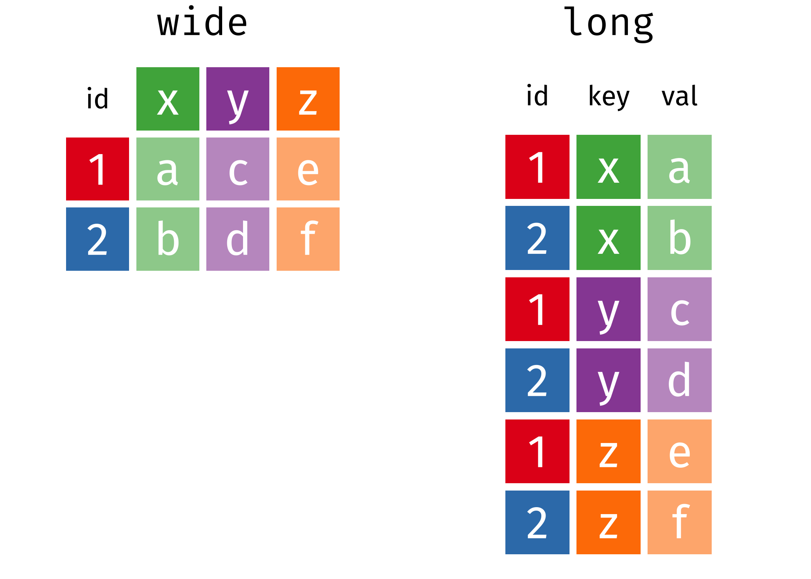

  
```{r titleslide, child="components/titleslide.Rmd"}
```


```{r setup, include=FALSE}
library(tidyverse)
library(knitr)
library(kableExtra)
library(emo)
opts_chunk$set(echo = TRUE,   
               message = FALSE,
               warning = FALSE,
               collapse = TRUE,
               fig.height = 4,
               fig.width = 8,
               fig.align = "center",
               cache = FALSE)

as_table <- function(...) knitr::kable(..., format='html', digits = 3)
```


---
class: refresher
# Recap

- consultation hours
- ggplot
- tidy data
- drawing mental models

---
class: refresher
# Recap: ggplot mental model

- Note: take a moment to try this out yourself.

.center.middle.huge[
[demo]
]

---
class: refresher
# Recap: Tidy data

```{r print-tidy-data-og, out.width = "75%", echo = FALSE}

```

---
class: refresher
# Recap: Tidy data - animation

```{r animate-wide-data, echo = FALSE, out.width = "50%"}
include_graphics("gifs/tidyr-spread-gather.gif")
```

---
class: refresher
# Overview

- What is relational data?
- Keys
- Different sorts of joins
- Using joins to follow an aircraft flight path

---
# Relational data

- Data analysis **rarely involves** only a single table of data. 
- To answer questions you generally need to combine many tables of data
- Multiple tables of data are called *relational data*
- It is the **relations**, not just the individual datasets, that are important.

---
# `nycflights13`

- Data set of flights that departed NYC in 2013 from https://www.transtats.bts.gov - a public database of all USA commercial airline flights. It has five tables:
    1. flights
    1. airlines
    1. airports
    1. planes
    1. weather

---
# flights

```{r print-flights}
library(nycflights13)
flights
```

---
# airlines

```{r print-airlines}
airlines
```

---
# airports

```{r print-airports}
airports
```

---
# print-planes
```{r print-planes}
planes
```

---
# weather

```{r print-weather}
weather
```

---
# Concept map of tables and joins from the text

```{r show-nycflights-graphic, echo = FALSE, out.width = "80%"}
include_graphics("images/relational-nycflights.png")
```

---
# Keys `r ji("key")`

- Keys = variables used to connect records in one table to another. 
- In the `nycflights13` data, 
    - `flights` connects to `planes` by a single variable `tailnum`
    - `flights` connects to `airlines` by a single variable `carrier`
    - `flights` connects to `airports` by two variables, `origin` and `dest`
    - `flights` connects to `weather` using multiple variables, `origin`, and `year`,     `month`, `day` and `hour`.


---
# Your turn: go to rstudio.cloud

- Load the `Lahman` package, which contains multiple tables of baseball data.
- What key(s) connect the batting table with the salary table?
- Can you draw out a diagram of the connections amongst the tables?

```{r countdown-1, echo = FALSE}
library(countdown)
countdown(minutes = 4, play_sound = TRUE)
```


---
# Joins

- "mutating joins", add variables from one table to another. 
- There is always a decision on what observations are copied to the new table as well. 
- Let's discuss how joins work using some [lovely animations](https://github.com/gadenbuie/tidyexplain) provided by [Garrick Aden-Buie](https://www.garrickadenbuie.com/).

---
# Example data

```{r print-example-data, echo = FALSE, out.width = "75%"}
include_graphics("images/original-dfs.png")
```

---
#  Left Join (Generally the one you want to use)

.left-code[
All observations from the "left" table, but only the observations from the "right" table that match those in the left.

]

.right-plot[

```{r animate-left-join, echo = FALSE, out.width = "100%"}
include_graphics("gifs/left-join.gif")
```
]

---
# Right Join

.left-code[
Same as left join, but in reverse.
]

.right-plot[
```{r animate-right-join, echo = FALSE, out.width = "100%"}
include_graphics("gifs/right-join.gif")
```
]

---
# Inner join

.left-code[
Intersection between the two tables, only the observations that are in both
]

.right-plot[
```{r animate-inner-join, echo = FALSE, out.width = "100%"}
include_graphics("gifs/inner-join.gif")
```
]

---
# Outer (full) join

.left-code[
Union of the two tables, all observations from both, and missing values might get added
]

.right-plot[
```{r animate-full-join, echo = FALSE, out.width = "100%"}
include_graphics("gifs/full-join.gif")
```
]

---
# Combine full airline name with flights data?

```{r print-flights-again}
flights
```

---
# Combine full airline name with flights data?


```{r print-airlines-again}
airlines
```

---
# Combine `airlines` & `flights` using `left_join()`

.left-code[
```{r join-flights-airlines, eval = FALSE}
flights %>%
  left_join(airlines, 
            by = "carrier") %>%
  glimpse()

```  
]

.right-plot[
```{r join-flights-airlines-out, ref.label = 'join-flights-airlines', echo = FALSE}

```
]

---
# Example: flights joining to airports

.left-code[
```{r join-flights-airports, eval = FALSE}
flights %>%
  left_join(
    airports, 
    by = c("origin" = "faa")) %>%
  glimpse()
```  
]

.right-plot[
```{r join-flights-airports-out, ref.label = 'join-flights-airports', echo = FALSE, out.width = "100%"}

```
]

---
# Airline travel, ontime data

```{r read-plane}
plane_N4YRAA <- read_csv("data/plane_N4YRAA.csv")

glimpse(plane_N4YRAA)
```

---


# Airline travel, airport location

```{r read-airports}
airport_raw <- read_csv("data/airports.csv")

airport_raw %>%
  select(AIRPORT, 
         LATITUDE, 
         LONGITUDE, 
         AIRPORT_STATE_NAME) %>%
  glimpse()
```

---
class: transition
# Our Turn: Joining the two tables to show flight movements

- Go to rstudio.cloud and open "flight-movements.Rmd" and complete exercise - the aim is to show flight movement on the map
- Next: Open "nycflights.Rmd"

---
# Learning more

- The coat explanation of joins: Different types of joins explained using a person and a coat, by [Leight Tami](https://twitter.com/leigh_tami18/status/1021471889309487105/photo/1)

```{r joins-using-coat, echo = FALSE}
include_graphics("images/joins_using_coat.jpg")
```


---

# References

- Chapter 13 of R4DS
