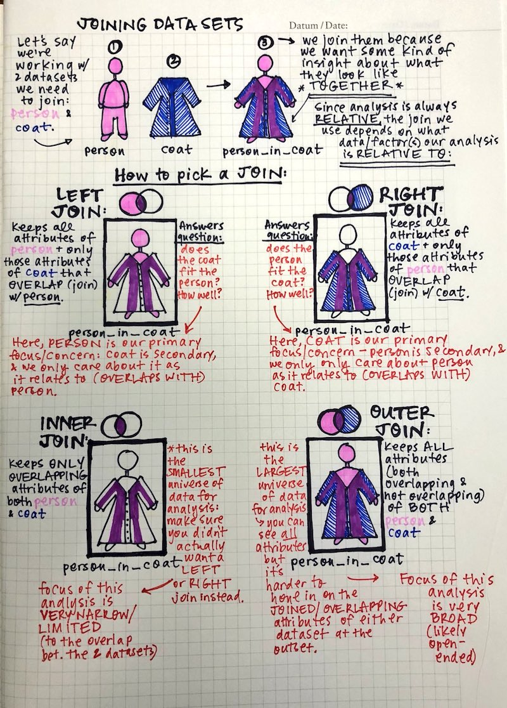

  
```{r titleslide, child="components/titleslide.Rmd"}
```


```{r setup, include=FALSE}
library(tidyverse)
library(knitr)
library(emo)
library(kableExtra)
opts_chunk$set(echo = TRUE,   
               message = FALSE,
               warning = FALSE,
               collapse = TRUE,
               fig.height = 4,
               fig.width = 8,
               out.width = "100%",
               fig.align = "center",
               cache = FALSE)

as_table <- function(...) knitr::kable(..., format='html', digits = 3)
```

---
class: transition
# While the song is playing...

Draw a mental model / concept map of last lectures content on joins.

---
class: refresher
# recap

- Joins
- venn diagrams
- feedback

---

# Joins with a person and a coat, by [Leight Tami](https://twitter.com/leigh_tami18/status/1021471889309487105/photo/1)

```{r joins-coat, echo = FALSE}

```

---
# Upcoming Due Dates

- Assignment 1: ...
- Other due dates?
- Stay tuned on ED for the upcoming dates

---


# Making effective data plots

1. Principles / science of data visualisation
2. Features of graphics

---
# Principles / science of data visualisation

  - Palettes and colour blindness
  - change blindness
  - using proximity
  - hierarchy of mappings

---
# Features of graphics 

- Layering statistical summaries
- Themes
- adding interactivity

---
# Palettes and colour blindness

There are three main types of colour palette:

- Qualitative: categorical variables
- Sequential: low to high numeric values
- Diverging: negative to positive values

---
# Qualitative: categorical variables

```{r print-qual-pal, echo=FALSE, fig.height=7, fig.width=12}
library(RColorBrewer)
display.brewer.all(type = "qual")
```

---
# Sequential: low to high numeric values

```{r print-seq-pal, echo=FALSE, fig.height=7, fig.width=12}
display.brewer.all(type = "seq")
```

---
# Diverging: negative to positive values

```{r print-div-pal, echo=FALSE, fig.height=7, fig.width=12}
library(RColorBrewer)
display.brewer.all(type = "div")
```

---
# Example: TB data

```{r read-tb, echo = FALSE}
# Read the tb data
tb <- read_csv("data/TB_notifications_2018-03-18.csv") %>%
  select(country, year, new_sp_m04:new_sp_fu) %>%
  gather(stuff, count, new_sp_m04:new_sp_fu) %>%
  separate(stuff, c("stuff1", "stuff2", "genderage")) %>%
  select(-stuff1, -stuff2) %>%
  mutate(
    gender = substr(genderage, 1, 1),
    age = substr(genderage, 2, length(genderage))
  ) %>%
  select(-genderage)

tb

```

---
# Example: TB data: adding relative change

```{r tb-increase, echo = FALSE}
tb_inc <- tb %>%
  filter(year %in% c(2002, 2012)) %>%
  group_by(country, year) %>%
  summarise(count = sum(count, na.rm = TRUE)) %>%
  spread(year, count) %>%
  mutate(reldif = if_else(condition = `2002` == 0, 
                          true = 0, 
                          false = (`2012` - `2002`) / (`2002`))) %>%
  ungroup()

tb_inc
```


```{r map-prep, echo = FALSE}
# Join with a world map
library(maps)
library(ggthemes)
# this function gets map data of
world_map <- map_data("world")
# Names of countries need to be the same in both data tables
tb_rel <- tb_inc %>%
  mutate(country = recode(
    country,
    "United States of America" = "USA",
    "United Kingdom of Great Britain and Northern Ireland" = "UK",
    "Russian Federation" = "Russia"
  ))
tb_map <- left_join(world_map, tb_rel, by = c("region" = "country"))
```

---
# Example: Sequential colour with default palette

```{r map-default, out.width = "80%", fig.height = 4, fig.width = 8}
ggplot(tb_map) + geom_polygon(aes(x = long, y = lat, group = group, fill = reldif)) +
  theme_map()
```  

---
# Example: (improved) sequential colour with default palette

```{r viridis-plot, out.width = "80%", fig.height = 4, fig.width = 8}
library(viridis)
ggplot(tb_map) +
  geom_polygon(aes(x = long, y = lat, group = group, fill = reldif)) +
  theme_map() + scale_fill_viridis(na.value = "white")
```

---
# Example:  Diverging colour with better palette

```{r map-distiller, out.width = "80%", fig.height = 4, fig.width = 8}
ggplot(tb_map) +
  geom_polygon(aes(x = long, y = lat, group = group, fill = reldif)) +
  theme_map() +
  scale_fill_distiller(palette = "PRGn", na.value = "white", limits = c(-7, 7))
```

---
# Summary on colour palettes

- Different ways to map colour to values:
  - Qualitative: categorical variables
  - Sequential: low to high numeric values
  - Diverging: negative to positive values

---
# Colour blindness

- About 8% of men (about 1 in 12), and 0.5% women (about 1 in 200) population have difficulty distinguishing between red and green. 
- Several colour blind tested palettes: RColorbrewer has an associated web site [colorbrewer.org](http://colorbrewer2.org) where the palettes are labelled. See also `viridis`, and `scico`.

---
# Plot of two coloured points: Normal Mode

```{r colour-blind, fig.show='hold', fig.width=8, fig.height=4, echo = FALSE}
library(scales)
df <- data.frame(x = runif(100), y = runif(100), cl = sample(c(rep("A", 50), rep("B", 50))))
p <- ggplot(data = df, aes(x, y, colour = cl)) + theme_bw() +
  geom_point() + theme(legend.position = "none", aspect.ratio = 1)
library(dichromat)
clrs <- hue_pal()(3)
p
```

---
# Plot of two coloured points: dicromat mode

```{r colour-blind-2, fig.show='hold', fig.width=8, fig.height=4, echo = FALSE}
clrs <- dichromat(hue_pal()(3))
p + scale_colour_manual("", values = clrs)
```

---
# Showing all types of colourblindness

```{r colourblindr-show, echo = FALSE}
library(colorblindr)
cvd_grid(p)
```

---
# Impact of colourblind-safe palette
```{r colourblindr-brewer, echo = TRUE}
p2 <- p + scale_colour_brewer(palette = "Dark2")
p2
```

---
# Impact of colourblind-safe palette
```{r cb-grid,echo = FALSE}
cvd_grid(p2)
```


---
# Impact of colourblind-safe palette
```{r colourblindr-viridis, echo = TRUE}
p3 <- p + scale_colour_viridis_d()
p3
```

---
# Impact of colourblind-safe palette
```{r cb-grid-viridis, echo = FALSE}
cvd_grid(p3)
```


---
# Summary colour blindness

- Apply colourblind-friendly colourscales
  - `+ scale_colour_viridis()`
  - `+ scale_colour_brewer(palette = "Dark2")`
  - `scico` R package

---
# Pre-attentiveness: Find the odd one out?

```{r pre-attentiveness, echo = FALSE}
df <- data.frame(x = runif(100), 
                 y = runif(100), 
                 cl = sample(c(rep("A", 1), 
                               rep("B", 99))))
ggplot(data = df, 
       aes(x, 
           y, 
           shape = cl)) + 
  theme_bw() +
  geom_point() +
  theme(legend.position = "None", aspect.ratio = 1)
```

---
# Pre-attentiveness: Find the odd one out?

```{r pre-attentive-easier, echo = FALSE}
ggplot(data = df, aes(x, y, colour = cl)) +
  geom_point() +
  theme_bw() +
  theme(legend.position = "None", aspect.ratio = 1) +
  scale_colour_brewer(palette = "Set1")
```

---
class: idea
# Using proximity in your plots

Basic rule: place the groups that you want to compare close to each other

```{r read-tb-again, echo=FALSE}
tb <- read_csv("data/TB_notifications_2018-03-18.csv") %>%
  select(country, iso3, year, new_sp_m04:new_sp_fu) %>%
  gather(stuff, count, new_sp_m04:new_sp_fu) %>%
  separate(stuff, c("stuff1", "stuff2", "genderage")) %>%
  select(-stuff1, -stuff2) %>%
  mutate(
    gender = substr(genderage, 1, 1),
    age = substr(genderage, 2, length(genderage))
  ) %>%
  select(-genderage)

tb_au_2012 <- tb %>%
  filter(country == "Australia") %>%
  filter(!(age %in% c("04", "014", "514", "u"))) %>%
  filter(year == 2012)
```

---
# Which plot answers which question?

- "Is the incidence similar for males and females in 2012 across age groups?"
- "Is the incidence similar for age groups in 2012, across gender?" 

---
# incidence similar for: (M and F) or (age, across gender) ?" 


```{r  print-many-tb, echo=FALSE, fig.width=8, fig.height=2}
gg_fill_gender <- 
ggplot(tb_au_2012,
       aes(x = gender, 
           y = count, 
           fill = gender)) +
  geom_col(position = "dodge") +
  facet_grid(~age) +
  scale_fill_brewer(palette = "Dark2")

gg_fill_age <- 
ggplot(tb_au_2012,
       aes(x = age, 
           y = count, 
           fill = age)) +
  geom_col(position = "dodge") +
  facet_grid(~gender) +
  scale_fill_brewer(palette = "Dark2")

gg_fill_gender
gg_fill_age
```

???

Here are two different arrangements of the tb data. To answer the question "Is the incidence similar for males and females in 2012 across age groups?" the first arrangement is better. It puts males and females right beside each other, so the relative heights of the bars can be seen quickly. The answer to the question would be "No, the numbers were similar in youth, but males are more affected with increasing age."

The second arrangement puts the focus on age groups, and is better to answer the question "Is the incidence similar for age groups in 2012, across gender?" To which the answer would be "No, among females, the incidence is higher at early ages. For males, the incidence is much more uniform across age groups."


---
# "Incidence similar for M & F in 2012 across age?"

```{r gg-fill-gender-print, fig.width=8, fig.height=2, echo = FALSE}
gg_fill_gender
```

- Males & females next to each other: relative heights of bars is seen quickly. 
- Auestion answer: "No, the numbers were similar in youth, but males are more affected with increasing age."

---
# "Incidence similar for age in 2012, across gender?"

```{r gg-fill-age-print, fig.width=8, fig.height=2, echo = FALSE}
gg_fill_age
```

- Puts the focus on age groups 
- Answer to the question: "No, among females, the incidence is higher at early ages. For males, the incidence is much more uniform across age groups."

---
# Proximity wrap up

- Facetting of plots, and proximity are related to change blindness, an area of study in cognitive psychology. 
- There are a series of fabulous videos illustrating the effects of making a visual break, on how the mind processes it by Daniel Simons lab. 
- Here's one example:  
[The door study](https://www.youtube.com/watch?v=FWSxSQsspiQ)

---
# Layering

- *Statistical summaries:* It is common to layer plots, particularly by adding statistical summaries, like a model fit, or means and standard deviations. The purpose is to show the **trend** in relation to the **variation**. 
- *Maps:* Commonly maps provide the framework for data collected spatially. One layer for the map, and another for the data.

```{r smooth-later, echo = FALSE}
df <- tibble(
  x = runif(100),
  y1 = 4 * x + rnorm(100),
  y2 = -x + 10 * (x - 0.5)^2 + rnorm(100)
)
```

---
# `geom_point()`
```{r point-1}
ggplot(df, aes(x = x, y = y1)) + geom_point()
```

---
# `geom_smooth(method = "lm", se = FALSE)`
```{r point-2}
ggplot(df, aes(x = x, y = y1)) + geom_point() +
  geom_smooth(method = "lm", se = FALSE)
```

---
# `geom_smooth(method = "lm")`
```{r point-3}
ggplot(df, aes(x = x, y = y1)) + geom_point() +
  geom_smooth(method = "lm")
```

---
# `geom_point()`

```{r point-4}
ggplot(df, aes(x = x, y = y2)) + geom_point()
```

---
# `geom_smooth(method = "lm", se = FALSE)`
```{r point-5palette}
ggplot(df, aes(x = x, y = y2)) + geom_point() +
  geom_smooth(method = "lm", se = FALSE)
```

---
`geom_smooth(se = FALSE)`
```{r point-6palette}
ggplot(df, aes(x = x, y = y2)) + geom_point() +
  geom_smooth(se = FALSE)
```


---
`geom_smooth(se = FALSE, span = 0.05)`
```{r point-7palette}
ggplot(df, aes(x = x, y = y2)) + geom_point() +
  geom_smooth(se = FALSE, span = 0.05)
```

---
# `geom_smooth(se = FALSE, span = 0.2)`
```{r point-8palette}
p1 <- ggplot(df, aes(x = x, y = y2)) + geom_point() +
  geom_smooth(se = FALSE, span = 0.2)
p1
```

---
# Interactivity with magic plotly

```{r point-interactive}
library(plotly)
ggplotly(p1)
```


---
# Themes: Add some style to your plot

.left-code[
```{r mtcars, eval = FALSE}
p <- ggplot(mtcars) +
  geom_point(aes(x = wt, 
                 y = mpg, 
                 colour = factor(gear))) +
  facet_wrap(~am)
p

```  
]

.right-plot[
```{r mtcars-out, ref.label = 'mtcars', echo = FALSE, out.width = "100%"}

```
]

---
# Theme: theme_minimal

.left-code[
```{r mtcars-minimal, eval = FALSE}
p + 
  theme_minimal()
```  
]

.right-plot[
```{r mtcars-minimal-out, ref.label = 'mtcars-minimal', echo = FALSE, out.width = "100%"}

```
]
---
# Theme: ggthemes `theme_few()`

.left-code[
```{r mtcars-theme-few, eval = FALSE}
p + 
  theme_few() + 
  scale_colour_few()
```  
]

.right-plot[
```{r mtcars-theme-few-out, ref.label = 'mtcars-theme-few', echo = FALSE, out.width = "100%"}

```
]

---
# Theme: ggthemes `theme_excel()` `r ji("sick")`

.left-code[
```{r mtcars-theme-excel, eval = FALSE}
p + 
  theme_excel() + 
  scale_colour_excel()
```  
]

.right-plot[
```{r mtcars-theme-excel-out, ref.label = 'mtcars-theme-excel', echo = FALSE, out.width = "100%"}

```
]
---
# Theme: for fun

.left-code[
```{r theme-wes, eval = FALSE}
library(wesanderson)
p + 
  scale_colour_manual(
    values = wes_palette("Royal1")
    )

```  
]

.right-plot[
```{r theme-wes-out, ref.label = 'theme-wes', echo = FALSE, out.width = "100%"}

```
]

---
# Summary: themes

- The `ggthemes` package has many different styles for the plots. 
- Other packages such as `xkcd`, `skittles`, `wesanderson`, `beyonce`, `ochre`, ....

---
# Hierarchy of mappings

1. Position - common scale (BEST): axis system
2. Position - nonaligned scale: boxes in a side-by-side boxplot
3. Length, direction, angle: pie charts, regression lines, wind maps
4. Area: bubble charts
5. Volume, curvature: 3D plots
6. Shading, color (WORST): maps, points coloured by numeric variable

- [Di's crowd-sourcing expt](http://visiphilia.org/2016/08/03/CM-hierarchy)
- Nice explanation by [Peter Aldous](http://paldhous.github.io/ucb/2016/dataviz/week2.html)
- [General plotting advice and a book from Naomi Robbins](https://www.forbes.com/sites/naomirobbins/#2b1e20082a6a)

---
# Your Turn:

- lab quiz open (requires answering questions from Lab exercise)
- go to rstudio.cloud and check out exercise 4-B
- If you want to use R / Rstudio on your laptop:
  - Install R + Rstudio (see )
  - open R
  - type the following:
  ```r
  # install.packages("usethis")
  library(usethis)
  use_course("bit.ly/ida-2020-exercise-4b.zip")
  ```

---

# Resources

- Kieran Healy [Data Visualization](http://socviz.co/index.html)
- Winston Chang (2012) [Cookbook for R](graphics cookbook)
- Antony Unwin (2014) [Graphical Data Analysis](http://www.gradaanwr.net)
- Naomi Robbins (2013) [Creating More Effective Charts](http://www.nbr-graphs.com)
