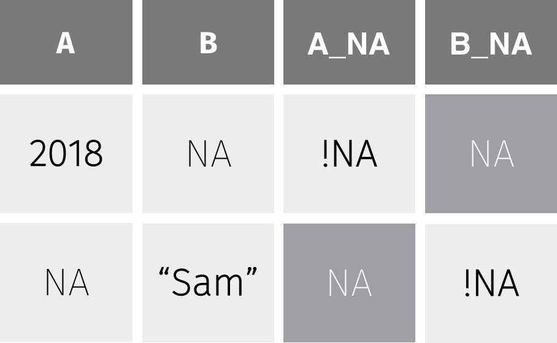

  
```{r titleslide, child="components/titleslide.Rmd"}
```


```{r setup, include=FALSE}
library(tidyverse)
library(knitr)
library(kableExtra)
opts_chunk$set(echo = TRUE,   
               message = FALSE,
               warning = FALSE,
               collapse = TRUE,
               fig.height = 4,
               fig.width = 8,
               fig.align = "center",
               cache = FALSE)

as_table <- function(...) knitr::kable(..., format='html', digits = 3)
```


```{r prepare-data, echo = FALSE}
library(tidyverse)
library(visdat)
library(naniar)

tb <- read_csv("data/TB_notifications_2018-03-18.csv") %>%
  select(country, iso3, year, new_sp_m04:new_sp_fu) %>%
  gather(stuff, count, new_sp_m04:new_sp_fu) %>%
  separate(stuff, c("stuff1", "stuff2", "genderage")) %>%
  select(-stuff1, -stuff2) %>%
  mutate(
    gender = substr(genderage, 1, 1),
    age = substr(genderage, 2, length(genderage))
  ) %>%
  select(-genderage)

tb_au <- tb %>%
  filter(country == "Australia")


dat_sf_clean <- readr::read_rds(here::here("slides/data/dat_sf_clean.rds"))

```

---
class: transition

While the song is playing...

Draw a mental model / concept map of last lectures content on data visualisation.

---
class: refresher

# Recap

- Joins
- advanced data vis

---
class: transition
# Motivation

Why would I want to deal with missing data?

???

I was handed a dataset in my PhD that had more than 65% of the data missing. 
We had to spend quite a bit of time exploring the missingness relationships and
the whole process was very frustrating, this inspired me to develop methods for
exploring missing data, which ended up being a substantial part of my thesis

But today we are going to talk about some example weather data from Melbourne.

---
class: center, middle
# Example

### San Francisco weather data 
### || Date | Wind | Temp ||
### Using the R package: [`GSODR`](https://github.com/ropensci/gsodr)
### [(Global Surface Summary of the Day)](https://data.noaa.gov/dataset/global-surface-summary-of-the-day-gsod)

### Written by Adam Sparks

### github.com/ropensci/GSODR
---

```{r sf-intro-temp-data, out.width = "100%", echo = FALSE, fig.width = 8, fig.height = 5}
# let's messy up the data
ggplot(
  dat_sf_clean,
  aes(
    x = date,
    y = temp_avg
  )
) +
  geom_line()
```

---
# Why data was missing

```{r sf-final-miss-mech, out.width = "90%", echo = FALSE}
ggplot(
  dat_sf_clean,
  aes(
    x = wind_speed_max,
    y = temp_avg
  )
) +
  geom_miss_point()
```

???f

So here we can create a graphic where we can see the data that are present are in blue, and the data that are missing are in red. What we see here then is that the data that are missing for air temperature are in red here, but are actually measured only beyond gust speeds of 8 kpmh

So in cases of strong winds, the air temperature measurements break. Done. Dusted.

---
class: transition

# Wait, What?

???

But, like all good explanations, this one is simple - but the process to get there, where we describe it, probably was not.

In order to get to a position where you could generate this graphic, and show this data, you probably had to spend more time than you would have liked developing exploratory data analyses and models

It might seem obvious to point out the precise mechanism for generating the missingness, but this is kind of difficult when there is a lot of missing data, or when there are many variables.  

---
class: transition

# What dealing with missing data looks like in a paper

---

background-image: url(images/narnia-doppel.jpg)
background-size: contain 
background-position: 50% 50%
class: center, bottom, inverse

---

background-image: url(gifs/narnia-golf-beer.gif)
background-color: #000000 
background-size: contain 
background-position: 50% 50%
class: center, bottom, inverse

---
class: transition

What dealing with missing data actually looks like

---

background-image: url(gifs/narnia-dart-throw.gif)
background-size: contain 
background-color: #000000 
background-position: 50% 50%
class: center, bottom, inverse

---
class: inverse, center, middle

.vvhuge[
What I want dealing with missing data to be like
]


---

background-image: url(gifs/njt-ideal-missing-data.gif)
background-size: contain 
background-color: #000000 
background-position: 50% 50%
class: center, bottom, inverse

---
class: inverse, middle, center

# Learn more

```{r learn-more, echo = FALSE, out.width = "70%"}
knitr::include_graphics("https://njtierney.updog.co/img/hex-visdat-and-naniar.png")
```

.pull-left[
.center[

visdat.njtierney.com

]
]

.pull-right[
.center[

naniar.njtierney.com

]
]

---
# Overview


1. What even are missing values

1. How to start looking at missing data

1. How to start exploring missing data

1. How to impute (fill in) Missing values


---
# What are missing values?

> Missing values are values that should have been recorded but were not.

`NA` = **N**ot **A**vailable.

???

Before we get started, we need to define missing values

Missing values are values that should have been recorded, but were not.

Think of it this way: 

You might accidentally not record seeing a bird - this is a missing value. This is different to recording that there were no birds observed.

R stores missing values as `NA`, which stands for **N**ot **A**vailable.


---
# How do I check if I have missing values?

```r
x <- c(1, NA, 3, NA, NA, 5)
```

```r
any_na(x)
```

```
[1] TRUE
```

```r
are_na(x)
```

```
[1] FALSE  TRUE FALSE  TRUE  TRUE FALSE
```

```r
n_miss(x)
```

```
[1] 3
```

```r
prop_miss(x)
```

```
[1] 0.5
```

???

Missing values don't jump out and scream "I'm here!". They're usually hidden, like a needle in a haystack.

To detect missing values use `any_na`, which returns TRUE if there are any missings, and FALSE if there are none.

`are_na` asks "are these NA?" and returns TRUE/FALSE for each value

`are_na` shows us 3 TRUE values - 3 missing values.

To avoid counting each TRUE yourself, `n_miss` counts the number of missings

And `prop_miss` gives the proportion of missings, which gives important context: 50% of data is missing!


---
# Working with missing data


`NA` + [anything] = `NA`

```r
heights
```

```
Sophie    Dan   Fred 
   165    177     NA 
```

```r
sum(heights)
```

```
[1] NA
```

---
# Working with missing data


`na.rm = TRUE` will removes missings

```r
sum(heights, na.rm = TRUE)
```

```
[1] 342
```

--


Use this power `responsibly`!


???

So what happens when we mix missing values with our calculations? We need to know what happens, so we can be primed to find these cases. The general rule is this:

Calculations with `NA` return `NA`.

Say you have the height of three friends: Sophie,  Dan, and Fred.

The sum of their heights returns `NA`, 

This is because we don't know the sum of a number and NA.

---
# Your turn:

- Open rstudio.cloud
- go to `exercise-5a-intro-missing.Rmd`
- If you want to use R / Rstudio on your laptop:
  - Install R + Rstudio (see )
  - open R
  - type the following:
  ```r
  # install.packages("usethis")
  library(usethis)
  use_course("bit.ly/ida-2020-exercise-5a.zip")
  ```

---
# Introduction to missingness summaries


Basic summaries of missingness:

- `n_miss`
- `n_complete`

--


Dataframe summaries of missingness:

- `miss_var_summary`
- `miss_case_summary`

These functions work with `group_by`

???

Now that you understand what missing values are, how to count them, and how they operate, let's scale these up to more detailed summaries of missingness.

We need to summarise missing data to identify variables, cases, or patterns of missingness, as these can bias our data analysis.

There are two main summaries: basic, and dataframe summaries.

Basic summaries return a single number, like the number of missing or complete values using `n_miss` or `n_complete`. 

However, you will need more detailed missingness summaries to help you on your journey through a data analysis. 

This lesson introduces you to missing data summaries.

`naniar` provides a family of functions all starting with `miss_`., which each provide different summaries of missingness, and return a dataframe. 

This allows us to see features that can be difficult to articulate, or time consuming to calculate. 

For example, `miss_var_summary` and `miss_case_summary` return the number and percentage of missings in each variable or case.

These summaries work with `dplyr`''s `group_by`, so you can fluidly explore missingness by each groups.

---
# Missing data summaries: Variables

```{r aq-miss-var-summary}
miss_var_summary(dat_sf_clean)
```

???

Use `miss_var_summary` to summarise the number of missings in each variable. 

This returns a dataframe where each row is a variable. It also includes summaries of the number and percentage of missings for each variable in the dataset, and is sorted by the number of missings.

For example, Ozone has 37 missing values, and is about 24.2 percent missing.

---
# Missing data summaries: Cases

```{r aq-miss-cas-summary}
miss_case_summary(dat_sf_clean)
```

???

Similar to `miss_var_summary`, `miss_case_summary` returns a summary dataframe, where each case represents a dataset row number.

Here, case 5 - the fifth row in the dataset - has 2 missing values, which means 33% of that case is missing.

---
# Missing data tabulations: variables

```{r aq-miss-var-tab}
miss_var_table(dat_sf_clean)
```

---
# Missing data tabulations: cases

```{r aq-miss-case-tab}
miss_case_table(dat_sf_clean)
```

???

Tabulation of missingness counts the number of times there are 0, 1, 2, 3, and so on, missings. They are very useful, compact summaries that reveal interesting structure.

`miss_var_table` returns a dataframe with the number of missings in a variable, and the number and percentage of variables affected. 

For example, there are four variables with no missings detected, which corresponds to 66.7 percent of variables, and there was 1 variable with 7 missings, and 1 variable with 37 missings.

Similarly, `miss_case_table` returns the same information, but for cases.

---
# Using summaries with `group_by`

```{r aq-group-miss-var-sum}
dat_sf_clean %>%
  group_by(month) %>%
  miss_var_summary()
```

???

Sometimes you are interested in missingness for groups in the data.

Each missingness summary function can be calculated by group, using `group_by` from `dplyr`.

For example, we can look at the missingness by Month in the airquality dataset.

Here we see that Month 5 for Ozone there are 5 missings, but for Month 6 Ozone has 21 missings.

---
class: transition
# Your Turn

Open exercise-5a-summarise-missings.Rmd

---
# Introduction to missing data visualisations in naniar


- Visualisation can quickly capture an idea or thought.
- `naniar` provides a friendly family of missing data visualization functions.
- Each visualization corresponds to a data summary.
- Visualisations help you operate closer to the speed of thought.

???

We cover how to get a bird's eye view of the data, how to look at missings in the variables and cases, and how to generate visualizations for missing spans and across groups in the data.

We now know what missing values are, how they work, how to count and summarise them - now let's look at some of the built-in visualisations that come with `naniar`.

Data summaries are very useful, but sometimes an idea or a thought can be quickly captured with a visualisation. 

`naniar` provides a friendly family of missing data visualisation functions, each presenting different visualisations missingness summaries.

In fact, each of these visualisations is a nice compact shorthand for the data summaries. While you could create similar and more complex visualisations using the summary information from the previous lesson, this can be repetitive. The visualisations in `naniar` reduce repetition and increase iteration, so you can operate closer to the speed of thought.

---
# Get a bird's eye view of the missing data

```{r aq-vis-miss}
vis_miss(dat_sf_clean)
```

???

When you first get a dataset, it can be difficult to get a visceral sense of **where** the missings are. 

To get an overview of the amount of missingness, use the `vis_miss` function from the `visdat` package. 

`vis_miss` produces a "heatmap" of the missingness - like as if the plot corresponded to the dataset as a giant spreadsheet, with values coloured black for missing, and grey for present.

`vis_miss` also provides missingness summary statistics, showing the overall percentage of missingness in the legend, and the amount of missings in each variable. 

These can be turned off in its options, described in the helpfile.

---
# Get a bird's eye view of the missing data

```{r aq-vis-miss-cluster}
vis_miss(dat_sf_clean, cluster = TRUE)
```

???

`vis_miss` also allows for clustering of the missing data by setting `cluster = TRUE`: this orders the rows by missingness to identify common co-occurrences.


---
# Look at missings in cases

```{r aq-gg-miss-var, out.width = "80%"}
gg_miss_var(dat_sf_clean)
```

---
# Look at missings in cases

```{r aq-gg-miss-case, out.width = "80%"}
gg_miss_case(dat_sf_clean)
```

???

To quickly show the missingness in variables and cases, we visualise them using `gg_miss_var` and `gg_miss_case`. Note that these are visual analogues of the `miss_var_summary` and `miss_case_summary` functions.

These plots show the amount of missingness on the x axis, and for `gg_miss_var`, each point represents the amount of missingness in that variable, and for `gg_miss_case`, each line represents the amount of missingness in that case.

Note that these visualisations are ordered so that the most missing is at the top. The ordsering in `gg_miss_case` can be turned off with option, `order_cases = FALSE`.


---
# Look at missings in variables

```{r}
gg_miss_var(dat_sf_clean, facet = month)
```

???

`gg_miss_var` and `gg_miss_case` also allow for facetting by one variable.

This means you can explore missingness in cases and variables across the levels of another group. 

This plot is facetted by month, showing the number of missings in each variable for each month.

Here we see that Ozone in Month 6 has the most missings.


---
# Visualizing missingness patterns

```{r}
gg_miss_upset(dat_sf_clean)
```


???

To visualise the common combinations of missingness - which variables and cases go missing together, use `gg_miss_upset`. 

This powerful visualisation shows the number of combinations of missing values that co-occur.

An upset plot of the `airquality` dataset shows there are only missing values in Ozone and Solar.R, with 35 in only Ozone, 5 in Solar.R, and in both Ozone and Solar.R, there are 2 missing cases.


---
# Visualizing factors of missingness

```{r}
gg_miss_fct(x = dat_sf_clean, fct = month)
```

???

To explore how missingness in each variable changes across a factor, use `gg_miss_fct`. 

This displays a heatmap visualisation showing the factors on the x axis,  each other variable on the y axis, and the amount of missingness coloured from dark purple to yellow. 

`gg_miss_fct` does not support facetting.

---
class: transition

# Your turn

- complete exercise-5a-visualise-missings.Rmd

---
class: middle

.pull-left[
# `miss_*`
# `miss_var_*`
# `miss_case_*`
]

--

.pull-right[
# `gg_miss_*`
# `gg_miss_var`
# `gg_miss_case`
]


---
class: transition

Principles of Tidy _Missing_ Data


---
class: transition
# The Shadowlands


Representing Missing values

---
# Tidy Data

.pull-left[

Variables in columns

Observations in Rows

One value per cell
]

.pull-right[
```{r fig.align='center', out.width="100%", echo = FALSE}
knitr::include_graphics("ex-tidy-data.png")
```
]

---


# Data Shadow

.huge.pull-left[
Variable ends in NA

Values are missing (NA) or not (!NA)
]

.pull-right[
```{r fig.align='center', out.width = "100%", echo = FALSE}
knitr::include_graphics("ex-shadow-data.png")
```
]

---
 center middle

# Tidy Missing Data 


`bind_shadow(data)`
]

```{r fig.align='center', out.width = "60%", echo = FALSE}

```

---


# `bind_shadow()`

```{r echo = TRUE, warnings = FALSE}

bind_shadow(dat_sf_clean) %>% glimpse()
```

---
# Shadows In Practice: Explore one variable

```{r shadow-plot-no-na, echo = TRUE, out.width = "70%", message = FALSE, warning = FALSE}

dat_sf_clean %>% 
  ggplot(aes(x = wind_speed_max)) + 
  geom_density()

```

---
# Shadows In Practice: Explore one variable

```{r shadow-plot-2, echo = TRUE, out.width = "70%", message = FALSE, warning = FALSE}

dat_sf_clean %>%
bind_shadow() %>% #<<
  ggplot(aes(x = wind_speed_max,
           colour = temp_avg_NA)) + #<<
  geom_density()

```

???

- Provides a consistent way to set the existing location of missing values.

- This has additional great benefits when combined with imputation

- Also allows for additional visualisations

---
# In Practice: Explore two variables

.left-code[
```{r gg-explore-two, eval = FALSE}
ggplot(dat_sf_clean, 
       aes(x = temp_avg, 
           y = wind_speed_max)) + 
  geom_point()

```  
]

.right-plot[
```{r gg-explore-two-out, ref.label = 'gg-explore-two', echo = FALSE, out.width = "100%"}

```
]

---
# Impute shadow values into our realm

.pull-left[
```{r show-missings, echo = FALSE}
dat_sf_clean %>%
  cast_shadow(temp_avg) %>%
  slice(1:7) 
```
]

--

.pull-right[
```{r show-imputed, echo = FALSE}
dat_sf_clean %>%
  cast_shadow(temp_avg) %>%
  slice(1:7) %>%
  mutate(temp_avg = impute_below(temp_avg))
```
]

???

One approach, (ggobi) is to **shift** missing values below the minimum value

This then means that they can be plotted on the same axis.


Typically, when exploring this data, you would do something like this:

The problem with this is that ggplot does not handle missings be default, and removes the missing values. This makes it hard to explore the missing values.

---
# `impute_below()`

# Impute missing values from the shadows into our realm

```{r echo = TRUE}
dat_sf_clean %>%
  slice(5:10) %>%
  mutate(temp_avg_shift = impute_below(temp_avg)) %>% #<<
  select(temp_avg, temp_avg_shift)

``` 

---
# `geom_miss_point()`

.left-code[
```{r gg-geom-miss-point, eval = FALSE}
ggplot(dat_sf_clean, 
       aes(x = wind_speed_max, 
           y = temp_avg)) + 
  geom_miss_point() #<<

```  
]

.right-plot[
```{r gg-geom-miss-point-out, ref.label = 'gg-geom-miss-point', echo = FALSE, out.width = "100%"}
```
]

???

Instead, we have create a ggplot2 geom, `geom_missing_point()`.

This `geom` allows for missing values to be displayed, and also works with the rest of ggplot2 - themes, and facets as well.

---
class: center

# Facets!

```{r ggmissing-facet, echo = FALSE}

ggplot(dat_sf_clean, 
       aes(x = wind_speed_max, 
           y = temp_avg)) + 
  geom_miss_point() + 
  facet_wrap(~lubridate::month(dat_sf_clean$date))

```

---
# Exploring imputed values


Imputation is the process of filling in missing values with some other estimate

---
# What about this imputation thing? 

```{r echo = TRUE, warning = FALSE, out.width = "70%"}

dat_sf_clean %>%  
  simputation::impute_lm(temp_avg ~ wind_speed_max) %>% #<<
  ggplot(aes(x = date,
             y = temp_avg)) + 
  geom_point()
  
```


---
# What about this imputation thing? 
They are **invisible!**

Where are the imputed values?

---
# Tidy Missing Data reveals the imputations!

```{r echo = TRUE, message=FALSE, warning = FALSE, out.width = "60%"}

bind_shadow(dat_sf_clean) %>% #<<
  simputation::impute_lm(temp_avg ~ wind_speed_max + date) %>%
  ggplot(aes(x = date,
             y = temp_avg,
             colour  = temp_avg_NA)) + #<<
  geom_point() +
  scale_colour_brewer(palette = "Dark2")
  
```

---
# Shadows make things clearer!

```{r echo = TRUE, message=FALSE, warning = FALSE, out.width = "60%"}
bind_shadow(dat_sf_clean) %>% #<<
  simputation::impute_lm(temp_avg ~ wind_speed_max) %>%
  ggplot(aes(x = temp_avg,
             fill = wind_speed_max_NA)) +  #<<
  geom_density(alpha = 0.5) 
```


---
# Example data: oceanbuoys

```{r print-tao}
oceanbuoys
```

---
# Start looking at missing values

```{r visdat-ocean}
vis_dat(oceanbuoys)
```

---
# Start looking at missing values

```{r vismiss-ocean}
vis_miss(oceanbuoys)
```

???

West Pacific Tropical Atmosphere Ocean Data, 1993 & 1997, for improved detection, understanding and prediction of El Nino and La Nina, collected from [http://www.pmel.noaa.gov/tao/index.shtml](http://www.pmel.noaa.gov/tao/index.shtml)

The data has 736 observations, and 8 variables. All of the variables are numeric (including year).

???

What do we learn?

- Two variables, air temperature and humidity,  have a large number of missings.
- Year, latitude and longitude have no missings
- Sea temperature has a couple of missings
- Some rows have a lot of missings

Overall statistics, 3% of possible values are missing. That's not much. BUT, both air temperature and humidity have more than 10% missing which is too much to ignore.

This type of display is called a "heatmap", displays the data table, with cells coloured according to some other information. In this case it is type of variable, and missingness status. What do we learn?

- Most of the variables are `character` (text) variables, or `integer` variables.
- Missing values are located only in the counts, but it is in blocks, so perhaps corresponds to some category levels of the other variables.

---
# Missing value patterns

```{r}
gg_miss_upset(oceanbuoys)
```

???

---
# Missings Tend to get ignored by most software

.left-code[
```{r gg-show-warning, eval = FALSE}
ggplot(oceanbuoys,
  aes(x = sea_temp_c,
      y = humidity)) +
  geom_point() + 
  theme(aspect.ratio = 1)
```  
]

.right-plot[
```{r gg-show-warning-out, ref.label = 'gg-show-warning', echo = FALSE, out.width = "100%"}

```

???

and this is a problem, because results computed on data with missing values might be biased. for example, `ggplot` ignores them, but at least tells you its ignoring them:

---
# Add missings to plot with `geom_miss_point()`

.left-code[
```{r gg-ocean-show-geom-miss, eval = FALSE}
ggplot(oceanbuoys,
       aes(x = sea_temp_c,
           y = humidity)) +
  scale_colour_brewer(palette="Dark2") +
  geom_miss_point() + theme(aspect.ratio=1)
```  
]

.right-plot[
```{r gg-ocean-show-geom-miss-out, ref.label = 'gg-ocean-show-geom-miss', echo = FALSE, out.width = "100%"}

```

---
# Facet By year

```{r gg-ocean-by-year, out.width = "60%"}
ggplot(oceanbuoys,
       aes(x = sea_temp_c, y = humidity)) +
  geom_miss_point() + 
  scale_colour_brewer(palette = "Dark2") +
  facet_wrap(~year) + 
  theme(aspect.ratio=1) 
```  

---
# Understanding missing dependencies

.left-code[
```{r gg-ocean-year, eval = FALSE}
ggplot(oceanbuoys,
       aes(x = sea_temp_c,
           y = air_temp_c)) +
  geom_miss_point() + 
  scale_colour_brewer(palette="Dark2") +
  facet_wrap(~year) + 
  theme(aspect.ratio=1)

```  
]

.right-plot[
```{r gg-ocean-year-out, ref.label = 'gg-ocean-year', echo = FALSE, out.width = "100%"}

```
]

???

What do we learn?

- There is a different missingness pattern in each of the years
- Year needs to be accounted for in finding good substitute values.

---
# Strategies for working with missing values

- Small fraction of cases have several missings (around 5%) - explore data, and possibly drop the cases
- A variable or two, out of many, have a lot of missings, drop the variables

---
# Strategies for working with missing values

- If missings are small in number, but located in many cases and variables, you need to impute these values, to do most analyses
- Designing the imputation should take into account dependencies that you have seen between missingness and existing variables.
- For the ocean buoys data this means imputation needs to be done separately by year

---
# Common ways to impute values

- (Usually bad) Simple parametric: use the mean or median of the complete cases for each variable
- (Better) More complex: use models to predict missing values
- (Best) Multiple imputation: Use a statistical distribution, e.g. normal model and simulate a value (or set of values, hot deck imputation) for the missings.

---
# Setup for missings

```{r tao-shadow}
tao_shadow <- bind_shadow(oceanbuoys)

tao_shadow
```

---
# Imputing the Mean (ignoring year).

```{r}
tao_imp_mean <- tao_shadow %>%
  mutate(sea_temp_c = impute_mean(sea_temp_c),
         air_temp_c = impute_mean(air_temp_c))

tao_shadow
```

---
# Imputing the Mean (ignoring year).

.left-code[
```{r gg-vis-mean-imp, eval = FALSE}
ggplot(tao_imp_mean,
       aes(x = sea_temp_c,
           y = air_temp_c, 
           colour = air_temp_c_NA)) +
  geom_point(alpha = 0.7) + 
  facet_wrap(~year) + 
  scale_colour_brewer(palette = "Dark2") +
  theme(aspect.ratio = 1)

```  
]

.right-plot[
```{r gg-vis-mean-imp-out, ref.label = 'gg-vis-mean-imp', echo = FALSE, out.width = "100%"}

```
]

???

What do we learn?

- Oh, this is so wrong!
- The imputed values are nothing like the complete case values

---
# Impute Mean by year

```{r imp-by-year}
tao_shadow <- tao_shadow %>%
  group_by(year) %>%
  mutate(sea_temp_c = impute_mean(sea_temp_c),
         air_temp_c = impute_mean(air_temp_c))
```


---
# by year

.left-code[
```{r gg-imp-mean-by-year, eval = FALSE}
ggplot(tao_shadow,
       aes(x = sea_temp_c,
           y = air_temp_c, 
           colour=air_temp_c_NA)) +
  geom_point(alpha=0.7) + 
  facet_wrap(~year) + 
  scale_colour_brewer(palette="Dark2") +
  theme(aspect.ratio=1)
```  
]

.right-plot[
```{r gg-imp-mean-by-year-out, ref.label = 'gg-imp-mean-by-year', echo = FALSE, out.width = "100%"}

```
]


???

What do we learn?

- The imputed values are closer to the complete case values
- However, they form a rigid line, mismatching the variation 
- and they extend outside the range of complete values. This is a problem in that the imputed air temperature value for these high sea temperature cases is lower than we would expect, and thus possibly impeding good model fitting

### Two minute challenge

- Change the code to plot sea temperature against humidity, with colour representing missing humidity values. What do you learn about the imputations?


### Relationship with other variables

```{r}
ggplot(data = tao_shadow,
       aes(x = wind_ew, 
           y=wind_ns, 
           colour=air_temp_c_NA)) +
       scale_colour_brewer(palette="Dark2") +
       geom_point(alpha=0.7) + theme(aspect.ratio=1) 
```

What do we learn?

- The lowest values of east-west winds have no missing values. Maybe it is less likely to have air temperature missing values when there are light east-west winds?

### Two minute challenge

- Generate the shadow matrix and make a plot of the winds, coloured by missingness on humidity.


---
# Your Turn:

- lab quiz open (requires answering questions from Lab exercise)
- go to rstudio.cloud and finish final exercise
- If you want to use R / Rstudio on your laptop:
  - Install R + Rstudio (see )
  - open R
  - type the following:
  ```r
  # install.packages("usethis")
  library(usethis)
  use_course("dmac.netlify.com/lectures/lecture4b/exercise/exercise-5a.zip")
  ```
]


---

# Resources


- [R-miss-Tastic](https://rmisstastic.netlify.com)
- [naniar](http://naniar.njtierney.com/)
- [visdat](http://visdat.njtierney.com/)


---
  
```{r endslide, child="components/endslide.Rmd"}
```
