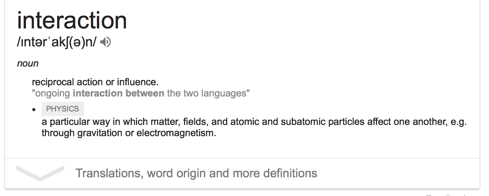

  
```{r titleslide, child="components/titleslide.Rmd"}
```


```{r setup, include=FALSE}
library(emo)
library(tidyverse)
library(tidytext)
library(knitr)
library(lubridate)
library(gridExtra)
library(plotly)
library(broom)
opts_chunk$set(echo = TRUE,   
               message = FALSE,
               warning = FALSE,
               collapse = TRUE,
               fig.height = 4,
               fig.width = 8,
               fig.align = "center",
               cache = FALSE)

as_table <- function(...) knitr::kable(..., format='html', digits = 3)
```

---
class: refresher

# Recap 

- tidying up text
- use `genius_album()` to download lyrics of songs
- stop_words - (I, am, be, the, this, what, we, myself)

---
# Overview

- interactions in modelling
- tidy text

---
# Adding interactions to the model



---
# Remember linear regression?

```{r echo = FALSE}
pp <- read_csv("data/paris-paintings.csv")

ggplot(pp, aes(x = Height_in,
               y = Width_in,
               colour = factor(landsALL))) + 
  geom_point(alpha = 0.3) + 
  geom_smooth(method = "lm", se = FALSE) +
  labs(colour = "")
```

---
# Interaction between quantitative and categorical variables

- An interaction term is needed in a model if the linear relationship is different for the response vs quantitative variable for different levels of the categorical variable. 
- That is, a different *slope* needs to be used/estimated for each level. 

---
# Interaction between quantitative and categorical variables

- Let's take a look at how this works for the [2015 OECD PISA data](http://www.oecd.org/pisa/data/2015database/).
- The question to be answered is whether more time spent studying science is associated with higher science scores, and how this varies with enjoyment of science.

---
# PISA data

```{r print-pisa}
pisa_au <- read_csv("data/pisa_au.csv")
pisa_au
```

---
# PISA data

```{r show-specific-pisa}
pisa_au %>%
  select(science_time,
         science,
         science_fun)
```

---
# Interaction between quantitative and categorical variables


```{r read-pisa, echo=FALSE}

library(labelled)
pisa_au_science <- pisa_au %>% 
  filter(science_fun < 5) %>%
  filter(!is.na(science_time)) %>% 
  select(science, 
         science_fun, 
         science_time, 
         stuweight) %>%
  mutate(science_fun = to_factor(science_fun, 
                                 ordered = TRUE, 
                                 drop_unused_labels = TRUE)) %>%
  mutate(science_time = as.numeric(science_time)) %>%
  filter(science_time > 0)
  
ggplot(pisa_au_science, 
       aes(x = science_time, 
           y = science,
           colour = science_fun)) + 
  geom_point(alpha = 0.1) + 
  scale_colour_brewer("Enjoy science", 
                      palette = "Dark2") +
  facet_wrap(~science_fun, 
             ncol = 2) + 
  scale_x_log10() +
  # geom_smooth(method="lm", se=FALSE) + 
  theme(legend.position = "bottom") + 
  xlab("Time spent studying science per week (mins") + 
  ylab("Synthetic science score")
```

---
# There are two possible models:

$y_i = \beta_0+\beta_1x_{i1}+\beta_2x_{i2}+\varepsilon_i$ (Model 1)

$y_i = \beta_0+\beta_1x_{i1}+\beta_2x_{i2}+\beta_3x_{i1}*x_{i2}+\varepsilon_i$ (Model 2)

- $y=$ science score
- $x_1=$ science study time
- $x_2=$ science enjoyment. 

Model 2 has an interaction term.  This means that the slope will be allowed to vary for the different levels of the categorical variables, science_fun.

---
# Note on modelling

*Note:* Ordered factors are treated as "numeric" in the default model fit, so we should convert `science_fun` to be an unordered categorical variable. Also, `science_time` is heavily skewed so should be transformed.

---

```{r pisa-science}
pisa_au_science_log10 <- pisa_au_science %>%
  mutate(log_science_time = log10(science_time)) %>%
  mutate(science_fun_c = factor(science_fun, ordered = FALSE))

mod1 <- lm(science ~ log_science_time + science_fun_c, #<<
           data = pisa_au_science_log10, 
           weights = stuweight)

mod2 <- lm(science ~ log_science_time * science_fun_c, #<<
           data = pisa_au_science_log10, 
           weights = stuweight)
```

---

```{r pisa-science-show}
tidy(mod1)
tidy(mod2)
```

---
# Five minute challenge

- Write out the equations for both models. (Ignore the log transformation.)
- Make a **hand** sketch of both models.

---
# Which is the better model?

```{r glance-models}
glance(mod1)
glance(mod2)
```

`r emo::ji("shocked")` they are both pretty bad! The interaction model (mod2) is slightly better but its really not.

---
# Five minute challenge

Using the PISA data: How does science score relate to text anxiety and gender?

- Make a plot of science by anxtest, coloured by gender. Does it look like an interaction term might be necessary?
- Try an interaction between gender and anxtest. 
- Which is the better model?

```{r cd-five}
library(countdown)
countdown(minutes = 5)
```


---
# Model building, Goal:

The simplest model possible that provides similar predictive accuracy to most complex model.

---
# Model building, Approach:

- Start simply, fit main effects models (single best variable, adding several more variables independently) and try to understand the effect that each has in the model. 
- Explore transformations with the aim to build a stable foundation of explanatory variables for the model.
- Check model diagnostics, residual plots.
- Explore two variable interactions, and understand effect on model.
- Explore three variable interactions.
- Use model goodness of fit to help decide on final. There may be more than one model that are almost equally as good.

---
# Some asides on model building

- Ideally, values of explanatory variables cover all possible combinations in their domain. 
- There should *not be any association between explanatory variables*. 
- If there is, then the there is more uncertainty in the parameter estimates. 
- Its like building a table with only two legs, that table would be a bit wobbly, and unstable. 

---
# Some asides on model building

- A work around is to first regress one explanatory variable on the other, and add the residuals from this fit to the model, instead of the original variable. 
- That is, suppose $X_1, X_2$ are strongly linearly associated, then model $X_2\sim b_0+b_1X_1+e$, and use $e$ (call it $X^*_2$) in the model instead of $X_2$. 
- You would then only be using the part of $X_2$ that is not related to $X_1$ to expand the model. 
- This approach can be used for multiple explanatory variables that are associated. 

---
class: transition
# Your Turn:

Build the best model you can for science scoreby exploring  these variables: 

- math score
- reading score
- tvs
- books
- breakfast

Feel free to choose others. (Code provided in exercise is just a sample, and needs to be modified.)

---
class: transition
# Sentiment analysis

Sentiment analysis tags words or phrases with an emotion, and summarises these, often as the positive or negative state, over a body of text. 

---
# Sentiment analysis: examples

- Examining effect of emotional state in twitter posts
- Determining public reactions to government policy, or new product releases
- Trying to make money in the stock market by modeling social media posts on listed companies
- Evaluating product reviews on Amazon, restaurants on zomato, or travel options on TripAdvisor

---
# Lexicons

The `tidytext` package has a lexicon of sentiments, based on four major sources: [AFINN](http://www2.imm.dtu.dk/pubdb/views/publication_details.php?id=6010), [bing](https://www.cs.uic.edu/~liub/FBS/sentiment-analysis.html), [Loughran](https://sraf.nd.edu/textual-analysis/resources/#LM%20Sentiment%20Word%20Lists), [nrc](http://saifmohammad.com/WebPages/NRC-Emotion-Lexicon.htm)

---
# emotion

What emotion do these words elicit in you?

- summer
- hot chips
- hug
- lose
- stolen
- smile

---
# Different sources of sentiment

- The `nrc` lexicon categorizes words in a binary fashion ("yes"/"no") into categories of positive, negative, anger, anticipation, disgust, fear, joy, sadness, surprise, and trust. 
- The `bing` lexicon categorizes words in a binary fashion into positive and negative categories. 
- The `AFINN` lexicon assigns words with a score that runs between -5 and 5, with negative scores indicating negative sentiment and positive scores indicating positive sentiment.

---

# Different sources of sentiment
```{r get-sentiment-afinn}
get_sentiments("afinn")
```

---
# Sentiment analysis

- Once you have a bag of words, you need to join the sentiments dictionary to the words data. 
- Particularly the lexicon `nrc` has multiple tags per word, so you may need to use an "inner_join". 
- `inner_join()` returns all rows from x where there are matching values in y, and all columns from x and y. 
- If there are multiple matches between x and y, all combination of the matches are returned.

---
# Exploring sentiment in Jane Austen

`janeaustenr` package contains the full texts, ready for analysis for for Jane Austen's 6 completed novels: 

1. "Sense and Sensibility"
2. "Pride and Prejudice"
3. "Mansfield Park"
4. "Emma"
5. "Northanger Abbey"
6. "Persuasion"


---
# Exploring sentiment in Jane Austen

```{r show-jane-austen}
library(janeaustenr)
library(stringr)

tidy_books <- austen_books() %>%
  group_by(book) %>%
  mutate(linenumber = row_number(),
         chapter = cumsum(str_detect(text, 
                                     regex("^chapter [\\divxlc]", 
                                           ignore_case = TRUE)))) %>%
  ungroup() %>%
  unnest_tokens(word, text)
```

---

# Exploring sentiment in Jane Austen
```{r print-tidy-ooks}
tidy_books
```

---
# Count joyful words in "Emma"

```{r count-joy}
nrc_joy <- get_sentiments("nrc") %>% 
  filter(sentiment == "joy")

tidy_books %>%
  filter(book == "Emma") %>%
  inner_join(nrc_joy) %>%
  count(word, sort = TRUE)
```

---
# Count joyful words in "Emma"

"Good" is the most common joyful word, followed by "young", "friend", "hope". 

All make sense until you see "found". 

Is "found" a joyful word?

---
# Your turn: go to rstudio.cloud

- What are the most common "anger" words used in Emma?
- What are the most common "surprise" words used in Emma?

---
# Comparing lexicons

.pull-left[
- All of the lexicons have a measure of positive or negative. 
- We can tag the words in Emma by each lexicon, and see if they agree. 
]

.pull-right[
```{r compare-sentiments}
nrc_pn <- get_sentiments("nrc") %>% 
  filter(sentiment %in% c("positive", 
                          "negative"))

emma_nrc <- tidy_books %>%
  filter(book == "Emma") %>%
  inner_join(nrc_pn)

emma_bing <- tidy_books %>%
  filter(book == "Emma") %>%
  inner_join(get_sentiments("bing")) 

emma_afinn <- tidy_books %>%
  filter(book == "Emma") %>%
  inner_join(get_sentiments("afinn"))
```
]

---
# Comparing lexicons

```{r show-lexi} 
emma_nrc
```

---
# Comparing lexicons

```{r show-lexi-afinn} 
emma_afinn
```


---
# Comparing lexicons

```{r compare-sentiments-show}
emma_nrc %>% count(sentiment) %>% mutate(n / sum(n))

emma_bing %>% count(sentiment) %>% mutate(n / sum(n))
```

---
# Comparing lexicons

```{r compare-sentiments-more}
emma_afinn %>% 
  mutate(sentiment = ifelse(value > 0, 
                            "positive", 
                            "negative")) %>% 
  count(sentiment) %>% 
  mutate(n / sum(n))

```

---
class: transition
# Your turn: Exercise 2

- Using your choice of lexicon (nrc, bing, or afinn) compute the proportion of positive words in each of Austen's books.
- Which book is the most positive? negative?


---
# Example: Simpsons

Data from the popular animated TV series, The Simpsons, has been made available on [kaggle](https://www.kaggle.com/wcukierski/the-simpsons-by-the-data/data). 

- `simpsons_script_lines.csv`: Contains the text spoken during each episode (including details about which character said it and where)
- `simpsons_characters.csv`: Contains character names and a character id

---
# The Simpsons

```{r read-scripts}
scripts <- read_csv("data/simpsons_script_lines.csv")
chs <- read_csv("data/simpsons_characters.csv")
sc <- left_join(scripts, chs, by = c("character_id" = "id"))

sc
```

---
# count the number of times a character speaks

```{r count-names}
sc %>% count(name, sort = TRUE)
```

---
# missing name?

```{r explore-missing}
sc %>% filter(is.na(name))
```


---
# Simpsons Pre-process the text

```{r process-simpsons-s1}
sc %>%
  unnest_tokens(output = word, 
                input = spoken_words)
```

---
# Simpsons Pre-process the text

```{r process-simpsons-s2}
sc %>%
  unnest_tokens(output = word, 
                input = spoken_words) %>%
  anti_join(stop_words)
```

---
# Simpsons Pre-process the text

```{r process-simpsons-s3}
sc %>%
  unnest_tokens(output = word, 
                input = spoken_words) %>%
  anti_join(stop_words) %>%
  count(word, sort = TRUE) %>%
  filter(!is.na(word))
```

---
# Simpsons Pre-process the text

```{r process-simpsons-s4}
sc_top_20 <- sc %>%
  unnest_tokens(output = word, 
                input = spoken_words) %>%
  anti_join(stop_words) %>%
  count(word, sort = TRUE) %>%
  filter(!is.na(word)) %>%
  mutate(word = factor(word, 
                       levels = rev(unique(word)))) %>%
  top_n(20)
```

---
# Simpsons plot most common words

.left-code[
```{r process-simpsons-s5, eval = FALSE}
ggplot(sc_top_20,
       aes(x = word, 
           y = n)) +
  geom_col() +
  labs(x = '', 
       y = 'count', 
       title = 'Top 20 words') +
  coord_flip() + 
  theme_bw()
```  
]


.right-plot[
```{r process-simpsons-s5-out, ref.label = 'process-simpsons-s5', echo = FALSE, out.width = "100%"}

```
]

---
# Tag the words with sentiments


Using AFINN words will be tagged on a negative to positive scale of -1 to 5.
]

.pull-left[
```{r tag-sentiments}
sc_word <- sc %>%
  unnest_tokens(output = word, 
                input = spoken_words) %>%
  anti_join(stop_words) %>%
  count(name, word) %>%
  filter(!is.na(word))
```
]

.pull-right[
```{r tag-sentiments-print}
sc_word
```
]

---
# Tag the words with sentiments
```{r tag-sentiments2}
sc_s <- sc_word %>% 
  inner_join(get_sentiments("afinn"), by = "word")

sc_s
```

---
# Examine Simpsons characters

```{r summarise-simpsons-characters}
sc_s %>% 
  group_by(name) %>% 
  summarise(m = mean(value)) %>% 
  arrange(desc(m))
```

---
# Examine Simpsons characters: Focus on the main characters.

```{r keep-main-chars}
keep <- sc %>% count(name, 
                     sort=TRUE) %>%
  filter(!is.na(name)) %>%
  filter(n > 999)

sc_s %>% 
  filter(name %in% keep$name) %>% 
  group_by(name) %>% 
  summarise(m = mean(value)) %>% 
  arrange(m)
```

---
class: transition
# Your turn: Exercise 3

1. Bart Simpson is featured at various ages. How has the sentiment of his words changed over his life?

2. Repeat the sentiment analysis with the NRC lexicon. What character is the most "angry"? "joyful"?

---
# (if time) Example: AFL Finals tweets

The `rtweet` package allows you to pull tweets from the archive. It gives only the last 6-9 days worth of data. You need to have a twitter account, and you need to create an app (its really basic) in order to pull twitter data. The instructions that come from this package (https://rtweet.info) are pretty simple to follow.

---
# (if time) Example: AFL Finals tweets


Given that it is AFL final week, I thought it might be interesting to look at tweets that use the hashtag "#AFLFinals". Once you have a developer account, this is as simple as 

```
afl <- search_tweets(
  "#AFLFinals", n = 20000, include_rts = FALSE
)
```

---
# (if time) Example: AFL Finals tweets

Here is the data collected in the previous year's AFL finals.

```{r load-afl}
afl <- read_rds("data/afl_twitter_past.rds")
afl
```

---
# Your turn

- When was the final played last year?
- What is the range of dates of this data?
- Who is the most frequent tweeter using this hashtag?
- Are there some days that have more tweets than others?
- Are there some hours of the day that are more common tweet times?
]

---
# Your Turn: Sentiment analysis

We need to break text of each tweet into words, tag words with sentiments, and make a cumulative score for each tweet.

- Which tweeter is the most positive? negative?
- Is there a day that spirits were higher in the tweets? Or when tweets were more negative?
- Does the tweeter `aflratings` have a trend in positivity or negativity?


---
  
```{r endslide, child="components/endslide.Rmd"}
```

???


```{r pipeline, eval=FALSE, echo = FALSE}
quiz(
  question("How would you describe the relationship between science score and time spent studying?",
    answer("Weak", correct = TRUE),
    answer("Moderate"), 
    answer("Strong")),
  question("What do these lines of code do?   `filter(science_fun < 5) %>%
  filter(!is.na(science_time))`", 
    answer("Remove missing values", correct = TRUE),
    answer("Remove extreme values, and missing values"),
    answer("I have no idea")),
  question("Why was `science_time` transformed to a log scale?",
    answer("It has a right-skewed distribution.", correct = TRUE),
    answer("It has a left-skewed distribution."),
    answer("It is symmetric")),
  question("Why were 0 values of `science_time` removed?",
    answer("It could be argued that these are most likely missing values", correct = TRUE),
    answer("They are outliers affecting the modeling"),
    answer("No-one would be able to study science 0 minutes per week"))
)
```

