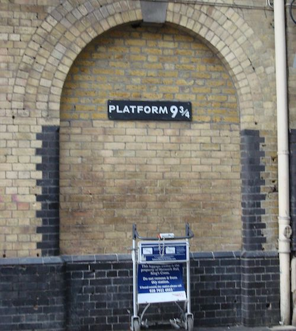

  
```{r titleslide, child="components/titleslide.Rmd"}
```


```{r setup, include=FALSE}
library(tidyverse)
library(knitr)
library(kableExtra)
library(emo)
library(ggraph)
library(igraph)
library(tidygraph)
library(knitr)
library(lubridate)
library(gridExtra)
library(plotly)
opts_chunk$set(echo = TRUE,   
               message = FALSE,
               warning = FALSE,
               collapse = TRUE,
               fig.height = 4,
               fig.width = 8,
               out.width = "100%",
               fig.align = "center",
               cache = FALSE)

as_table <- function(...) knitr::kable(..., format='html', digits = 3)
```


---
# Announcements

- Project deadlines:
  - **Deadline 2 (<DATE>) **:  Electronic copy of your data, and a page of data description, and cleaning done, or needing to be done.
  - **Deadline 3 (<DATE>) **:  Final version of story board uploaded. 
- Practical exam: **<DATE> in class at <TIME>**

---
class: refresher

# recap: Last week on tidy text data


---
# Network analysis

--

# A description of phone calls

- Johnny --> Liz
- Liz --> Anna
- Johnny -- > Dan
- Dan --> Liz
- Dan --> Lucy

---
# As a graph

```{r make-call-graph, echo = FALSE}
simple <- make_graph('bull')
V(simple)$name <- c('Johnny', 'Dan', 'Liz', 'Lucy', 'Anna')

example <- as_tbl_graph(simple)
ggraph(example, layout = 'graphopt') + 
    geom_edge_link(aes(start_cap = label_rect(node1.name),
                       end_cap = label_rect(node2.name)), 
                   arrow = arrow(length = unit(4, 'mm'))) + 
    geom_node_text(aes(label = name))

```

---
class: transition

# And as an association matrix

[DEMO]

---
# Nodes and edges?

Netword data can be thought of as two related tables, **nodes** and **edges**:

- **nodes** are connection points
- **edges** are the connections between points

---
# Example: Mad Men. (Nodes = characters from the series)

```{r mm-show-nodes, echo=FALSE}
library(geomnet)
data(madmen)
as_tibble(madmen$vertices)
```

---
# Example: Mad Men. (Edges = how they are associated)

```{r echo=FALSE}
as_tibble(madmen$edges)
```

---
# Why care about these relationships?

- **Telephone exchanges**: Nodes are the phone numbers. Edges would indicate a call was made betwen two numbers.
- **Book or movie plots**: Nodes are the characters. Edges would indicate whether they appear together in a scene, or chapter. If they speak to each other, various ways we might measure the association.
- **Social media**: nodes would be the people who post on facebook, including comments. Edges would measure who  comments on who's posts.

---
# Drawing these relationships out:

One way to describe these relationships is to provide association matrix between many objects. 

```{r draw-association, echo = FALSE, out.width = "80%"}
include_graphics("images/network_data.png")
```

(Image created by Sam Tyner.) 
---
# Example: Madmen

```{r show-madmen-logo, echo = FALSE}
include_graphics("images/Mad-men-title-card.jpg")
```

*Source: [wikicommons](https://en.wikipedia.org/wiki/Mad_Men#/media/File:Mad-men-title-card.jpg)*

---
# Generate a network view

- Create a layout (in 2D) which places nodes which are most related close,
- Plot the nodes as points, connect the appropriate lines
- Overlaying other aspects, e.g. gender

---
# introducing `tidygraph` and `ggraph`

.pull-left[
```{r make-madmen-graph}
library(tidygraph)
library(ggraph)

glimpse(madmen)
```
]

.pull-right[
```{r print-madmen, echo = FALSE}
MMnet <- madmen$edges %>%
  rename(from_id = Name1, to_id = Name2) %>%
  mutate_all(as.character) %>%
  full_join(mutate(madmen$vertices, label = as.character(label)), 
            by = c("from_id" = "label"))

```
]

---
# How to plot

```{r ggraph-madmen}
# create plot
set.seed(5556677)
ggplot(data = MMnet, aes(from_id = from_id, to_id = to_id)) +
  geom_net(aes(colour = Gender), layout.alg = "kamadakawai",
    size = 2, labelon = TRUE, vjust = -0.6, ecolour = "grey60",
    directed =FALSE, fontsize = 3, ealpha = 0.5) +
    scale_colour_manual(values = c("#FF69B4", "#0099ff")) +
    xlim(c(-0.05, 1.05)) +
    theme_net() +
    theme(legend.position = "bottom")

```

---
# Which actor was most connected?

```{r most-connected}
madmen$edges %>% 
  gather(X, Name, Name1, Name2) %>% 
  count(Name, sort=TRUE)
```

---
# What do we learn?

- Joan Holloway had a lot of affairs, all with loyal partners except for his wife Betty, who had two affairs herself
- Followed by Woman at Clios party

---
# Example: American college football

Early American football outfits were like Australian AFL today!

```{r show-football, echo = FALSE, out.width = "50%"}
include_graphics("images/1480px-Unknown_Early_American_Football_Team.jpg")
```

*Source: [wikicommons](https://commons.wikimedia.org/wiki/File:Unknown_Early_American_Football_Team.jpg)*

---
# Example: American college football


Fall 2000 Season of [Division I college football](https://en.wikipedia.org/wiki/NCAA_Division_I). 
- Nodes are the teams, edges are the matches. 
- Teams are broken into "conferences" which are the primary competition, but they can play outside this group.

```{r  make-football-graph, echo=FALSE}
# data step: merge vertices and edges
ftnet <- full_join(
  football$edges, football$vertices,
  by = c("from" = "label")
) %>%
  mutate(schools = ifelse(value == "Independents", from, ""))

```

---
# Example: American college football

```{r print-football}
ggplot(data = ftnet,
       aes(from_id = from, to_id = to)) +
  geom_net(
    aes(
      colour = value, group = value,
      linetype = factor(1-same.conf),
      label = schools
    ),
    linewidth = 0.5,
    size = 5, vjust = -0.75, alpha = 0.3,
    layout.alg = 'fruchtermanreingold'
  ) +
  theme_net() +
  theme(legend.position = "bottom") +
  scale_colour_brewer("Conference", palette = "Paired")
```

---

```{r print-gg-foot-graph, echo = FALSE, fig.width = 10, fig.height = 8, out.width = "80%"}
# gg_foot_graph
```

---
# What do we learn?

- Remember layout is done to place nodes that are more similar close together in the display. 
- The colours indicate conference the team belongs too. For the most part, conferences are clustered, more similar to each other than other conferences. 
- There are some clusters of conference groups, eg Mid-American, Big East, and Atlantic Coast
- The Independents are independent
- Some teams play far afield from their conference.

---
# Example: Harry Potter characters

```{r show-hp-platform, echo = FALSE, out.width = "50%"}

```

*Source: [wikicommons](https://commons.wikimedia.org/wiki/File:Harry_Potter_Platform_Kings_Cross.jpg)*

---
# Example: Harry Potter characters

There is a connection between two students if one provides emotional support to the other at some point in the book. 
- Code to pull the data together is provided by Sam Tyner [here](https://github.com/sctyner/geomnet/blob/master/README.Rmd#harry-potter-peer-support-network).

```{r read-hp, echo=FALSE}
hp_chars <- read_csv(here::here("slides/data/hp_chars.csv"))
hp_edges <- read_csv(here::here("slides/data/hp_edges.csv"))

# for each book, expand the edges data and join it to characters
hp_all <- hp_edges %>%
  group_by(book) %>%
  group_map(~ full_join(.x, hp_chars, by = c("name1" = "name"))) %>%
  bind_rows(.id = "book") %>% 
  rename(from_id = name1, 
         to_id = name2)
```

---
# Harry potter data as nodes and edges

```{r print-hp}
hp_all
```

---
# Let's plot the characters

```{r echo=TRUE}

ggplot(data=hp_all, 
       aes(from_id = from_id, to_id = to_id)) + 
  geom_net(fiteach=T, directed = T, size = 3, linewidth = .5, 
           ealpha = .5, labelon = T, fontsize = 3, repel = T, 
           labelcolour = "black", arrowsize = .5, singletons = FALSE,
           aes(colour = house, group = house, shape = gender)) + 
  scale_colour_manual(values = c("#941B08","#F1F31C", 
                                 "#071A80", "#154C07")) + 
  facet_wrap(~book, labeller = "label_both", ncol=3) + 
  theme_net() + theme(panel.background = element_rect(colour = 'black'), legend.position="bottom")
```

---
# Let's plot the characters

```{r ggraph-hp}
```


---
class: transition
# Your turn: rstudio exercise

.pull-left[
- Read in last semesters class data, which contains `s1_name` and `s2_name` are the first names of class members, and tutors, with the latter being the "go-to" person for the former. 
- Write the code to produce a class network that looks something like below
]

.pull-right[
```{r}
include_graphics("images/class_network.png")
```
]

## Simpsons

Your turn to make a network diagram for the Simpsons. The measure of association will be "that the two characters had lines in the same episode together".

- How many characters appeared only in one episode? (You will want to drop these)
- Write code to search if a character has a line in an episode
- Compile a dataset of episode (rows) and character (columns) which is a binary matrix where 1 indicates the character had a line in the episode, and 0 is otherwise
- Gather the matrix into long form, with these columns: `episode`, `character`, `had a line` (0,1)
- Filter the rows with `had a line` equal to 1.
- Count the number of times the pair of characters appeared. This now forms your edge set, with an additional column of the strength of the relationship
- Make your network display

---
  
```{r endslide, child="components/endslide.Rmd"}
```
