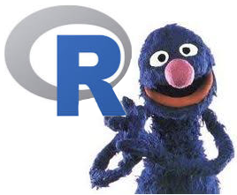
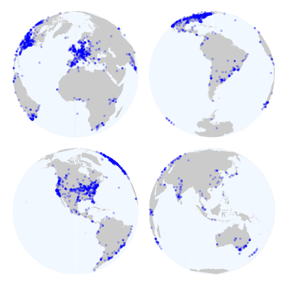

```{r titleslide, child="components/titleslide.Rmd"}
```

```{r setup, include=FALSE}
library(tidyverse)
library(knitr)
library(kableExtra)
library(countdown)
opts_chunk$set(echo = FALSE,   
               message = FALSE,
               warning = FALSE,
               collapse = TRUE,
               fig.height = 4,
               fig.width = 8,
               fig.align = "center",
               cache = FALSE)
# options(htmltools.dir.version = FALSE)
```

---

background-image: url(https://media.giphy.com/media/OkJat1YNdoD3W/giphy.gif)
background-size: contain
background-position: 50% 50%
class: center, bottom, bg-yellow

---

# What is this course?

This is a course on introduction to **data analysis**. 

--

You can also think of it as introduction to data science.

--

**Q - What data analysis background does this course assume?**  

A - None.

--

**Q - Is this an intro stat course?**  
A - Statistics $\ne$ data science. BUT they are closely related. This course is a great way to get started with statistics. But is **not** your typical high school statistics course.

--

**Q - Will we be doing computing?**   
A - Yes.

---

# What is this course?


**Q - Is this an intro Computer Science course?**  
A - No, but there are some shared themes.

--

**Q - What computing language will we learn?**  
A - R.

--

**Q: Why not language X?**  
A: We can discuss that over `r emo::ji("coffee")`.

--

Taught as a **lectorial** (Lecture + Tutorial)

--

It is **not** (typically) recorded because **you** are doing work

--

You have to show up to class to practice!

---
class: motivator

# The _language_ of data analysis

.left-code[
This course is brought to you today by the letter "R"!
]

.right-plot[
```{r grover, out.width = "70%", echo = FALSE}

```

Grover image sourced from https://en.wikipedia.org/wiki/Grover.
]

---

# What is R? 

.blockquote[
R is a language for data analysis. If R seems a bit confusing, disorganized, and perhaps incoherent at times, in some ways that's because so is data analysis.

-- Roger Peng, 12/07/2018
]

---
# Why R?

- __Free__
- __Powerful__: Over 15000 contributed packages on the main repository (CRAN), as of March 2020, provided by top international researchers and programmers. 
- __Flexible__: It is a language, and thus allows you to create your own solutions
- __Community__: Large global community friendly and helpful, lots of resources

---

# Community

.left-code[
R Consortium conducted a survey of users 2017.

These are the locations of respondents to an R Consortium survey conducted in 2017.

**8% of R users are between 18-24 BUT 45% of R users are between 25-34!**
]

.right-plot[
```{r r-community, out.width = "90%"}

```
]

---
#  Sample of Australian organisations/companies that sent employees to [useR! 2018](https://user2018.r-project.org)

.blockquote[
ABS, **CSIRO**, ATO, **Microsoft**, Energy Qld, Auto and General, Bank of Qld, BHP, AEMO, Google, Flight Centre, Youi, Amadeus Investment Partners,  Yahoo, Sydney Trains, Tennis Australia, Rio Tinto, Reserve Bank of Australia, PwC, Oracle, **Netflix**, NOAA Fisheries, NAB, Menulog, Macquarie Bank, Honeywell, Geoscience Australia, DFAT, DPI, CBA, Bank of Italy, Australian Red Cross Blood Service, **Amazon**, **Bunnings**.
]

---
class: center middle

# R and RStudio

.pull-left[
```{r r-logo, out.width = "100%"}
include_graphics("images/Rlogo.png")
```
]


.pull-right[
```{r rstudio-logo, out.width = "100%"}
include_graphics("images/rstudio-logo.png")
```

]
---
class: informative

# What is R/RStudio?

- R is a statistical programming language

- RStudio is a convenient interface for R (an integrated development environment, IDE)

--

.blockquote[
If R were **an airplane**, RStudio would be **the airport**, providing many, many supporting services that make it easier for you, the pilot, to take off and go to awesome places. Sure, you can fly an airplane without an airport, but having those runways and supporting infrastructure is a game-changer

-- [Julie Lowndes](http://jules32.github.io/resources/RStudio_intro/) 
]

---
class: transition middle

# Let's take a tour of R and RStudio

---
class: bg-main1
background-image: url(images/rstudio-screenshot.png)
background-size: contain
background-position: 50% 50%
class: center, bottom, white

???

- __Source code editor__: This is where you edit your script! Experiment with writing your data analysis pipeline, ... You can have multiple files open, there are useful shortcuts (eg "Run", "Knit"), code is highlighted usefully and there is tab-completion when you start typing. *Also, if you want to look at any of the data you have read or created, it can be viewed in a tab on this pane.*
- __Console window__: This is where the code is executed. There is a prompt ">" which says *R is waiting for your command*. You don't actually need to type anything in this pane, you can run code directly from the Editor pane. The functions will show up in this window, and the results will be here. (Although, if you use an R notebook the result will show up in that notebook.)
- __Help__: *?function* will show the help pages for the function here.
- __Plot__: Plots you ask R to make will show up here, and you can zoom to make them bigger in a separate window if you want.
- __Environment__: Data that you have read into R, or data or functions that you create will be listed here. **When you quit R, you will be asked if you want to save the environment. I suggest that you always answer NO.** Because we are scripting everything it is always easy to re-create the objects in the environment. The only time it can be useful is if you have created something that took a while, but a better option is to save this object to a file, and read it in at the start of the next R session.


---
class: transition

# End of part 1 of Lecture 1A

---
class: transition

# Start of part 2 of Lecture 1A


---
# Let's start writing...

Go to [http://bit.ly/etc1010-s1-2020](http://bit.ly/etc1010-s1-2020) to log in to RStudio cloud.

Log in with Google / GitHub / other credentials.

.small[
This section is based on an exercise from [data science in a box by Mine Çetinkaya-Rundel](https://github.com/rstudio-education/datascience-box/blob/c2e3ed13417c896fb49b78fd4a5a551392286351/extras/exercises/01-unvotes/unvotes.Rmd)
]

---
# Create your first data visualisation

- Once you log on to RStudio Cloud, click on this course's workspace "ETC1010 2020 semester 1"
- You should see a project called "UN Votes", click on the xx icon. This will create a copy of the project, and launch it.
- In the Files pane in the bottom right corner, open the file called `unvotes.Rmd`. Then click on the "Knit" button.
- Go back to the file and change your name on top (in the `yaml` -- we'll talk about what this means later) and knit again.
- Change the country names to those you're interested in. Spelling and capitalization should match the data so take a peek at the Appendix to see how the country names are spelled. Knit again. And voila, your first data visualization!


---
class: transition

# End of part 2 of Lecture 1A

---
class: transition

# Start of part 3 of Lecture 1A

---
# R essentials: A short list (for now)

- Functions are (most often) verbs, followed by what they will be applied to in parentheses:

```{r do-what, eval=FALSE, echo = TRUE}
do_this(to_this)
do_that(to_this, to_that, with_those)
```

--

For example:

--

```{r mean-example, echo = TRUE}
mean(c(1,2,1,2))
```

---
# R essentials: A short list (for now)


- Columns (variables) in data frames are accessed with `$`:

```{r eval=FALSE, echo = TRUE}
dataframe$var_name
```

--

For example:

--

```{r show-mean, echo = TRUE}
starwars$name
```

---
# R essentials: A short list (for now)


- Packages are installed with the `install.packages` function and loaded with the `library` function, once per session:

```{r eval=FALSE, echo = TRUE}
install.packages("package_name")
library(package_name)
```


---
# What can you do at the end of semester?

Some of our best final projects:

* [instagram](https://ebsmonash.shinyapps.io/Instagram/)
* [babynames](https://ebsmonash.shinyapps.io/BabyNames/)
* [oztourism](https://ebsmonash.shinyapps.io/OzTourism/)
* [salary gaps](https://dmac.dicook.org/project/project_python_r/project#introduction)
* [FantasyAFL](https://ebsmonash.shinyapps.io/FantasyAFL/)

---
# What you need to learn

.blockquote[
Data preparation accounts for about 80% of the work of data scientists 

-- [Gil Press, Forbes 2016](https://www.forbes.com/sites/gilpress/2016/03/23/data-preparation-most-time-consuming-least-enjoyable-data-science-task-survey-says/##47cbbbf46f63)

]
--

## Data Preparation

* One of the least taught parts of data science, and business analytics, and yet it is what data scientists spend most of their time on. 
* By the end of this semester, you will have the tools to be more efficient and effective in this area, so that you have more time to spend on your mining and modeling.

---

# Learning objectives

The learning goals associated with this unit are to:

1. Learn to read different data formats, learn about tidy data and wrangling techniques
2. Apply effective visualisation and modelling to understand relationships between variables, and make decisions with data
3. Develop communication skills using reproducible reporting.

---

# Philosophy

.blockquote[
If you feed a person a fish, they eat for a day. If you teach a person to fish, they eat for a lifetime.
]

Whatever I do in the data analysis that is shown to you during the class, you can do it, too.

---
class: informative
# Course Website: ida.numbat.space

- "ida" = Introduction to Data Analysis
- "numbat" = Non-Uniform-Monash-Business-Analyics-Team
- [unit guide](https://unitguidemanager.monash.edu/view?unitCode=ETC1010&tpCode=S1-01&tpYear=2020) (authority on course structure).
- Lecture notes for each class
- Assignment and project instructions
- Textbook + other online resources related to topics
- Consultation times (7 x 1Hr consultations)
- demo

---

# Using laptops

- We will start out using the rstudio cloud server.

- In the future we will have R and Rstudio installed locally.

- This course is also set up as a "MoVE unit", which means you can borrow a laptop
from the university for class hours.

- It is also possible to set up R and RStudio onto a USB stick to use with your borrowed laptop.


---
# Grading

```{r grade-table, results = "asis"}
grade <- data.frame(
  Assessment = c("Reading Quiz", "Lab Exercise"),
  Weight = c("5%", "5%"),
  Task = c("Complete prior to each class, for the first 8 weeks on ED. Quiz needs to be completed by class time. No mulligans. One can be missed without penalty.",
           "Each class period will have a quiz to be completed individually. Two can be missed without penalty.")
)

kable(grade, 
      format = "html",
      align = c("c")) %>% 
  kable_styling(bootstrap_options = "striped",
                fixed_thead = T)

```

---

# Grading Example: Reading Quiz

- Before 12pm (noon) on Wednesday, you need to complete the 5 question **reading quiz** on ED
- Before 4pm **next Monday** You need to complete the 5 question **reading quiz** on ED.

---

# Grading Example: Lab Exercise

There is time at the end of class to complete **lab exercise on ED**:

- Before 6pm **Next Monday (16th March)**, you need to complete the 10 question **Lab Exercise** on ED
- Before 4pm **Mext Wednesday (18th March)** you need to complete the 10 question **Lab Exercise** on ED. 

---
# Grading

```{r grade0remain}
grade_remainder <- data.frame(
  Assessment = c("Assignment", 
                 "Mid-Sem Theory + Concept exam", 
                 "Data Analysis Exam",
                 "Project", 
                 "Final Exam"),
  Weight = c("12%", 
             "8%", 
             "10%", 
             "10%", 
             "50%"),
  Task = c("Teamwork, data analysis challenge, due in weeks 4, and 8",
           "Due week 6",
           "Due week 11",
           "Due week 11",
           "TBA")
)

kable(grade_remainder,
      format = "html") %>% 
  kable_styling(bootstrap_options = "striped",
                fixed_thead = T)
```


---

# Textbook

.pull-left[
```{r r4ds-img, out.width = "80%"}
include_graphics("https://raw.githubusercontent.com/hadley/r4ds/master/cover.png")
```
]

.pull-right[
* Free
* Written by authors of [Tidyverse R packages](http://tidyverse.org/)
]

---
class: informative
# Ed System

- Online quizzes
- Conduct discussions
- Ask questions about the course material and exercises, and turn in assignments and project. *Only your name and email address are recorded in the ED systems.*

--

(DEMO)

---
background-image: url(https://imgs.njtierney.com/edstem.png)
background-size: contain
class: center, bottom, bg-indigo

---
# Tips for asking questions

- First search existing discussion for answers. If the question has already been answered, you're done! If it has already been asked but you're not satisfied with the answer, add to the thread. 

--

- Give your question context from course concepts not course assignments.
    - Good context: "I have a question on filtering data"
    - Bad context: "I have a question on Assignment 1"

---
# Tips for asking questions

- Be precise in your description:
    - Good description: "I am getting the following error and I'm not sure how to resolve it - `Error: could not find function "ggplot"`"
    - Bad description: "R giving errors, help me! Aaaarrrrrgh!" 
- Remember: you can edit a question after posting it.

---
class: informative

# How do you do well in this class

- Do the reading prior to each class period.

--

- Participate actively in this class. 

--

- Ask questions on the **ed**.

---
class: informative
# How do you do well in this class

- Come to consultation if you have questions.

--

- Practice the materials taught in each lectorial by doing more exercises from the textbook.

--

- Be curious, be positive, be engaged. 


---
class: motivator

# Remember:

All information is on the website `r emo::ji("smile")`

--

Post questions on ED **instead of** questions over email


---
#  Diversity & Inclusiveness:

- Intent: Students from all diverse backgrounds and perspectives be well-served by this course, that students' learning needs be addressed both in and out of class, and that the diversity that the students bring to this class be viewed as a resource, strength and benefit. 

- It is my intent to present materials and activities that are respectful of diversity: gender identity, sexuality, disability, age, socioeconomic status, ethnicity, race, nationality, religion, and culture. Let me know ways to improve the effectiveness of the course for you personally, or for other students or student groups.

---
# Diversity & Inclusiveness:

- If you have a name and/or set of pronouns that differ from those that appear in your official Monash records, please let me know!

- If you feel like your performance in the class is being impacted by your experiences outside of class, please don't hesitate to come and talk with me. I want to be a resource for you. If you prefer to speak with someone outside of the course, talk to Di Cook, or look at the services available to you in the [Monash student support services](https://www.monash.edu/students/support). 

---
# Diversity & Inclusiveness:

- I (like many people) am still in the process of learning about diverse perspectives and identities. If something was said in class (by anyone) that made you feel uncomfortable, please talk to me about it.

---

# Sharing / Reusing code

- I am well aware that a huge volume of code is available on the web to solve any number of problems.
- Unless I explicitly tell you not to use something the course's policy is that you may make use of any online resources (e.g. StackOverflow) but you must explicitly cite where you obtained any code you directly use (or use as inspiration). This can be as simple as pasting the link in a references section.

---

# Sharing / Reusing code

- Any recycled code not explicitly cited will be treated as plagiarism. 
- Assignment groups may not directly share code with another group. 
- You are welcome to discuss the problems together and ask for advice, but you may not make direct use of code from another team.


---

# Group Assignments

What we expect:

- Conducted according to the [Monash policies](https://www.monash.edu/__data/assets/pdf_file/0011/1098659/Team-Assessment-Guidelines.pdf). 

- Each member of the group completes the entire assignment, as best they can.
- Group members compare answers and combine it into one document for the final asubmission. 
- 25% of the assignment grade will come from peer evaluation. 
- Peer evaluation is an important learning tool. 

---

# Group Assignments: Peer evaluation

Each student will be randomly assigned another team's submission to provide feedback on three things: 

  1. Could you reproduce the analysis? 
  2. Did you learn something new from the other team's approach?
  3. What would you suggest to improve their work?

---

# Group Assignments: Working in groups

- Conflicts can arise in group work.

--

- They can be both productive and destructive. 

--

- Teams need to work on managing conflicts and building on the strengths of all team members. 

---

# Group Assignments: Working in groups

- For each assignment, you will be given the option to comment on the efforts of your other group members. 

--

- If a team member has not contributed to an assignment submission, they might score a 0. 

--

- In this situation the team will need to discuss team function and dysfunction with the instructor.


---
class: transition middle
# Group Assignments

Assignment 1 will be announced at class on Monday Week 2

---
class: transition

# End of Part 3 of Lecture 1A

---
class: transition

# Start of Part 4 of Lecture 1A


---
class: refresher

# Concepts introduced:

.pull-left[

- How to edit R code
- Creating Data Visualisations
- R
- RStudio

]

.pull-right[
- Console
- Using R as a calculator
- Environment
- Loading and viewing a data frame
- Accessing a variable in a data frame
- R functions
]

---
class: bg-main1

# Lab Exercise

Check your knowledge and comprehension by taking your first lab quiz on Ed

Go to the ED page, and complete the lab quiz before next Monday, 16th March.

---

```{r endslide, child="components/endslide.Rmd"}
```


???

### Cheatsheets

RStudio started a trend by writing really concise summaries, and others have added to the collection. You can find the RStudio collection in the "Help" menu on the IDE, and at https://www.rstudio.com/resources/cheatsheets/. 

Start with the [RStudio IDE cheatsheet](https://github.com/rstudio/cheatsheets/raw/master/rstudio-ide.pdf). 

### Using the IDE

- __Source code editor__: This is where you edit your script! Experiment with writing your data analysis pipeline, ... You can have multiple files open, there are useful shortcuts (eg "Run", "Knit"), code is highlighted usefully and there is tab-completion when you start typing. *Also, if you want to look at any of the data you have read or created, it can be viewed in a tab on this pane.*
- __Console window__: This is where the code is executed. There is a prompt ">" which says *R is waiting for your command*. You don't actually need to type anything in this pane, you can run code directly from the Editor pane. The functions will show up in this window, and the results will be here. (Although, if you use an R notebook the result will show up in that notebook.)
- __Help__: *?function* will show the help pages for the function here.
- __Plot__: Plots you ask R to make will show up here, and you can zoom to make them bigger in a separate window if you want.
- __Environment__: Data that you have read into R, or data or functions that you create will be listed here. **When you quit R, you will be asked if you want to save the environment. I suggest that you always answer NO.** Because we are scripting everything it is always easy to re-create the objects in the environment. The only time it can be useful is if you have created something that took a while, but a better option is to save this object to a file, and read it in at the start of the next R session.


