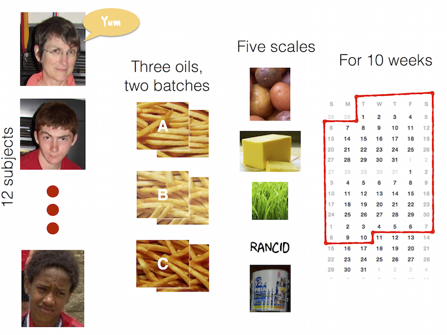

 
```{r titleslide, child="components/titleslide.Rmd"}
```


```{r setup, include=FALSE}
library(tidyverse)
library(knitr)
library(kableExtra)
library(emo)
library(countdown)
opts_chunk$set(echo = FALSE,   
               message = FALSE,
               warning = FALSE,
               collapse = TRUE,
               fig.height = 4,
               fig.width = 8,
               fig.align = "center",
               cache = FALSE)
```

---
class: transition middle

# What is this song?

(Discuss with your neighbour)


---
class: transition middle

# About your instructors


---
# Nick

.pull-left[
* `r emo::ji("mortar_board")` Bachelor of Psychological Sciences UQ
*  `r emo::ji("mortar_board")` PhD in Statistics at QUT. 
* Research: missing data, data visualisation, statistical computing
* R `r emo::ji("package")`: `naniar`, `visdat`, 
* `#rstats` `r emo::ji("microphone")`: Credibly Curious w Saskia Freytag
* `r emo::ji("heart")` outdoors, especially: `r emo::ji("hiking_boot")`, `r emo::ji("man_running")`, and `r emo::ji("man_climbing")`.
]

.pull-right[
```{r img-nick, out.width = "80%"}

```

]


---
# Steph

.pull-left[
* `r emo::ji("mortar_board")` Bachelor of Economics and Bachelor of Commerce from Monash
* Studying a Masters of Statistics at QUT, based at Monash.  
* Loves to read `r emo::ji("book")`, any and all recommendations are welcome.
* Has an R package called [taipan](https://github.com/srkobakian/taipan), and another called [sugarbag](https://github.com/srkobakian/sugarbag).
]

.pull-right[
```{r img-steph, out.width = "80%"}

```

]

---

# Sarah

- `r emo::ji("mortar_board")` MPhil student in Applied Mathematics and Statistics at Monash University. Research predicts mosquito behaviour (ask me for mosquito facts!)
- Commenced in 2017, moved from Adelaide
- Loves figure skating ⛸

---

# Cynthia

.pull-left[
* `r emo::ji("mortar_board")` Bachelor of Commerce with Honours in Economics from Unimelb
* Previously, Research & Tutoring at Unimelb Econ Department
* Now, Research Assistant with SoDa Labs at Monash doing data collection / cleaning / analysis
* Loves climbing, food & my nintendo switch
]

.pull-right[
```{r img-cynthia, out.width = "80%"}

```
]
---

# Nitika

* `r emo::ji("mortar_board")` Bachelor of Bioinformatics
* `r emo::ji("mortar_board")` Master of Bioinformatics
* Current: PhD Student in the Faculty of Medicine Nursing and Health Sciences
* Data Officer with [Monash Data Fluency](https://monashdatafluency.github.io/)
* Research: Bioinformatics analysis with RNA seq data
* `r emo::ji("heart")` Travel, Food, Anime, D&D.

---

# Sherry

.pull-left[
- `r emo::ji("mortar_board")` Bachelor of Commerce 2018
- Honours in Econometrics 2019 with Di Cook 
- Commenced PhD programme 2020
- Created her first ever R package, `quickdraw`
- Loves puzzles games like jigsaws `r emo::ji("jigsaw")`. 
]

.pull-right[
```{r img-sherry, out.width = "80%"}

```
]

---

# Di

.pull-left[
- Professor at Monash University in Melbourne Australia, doing research in statistics, data science, visualisation, and statistical computing. 
- Created the current version of the course
- Likes to play all sorts of sports, tennis, soccer, hockey, cricket, and go boogie boarding.
]

.pull-right[
```{r img-di, out.width = "80%"}
knitr::include_graphics("images/di.png")
```
]


---
class: transition left
# Your Turn: Making the groups

We are going to set up the groups for doing assignment work.

1. Find your name from the list at [this link]()
2. Find the other people in the class with the same quote as you (feel free to wander around the class!)
3. Grab your gear and claim a table to work together at. 

---
class: transition left
# Your Turn: Ask your team mates these questions:

1. What is one food you'd never want to taste again?
2. If you were a comic strip character, who would you be and why?

LASTLY, come up with a name for your team (we have provided a suggested name, but you are free to change it!) and tell this to a tutor, along with the names of members of the team.

```{r countdown-two}
countdown(minutes = 5,
          left = 0, 
          right = 0,
          padding = "2px",
          margin = "2%",
          font_size = "2em",
          play_sound = TRUE)
```

---
# Traffic Light System

```{r tom-cruise, out.width = "90%"}
include_graphics("gifs/help-me-help-you.gif")
```

---
# Traffic Light System

.pull-left.middle[

.red[
# Red Post-it
]

* I need a hand
* Slow down

]

--

.pull-right.middle[
.green[
# Green Post-it
]

* I am up to speed
* I have completed  the thing
]


---
class: refresher

# Recap

- packages are installed with ___ ?
- packages are loaded with ___ ?
- Why do we care about Reproducibility?
- Output + input of rmarkdown
- I have an assignment group
- If I have an assignment group, have recorded my assignment group in the ED survey

---

# Today: Outline

- An aside on learning
- Tidy Data
- Terminology of data
- Different examples of data 
- Steps in making data tidy
- Lots of examples

---

# A note on difficulty

* This is not a programming course - it is a course about **data, modelling, and computing**. 

--

- At the moment, you might be sitting there, feeling a bit confused about where we are, what are are doing, what R is, and how it even works.
- That is OK!

--

- The theory of this class will only get you so far
- The real learning happens from doing the data analysis - the **pressure of a deadline can also help.**

---
# Tidy Data

```{r clean-data-img, echo = FALSE, output = "75%"}
include_graphics("images/cleaning-data.jpg")
```

.blockquote[
You're ready to sit down with a newly-obtained dataset, excited about how it will open a world of insight and understanding, and then find you can't use it. You'll first have to spend a significant amount of time to restructure the data to even begin to produce a set of basic descriptive statistics or link it to other data you've been using.

--John Spencer 
([Measure Evaluation](https://www.measureevaluation.org/resources/newsroom/blogs/tidy-data-and-how-to-get-it))
]

---
# Tidy Data

```{r clean-data-img-2, echo = FALSE, output = "75%"}
include_graphics("images/cleaning-data.jpg")
```


.blockquote[
"Tidy data" is a term meant to provide a framework for producing data that conform to standards that make data easier to use. Tidy data may still require some cleaning for analysis, but the job will be much easier.

--John Spencer 
([Measure Evaluation](https://www.measureevaluation.org/resources/newsroom/blogs/tidy-data-and-how-to-get-it))
]

---

# Example: US graduate programs

- Data from a study on US grad programs. 
- Originally came in an excel file containing rankings of many different programs. 
- Contains information on four programs:
  1. Astronomy
  1. Economics
  1. Entomology, and 
  1. Psychology

---

# Example: US graduate programs

```{r readgrad, echo = TRUE}
library(tidyverse)
grad <- read_csv(here::here("slides/data/graduate-programs.csv"))
grad
```

---
# Example: US graduate programs

Good things about the format:

```{r print-grad, echo = FALSE}
head(grad) %>% as_table()
```

--

- **Rows** contain information about the institution

--

- **Columns** contain types of information, like average number of publications, average number of citations, % completion, 

---

# Example: US graduate programs

Easy to make summaries:

```{r grad-count, echo = TRUE}
grad %>% count(subject)
```

---

# Example: US graduate programs

Easy to make summaries:

```{r grad-filter, echo = TRUE}
grad %>%
  filter(subject == "economics") %>%
  summarise(mean = mean(NumStud),
            s = sd(NumStud))
```

---

# Example: US graduate programs

Easy to make a plot

.left-code[
```{r grad-plot, eval = FALSE}
grad %>%
  filter(subject == "economics") %>%
  ggplot(aes(x = NumStud, 
             y = MedianTimetoDegree)) +
  geom_point() + 
  theme(aspect.ratio = 1)
```  
]

.right-plot[
```{r gra-dplot-out, ref.label = 'grad-plot', echo = FALSE, out.width = "100%"}

```

---
class: transition left
# Your Turn: Open Lecture 2A in rstudio cloud

- Notice the `data/` directory with many datasets! 
- Open `graduate-programs.Rmd`
- Answer these questions:
    - "What is the average number of graduate students per economics program?"
    - "What is the best description of the relationship between number of students and median time to degree?"
- Use the traffic light system if you need a hand.

```{r cd-graduate-programs}
countdown(minutes = 3)
```

???

- "The average number of graduate students per economics program is:"
- "about 61" (correct)
- about 39

"What is the best description of the relationship between number of students and median time to degree?"

- "as the number of students increases the median time to degree increases, weakly" (correct)
- as the number of students increases the variability in median time to degree decreases

---
class: refresher
.left-code[
What could this image say about R?

```{r countdown-babel}
countdown(minutes = 3,
          left = 0,
          play_sound = TRUE,
          font_size = "1.5em")
```

]

.right-plot[
```{r babel, out.width = "100%"}

```
]
<!-- There can be many ways to achieve the same result. I don't know everything. You might find a better solution than I have give you. Your tutors might give you different ways to do it than I told you.  -->


---
# Terminology of data: Variable

- A quantity, quality, or property that you can measure. 
- For the grad programs, these would be all the column headers.

```{r show-grad}
grad
```

---
# Terminology of data: Observation

- A set of measurements made under similar conditions
- Contains several values, each associated with a different variable.
- For the grad programs, this is institution, and program, uniquley define the observation.

```{r show-grad-again}
grad
```


---
# Terminology of data: Value

- Is the state of a variable when you measure it. 
- The value of a variable typically changes from observation to observation.
- For the grad programs, this is the value in each cell

```{r show-grad-again-again}
grad
```


---
# Tidy tabular form

__Tabular data__ is a set of values, each associated with a variable and an observation. Tabular data is __tidy__ iff (if and only if):

* Each variable in its own column, 
* Each observation in its own row,
* Each value is placed in its own `cell`.

---
background-image: url(https://imgs.njtierney.com/tidy-data.png)
background-size: contain
background-position: 50% 50%
class: center, bottom, black

---

# The grad program

Is in **tidy** tabular form. 

```{r}
grad
```


---
class: transition
# Different examples of data

For each of these data examples, **let's try together to identify the variables and the observations** - some are HARD!

---

# Your Turn: Genes experiment `r ji("thinking")`

```{r read-genes}
genes <- read_csv(here::here("slides/data/genes.csv"))
genes 
```

```{r cd-genes}
countdown(minutes = 2, play_sound = TRUE)
```


---
# Melbourne weather `r ji("scared")`


```{r melb-weather-read, echo = FALSE}
melbtemp <- read_fwf("data/ASN00086282.dly", 
   col_positions=fwf_widths(c(11, 4, 2, 4, 
        rep(c(5, 1, 1, 1), 31)))) %>%
select(X1, X2, X3, X4, X5, X9, 
          X13, X17, X21, X25, X29, X33)
```

```{r print-weather}
melbtemp
```

```{r cd-melb-temp}
countdown(minutes = 2, play_sound = TRUE)
```


---
# Tuberculosis notifications data taken from [WHO](http://www.who.int/tb/country/data/download/en/) `r set.seed(2018); ji("sick")` 

```{r read-tb-data, echo = FALSE}
tb <- read_csv(here::here("slides/data/TB_notifications_2018-03-18.csv")) %>%
  select(country, year, starts_with("new_sp_")) %>%
  filter(year>1996, year<2012)
```


```{r print-tb-data}
tb 
```

```{r cd-who}
countdown(minutes = 2, play_sound = TRUE)
```


---
# French fries

.pull-left[
- 10 week sensory experiment
- 12 individuals assessed taste of french fries on several scales (how potato-y, buttery, grassy, rancid, paint-y do they taste?)
- fried in one of 3 different oils, replicated twice. 
]

.pull-right[

```{r graph-french-fries, echo = FALSE, out.width = "100%"}

```

]


---
# French fries: Variables? Observations?

```{r read-french-fries}
french_fries <- read_csv(here::here("slides/data/french_fries.csv"))
french_fries
```

---
# Rude Recliners  data

- data is collated from this story: [41% Of Fliers Think You're Rude If You Recline Your Seat](http://fivethirtyeight.com/datalab/airplane-etiquette-recline-seat/)

- What are the variables?

```{r read-recline}
recliners <- read_csv(here::here("slides/data/recliners.csv"))
recliners
```


---

# Messy vs tidy

.pull-left[
Messy data is messy in its own way. You can make unique solutions, but then another data set comes along, and you have to again make a unique solution. 
]

.pull-right[
Tidy data can be though of as legos. Once you have this form, you can put it together in so many different ways, to make different analyses.

```{r img-lego, echo = FALSE, out.width = "100%"}
include_graphics("images/lego.png")
```
]

---
# Data Tidying verbs

- `pivot_longer`: Specify the **names_to** (identifiers) and the **values_to** (measures) to make longer form data.
- `pivot_wider`: Variables split out in columns
- `separate`: Split one column into many

---
class: refresher
# Aside: naming things is hard

- You might have come across `pivot_` functions as `spread` or `gather`. These are still valid, but have been improved upon in the latest version of the `tidyr` package.
- You can read more about this change here:

  - [tidyverse blog post](https://www.tidyverse.org/blog/2019/09/tidyr-1-0-0/)
  - [tidyr vignette](http://tidyr.tidyverse.org/articles/pivot.html)
  - [Hadley Wickham's talk]()

---

# one more time: `pivot_longer`

```r
pivot_longer(<DATA>,
             <COLS>,
             <NAMES_TO>
             <VALUES_TO>)
```

- **Cols** to select are those that represent values, not variables.
- **names_to** is the name of the variable whose values for the column names.
- **values_to** is the name of the variable whose values are spread over the cells.

---
# pivot_longer: example

.pull-left[
```{r print-table4a}
table4a
```

]

.pull-right[

```{r pivot_longer-table4, echo = TRUE}
table4a %>% 
  pivot_longer(cols = c("1999", "2000"),
               names_to = "year",
               values_to = "cases")
```

]

---
# Tidying genes data

Tell me what to put in the following?

- **cols** are the columns that represent values, not variables.
- **names_to** is the name of new variable whose values for the column names.
- **values_to** is the name of the new variable whose values are spread over the cells.


```{r print-genes}
genes
```

---
# Tidy genes data

.pull-left[
```{r show-pivot-longer}
genes
```

]

```{r pivot_longer-genes, echo = TRUE}
genes_long <- genes %>% 
  pivot_longer(cols = -id,
               names_to = "variable",
               values_to = "expr")

genes_long
```

---
# Separate columns

.pull-left[
```{r print-genes-long}
genes_long
```

]

.pull-right[
```{r genes-separate, echo = TRUE}
genes_long %>%
  separate(col = variable, 
           into = c("trt", "leftover"), "-")
```
]

---
# Separate columns

```{r genes-separate-again, echo = TRUE}
genes_long_tidy <- genes_long %>%
  separate(variable, c("trt", "leftover"), "-") %>%
  separate(leftover, c("time", "rep"), "\\.") 

genes_long_tidy

```

---
class: transition
# Now let's use `pivot_wider` to examine different aspects

---
# Examine treatments against each other

.left-code[
```{r plot-genes, eval = FALSE}
genes_long_tidy %>%
  pivot_wider(id_cols = c(id, rep, time),
              names_from = trt, 
              values_from = expr) %>%
  ggplot(aes(x=WI, y=WM, colour=id)) + geom_point()
```  
]

.right-plot[
```{r plot-genes-out, ref.label = 'plot-genes', echo = FALSE, out.width = "100%"}

```

Generally, some negative association within each gene, WM is low if WI is high. 

---
# Examine replicates against each other

.left-code[
```{r shoe-replicates, eval = FALSE}
genes_long_tidy %>%
  pivot_wider(id_cols = c(id, trt, time),
              names_from = rep, 
              values_from = expr) %>%
  ggplot(aes(x=R1, y=R4, colour=id)) + 
  geom_point() + coord_equal()
```  
]

.right-plot[
```{r shoe-replicates-out, ref.label = 'shoe-replicates', echo = FALSE, out.width = "100%"}

```

Roughly, replicate 4 is like replicate 1, eg if one is low, the other is low. 

That's a good thing, that the replicates are fairly similar.

---
class: transition
# Your turn: Demonstrate with koala bilby data (live code)

Here is a little data to practice `pivot_longer`, `pivot_wider` and `separate` on.

```{r koala-bilby}
kb <- read_csv(here::here("slides/data/koala_bilby.csv"))
kb
```

- Read over `koala-bilby.Rmd`
- pivot_longer the data into long form, naming the two new variables, `label` and `count`
- Separate the labels into two new variables, `animal`, `state`
- pivot_wider the long form data into wide form, where the columns are the states. 
- pivot_wider the long form data into wide form, where the columns are the animals. 


---
# Exercise 1: Rude Recliners 

- Open `rude-recliners.Rmd`
- This contains data from the article [41% Of Fliers Think You're Rude If You Recline Your Seat](http://fivethirtyeight.com/datalab/airplane-etiquette-recline-seat/). 
- V1 is the response to question: "Is it rude to recline your seat on a plane?"
- V2 is the response to question: "Do you ever recline your seat when you fly?". 

```{r read-recline-2}
recliners <- read_csv(here::here("slides/data/recliners.csv"))
recliners
```

---
# Exercise 1: Rude Recliners (15 minutes)

Answer the following questions in the rmarkdown document.

- A) What are the variables and observations in this data?

- 1B) Put the data in tidy long form (using the names `V2` as the key variable, and `count` as the value). 

- 1C) Use the `rename` function to make the variable names a little shorter.

---
class: transition left
# Exercise 1: Answers

```{r recliner-answers, echo=FALSE, eval=FALSE}
library(tidyverse)
recliners <- read_csv(here::here("slides/data/recliners.csv"))
recliners %>% 
  pivot_longer(cols = -V1,
               names_to = "V2",
               values_to = "count")
```

---
class: transition left
# Your Turn: Turn to the people next to you and ask 2 questions:

- Are you more of a dog or a cat person?
- What languages do you know how to speak?

```{r first-timer}
library(countdown)
countdown(minutes = 3,
          left = 0, 
          right = 0,
          padding = "10px",
          margin = "5%",
          font_size = "2em",
          play_sound = TRUE)
```


---
# Exercise 2: Tuberculosis Incidence data (15 minutes)

Open: `tb-incidence.Rmd`

Tidy the TB incidence data, using rthe Rmd to prompt questions.

---
# Exercise 3: Currency rates (15 minutes)

- open `currency-rates.Rmd`
- read in `rates.csv`
- Answer the following questions:

1. What are the variables and observations?
2. pivot_longer the five currencies, AUD, GBP, JPY, CNY, CAD, make it into tidy long form.
3. Make line plots of the currencies, describe the similarities and differences between the currencies. 

---

# Exercise 4: Australian Airport Passengers (optional!)

- Open `oz-airport.Rmd`
- Contains data from the web site [Department of Infrastructure, Regional Development and Cities](https://bitre.gov.au/publications/ongoing/airport_traffic_data.aspx), containing data on Airport Traffic Data 1985–86 to 2017–18.

- Read the dataset, into R, naming it `passengers`
- Tidy the data, to produce a data set with these columns
    - airport: all of the airports. 
    - year 
    - type_of_flight: DOMESTIC, INTERNATIONAL
    - bound: IN or OUT

---

# Lab quiz

Time to take the lab quiz.

---

# Learning is where you:

1. Receive information accurately
2. Remember the information (long term memory)
3. In such a way that you can reapply the information when appropriate

---

# Your Turn:

Go to the data source at this link: [bit.ly/dmac-noaa-data](https://bit.ly/dmac-noaa-data) 
- "Which is the best description of the temperature units?"
- "What is the best description of the precipitation units"
- "What does -9999 mean?"


???

- "Which is the best description of the temperature units?"

- degrees farehnheit F
- degrees Kelvin K
- "degrees C x10"

"What is the best description of the precipitation units"

- "mm x10"
- inches

"What does -9999 mean?"

- it was really cold
- the keyboard got stuck
- "the value was missing"


---
class: refresher

# Recap

- Traffic Light System: Green = "good!" ; Red = "Help!"
- R + Rstudio
- Functions are  ___
- columns in data frames are accessed with ___ ?
.red[If you have questions, place a red sticky note on your laptop.]

.white[If you are done, place a green sticky on your laptop]

---
class: refresher

# Traffic Light System

# .red[Red] Post it

- I need a hand
- Slow down

--

# Green Post it

* I am up to speed
* I have completed the thing


---

# summary slide

- Tower of babel analogy for writing R code

---

background-image: url(images/tower-of-babel.jpg)
background-size: contain
background-position: 50% 50%
class: refresher, center, bottom


---
  
```{r endslide, child="components/endslide.Rmd"}
```

```{r allison-tidy-img, echo = FALSE, out.width = "50%"}
include_graphics("images/horst_tidy.jpg")
```

Source: A drawing made by Alison Horst [@allison_horst](https://twitter.com/allison_horst?lang=en) 
