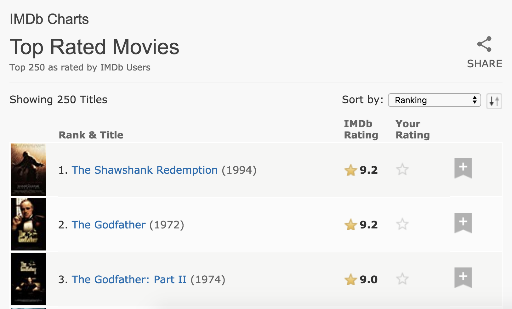

  
```{r titleslide, child="components/titleslide.Rmd"}
```


```{r setup, include=FALSE}
library(tidyverse)
library(knitr)
library(kableExtra)
library(tuneR)
library(gridExtra)
library(countdown)
library(httr)
library(rvest)
opts_chunk$set(echo = TRUE,   
               message = FALSE,
               warning = FALSE,
               collapse = TRUE,
               fig.height = 5,
               fig.width = 8,
               out.width = "80%",
               fig.retina = 2,
               fig.align = "center",
               cache = FALSE)

as_table <- function(...) knitr::kable(..., format='html', digits = 3)
```


```{r read-data, echo = FALSE}
wav_data <- readWave("data/data3.wav") %>% extractWave(from = 25000, 
                                                       to = 75000)

df_wav_data <- tibble(
  t = 1:length(wav_data@left),
  left = wav_data@left,
  right = wav_data@right
)

wav_stats <- readWave("data/statistics1.wav") %>% 
  extractWave(from = 25000, 
              to = 75000)

df_wav_stats <- tibble(
  t = 1:length(wav_stats@left),
  left = wav_stats@left,
  right = wav_stats@right
)
```

---
class: transition
# While the song is playing...

Draw a mental model / concept map of last lectures content on Missing Data.


---

background-image: url(https://www.kdnuggets.com/images/cartoon-turkey-data-science.jpg)
background-size: contain
background-position: 50% 50%

---
# Overview

- Different file formats
    - Audio / binary
- Web data
    - responsible scraping
    - scraping
    - JSON

---
class: transition
# Recap on some tricky topics

- pipes `%>%` ("then")
- assignment `<-` ("gets")

---
# The pipe operator: `%>%`

- Code to tell a story about a little bunny foo foo (borrowed from https://r4ds.had.co.nz/pipes.html):
- Using functions for each verb: `hop()`, `scoop()`, `bop()`.

> Little bunny Foo Foo
Went hopping through the forest
Scooping up the field mice
And bopping them on the head

---
# Approach: Intermediate steps

```r
foo_foo_1 <- hop(foo_foo, through = forest)
foo_foo_2 <- scoop(foo_foo_1, up = field_mice)
foo_foo_3 <- bop(foo_foo_2, on = head)
```

- Main downside: forces you to name each intermediate element. 
- Sometimes these steps form natural names. If this is the case - go ahead.
- **But many times there are not natural names**
- Adding number suffixes to make the names unique leads to problems. 

---
# Approach: Intermediate steps

```r
foo_foo_1 <- hop(foo_foo, through = forest)
foo_foo_2 <- scoop(foo_foo_1, up = field_mice)
foo_foo_3 <- bop(foo_foo_2, on = head)
```
- Code is cluttered with unimportant names
- Suffix has to be carefully incremented on each line.
- I've done this! 
- 99% of the time I miss a number somewhere, and there goes my evening ... debugging my code.

---
# Another Approach: Overwrite the original

```r
foo_foo <- hop(foo_foo, through = forest)
foo_foo <- scoop(foo_foo, up = field_mice)
foo_foo <- bop(foo_foo, on = head)
```

- Overwrite originals instead of creating intermediate objects 
- Less typing (and less thinking). Less likely to make mistakes?
- **Painful debugging**: need to re-run the code from the top.
- Repitition of object - (`foo_foo` written 6 times!) Obscures what changes.

---
# (Yet) Another approach: function composition

```r
bop(
  scoop(
    hop(foo_foo, through = forest),
    up = field_mice
  ), 
  on = head
)
```

- You need to read inside-out, and right-to-left.
- Arguments are spread far apart
- Harder to read

---
# Pipe `%>%` can help!

.pull-left[
`f(x)` 

`g(f(x))`

`h(g(f(x)))`
]

--

.pull-right[
`x %>% f()`

`x %>% f() %>% g()`

`x %>% f() %>% g() %>% h()`
]

---
# Solution: Use the pipe - `%>%`


```r
foo_foo %>%
  hop(through = forest) %>%
  scoop(up = field_mice) %>%
  bop(on = head)
```

- focusses on verbs, not nouns. 
- Can be read as a series of function compositions like actions. 

> Foo Foo hops, then scoops, then bops. 

- read more at: https://r4ds.had.co.nz/pipes.html 

---
class: transition

# Assignment `<-`

"gets"

---
# Assignment

We can perform calculations in R:

```r
1 + 1
read_csv("data.csv")
```

---
# Assignment

But what if we want to use that information later?

```r
1 + 1
read_csv("data.csv")
```

---
# Assignment

We can assign these things to an object using `<-`

This reads as "gets".

```r
x <- 1 + 1
my_data <- read_csv("data.csv")
```

--

- x 'gets' 1+1
- my_data 'gets' the output of read_csv...
---
# Assignment

Then we can use those things in other calculations

```r
x <- 1 + 1
my_data <- read_csv("data.csv")

x * x

my_data %>% 
  select(age, height, weight) %>% 
  mutate(bmi = weight / height^2)
```

---
class: transition
# Take 3 minutes to discuss these two concepts with your breakout room

- What are pipes `%>%`
- What is assignment? `<-`

---
class: transition
# The many shapes and sizes of data

---
# Data as an audio file

```{r print-audio-data, echo = FALSE}
df_wav_data
```


---
# Plotting audio data?

```{r show-audio, echo = FALSE}
p1 <- ggplot(df_wav_data, 
             aes(x = t, 
                 y = left)) + 
  geom_line() + 
  labs(title = "Say `data`")

p2 <- ggplot(df_wav_stats, 
             aes(x = t, 
                 y = left)) + 
  geom_line() + 
  labs(title = "Say `statistics`")

grid.arrange(p1, p2, ncol = 2)

```

---
# Compare left and right channels

```{r gg-compare-left-and-right, echo = FALSE}
p1 <- ggplot(df_wav_data, aes(x = left, y = right)) +
  geom_point() + theme(aspect.ratio = 1)
p2 <- ggplot(df_wav_stats, aes(x = left, y = right)) +
  geom_point() + theme(aspect.ratio = 1)
grid.arrange(p1, p2, ncol = 2)
```


???

Oh, same sound is on both channels! A tad drab.

---
# Compute statistics

```{r summarise, echo = FALSE}
df_wav_data_long <- df_wav_data %>%
  gather(key = channel, 
         value = value, 
         left, 
         right)

df_wav_stats_long <- df_wav_stats %>%
  gather(key = channel, 
         value = value, 
         left, 
         right)

df_wavs <- bind_rows(data = df_wav_data_long, 
                     word = df_wav_stats_long,
                     .id = "word")
```


```{r print-summary}
df_wavs %>%
  filter(channel == "left") %>%
  group_by(word) %>%
  summarise(
    m = mean(value),
    s = sd(value),
    mx = max(value),
    mn = min(value)
  ) %>%
  as_table()
```

---
# Di's music

```{r dis-music, include = FALSE}
music <- read.csv("data/music-sub.csv",
                  row.names = 1,
                  stringsAsFactors = FALSE)
```


```{r dis-music-print, echo = FALSE}
music

```

---
# Plot Di's music

```{r gg-di-music, echo = FALSE}
ggplot(music, aes(x = artist, y = lave)) + geom_boxplot() +
  xlab("") + ylab("Average amplitude")
```

---
# Plot Di's Music

```{r gg-di-music-points, fig.height=4.5, fig.weight=7, echo = FALSE}
ggplot(music, aes(x = lvar, y = lave, colour = artist)) +
  geom_point(size = 5, alpha = 0.5) +
  scale_colour_brewer(palette = "Dark2") +
  xlab("Std amplitude") + ylab("Average amplitude") +
  theme(aspect.ratio = 1)
```

Abba is just different from everyone else!

---
# Question time:

-   "How does `data` appear different than `statistics` in the time series?"
-   "What format is the data in an audio file?"
-   "How is Abba different from the other music clips?",

```{r q1, echo = FALSE}
countdown(minutes =  1,
          seconds = 30)
```

---
# Why look at audio data?

- Data comes in many shapes and sizes
- Audio data can be transformed ("rectangled") into a data.frame
- Another type of data is data on the web.
- Extracting data from websites is called "web scraping". 

---
# Scraping the web: what? why?

- Increasing amount of data is available on the web.
- These data are provided in an unstructured format: you can always copy&paste, but it's 
time-consuming and prone to errors.
- Web scraping is the process of extracting this information automatically and transform it into 
a structured dataset.

---
# Scraping the web: what? why?


1. Screen scraping: extract data from source code of website, with html parser (easy) or regular expression matching (less easy).
2. Web APIs (application programming interface): website offers a set of structured http  requests that return JSON or XML files.
- Why R? It includes all tools necessary to do web scraping, familiarity, direct analysis of data... But python, perl, java are also efficient tools.

---
class: transition
# Web Scraping with `rvest` and `polite`

---
# Hypertext Markup Language

Most of the data on the web is still largely available as HTML - while it is structured (hierarchical / tree based) it often is not available in a form useful for analysis (flat / tidy).

```html
<html>
  <head>
    <title>This is a title</title>
  </head>
  <body>
    <p align="center">Hello world!</p>
  </body>
</html>
```

---
# What if we want to extract parts of this text out?

```html
<html>
  <head>
    <title>This is a title</title>
  </head>
  <body>
    <p align="center">Hello world!</p>
  </body>
</html>
```

--

- `read_html()`: read HTML in (like `read_csv` and co!)

--

- `html_nodes()`: select specified nodes from the HTML document using CSS selectors.

---
# Let's read it in with `read_html`

```{r read-html}
example <- read_html(here::here("slides/data/example.html"))
example
```

--

- We have two parts - head and body - which makes sense:

```html
<html>
  <head>
    <title>This is a title</title>
  </head>
  <body>
    <p align="center">Hello world!</p>
  </body>
</html>
```


---
# Now let's get the title

```{r read-html-title}
example %>% 
  html_nodes("title")
```

--

```html
<html>
  <head>
    <title>This is a title</title>
  </head>
  <body>
    <p align="center">Hello world!</p>
  </body>
</html>
```


---
# Now let's get the paragraph text

```{r read-html-para}
example %>% 
  html_nodes("p")
```

--

```html
<html>
  <head>
    <title>This is a title</title>
  </head>
  <body>
    <p align="center">Hello world!</p>
  </body>
</html>
```


---
# Rough summary

- `read_html` - read in a html file
- `html_nodes` - select the parts of the html file we want to look at
    - This requires knowing about the website structure
    - But it turns out website are much...much more complicated than out little example file

---
class: transition
# rvest + polite: 

Simplify processing and manipulating HTML data

- `bow()` - check if the data can be scraped appropriately
- `scrape()` - scrape website data (with nice defaults)
- `html_nodes()` - select specified nodes from the HTML document using CSS selectors.
- `html_table` - parse an HTML table into a data frame.
- `html_text` - extract tag pairs' content.

---
# SelectorGadget: css selectors

- Using a tool called selector gadget to **help** identify the html elements of interest
- Does this by constructing a css selector which can be used to subset the html document.

---
# SelectorGadget: css selectors

.small[
Selector          |  Example         |     Description
------------      |------------------|      ------------------------------------------------
element           |  `p`             |      Select all &lt;p&gt; elements
element element   |  `div p`         |      Select all &lt;p&gt; elements inside a &lt;div&gt; element          
element>element   |  `div > p`       |      Select all &lt;p&gt; elements with &lt;div&gt; as a parent
.class            |  `.title`        |      Select all elements with class="title"
\#id              |  `.name`         |      Select all elements with id="name"
[attribute]       |  `[class]`       |      Select all elements with a class attribute
[attribute=value] |  `[class=title]` |      Select all elements with class="title"
]

---
# SelectorGadget

- SelectorGadget: Open source tool that eases CSS selector generation and discovery
- Install the [Chrome Extension](https://chrome.google.com/webstore/detail/selectorgadget/mhjhnkcfbdhnjickkkdbjoemdmbfginb) 
- A box will open in the bottom right of the website. Click on a page element 
that you would like your selector to match (it will turn green). SelectorGadget 
will then generate a minimal CSS selector for that element, and will highlight 
(yellow) everything that is 
matched by the selector. 
- Now click on a highlighted element to remove it from the selector (red), or 
click on an unhighlighted element to add it to the selector. Through this process 
of selection and rejection, SelectorGadget helps you come up with the appropriate 
CSS selector for your needs.

---
# Top 250 movies on IMDB

Take a look at the source code, look for the tag `table` tag:
<br>
http://www.imdb.com/chart/top


```{r show-imdb-top-img, echo = FALSE}

```


---
# First check to make sure you're allowed!

```{r show-robots-text, warning=FALSE}
# install.packages("remotes")
# remotes::install_github("dmi3kno/polite")
library(polite)
bow("http://www.imdb.com")
```

--

```{r show-paths-allowed, warning=FALSE}
bow("http://www.facebook.com")
```

---
# Join in

- Go to [rstudio.cloud](https://rstudio.cloud/) $\rightarrow$ ida-exercise-5a
- If you want to use R / Rstudio on your laptop:
  - Install R + Rstudio (see [Stuart Lee's Guide](https://github.com/sa-lee/installr))
  - open RStudio
  - type the following:

```r
# install.packages("usethis")
library(usethis)
use_course("https://ida.numbat.space/exercises/5b/ida-exercise-5b.zip")
```

---

# Demo

Let's go to http://www.imdb.com/chart/top

---
# Bow and scrape

```{r imdb-bow-scrape}
imdb_session <- bow("http://www.imdb.com/chart/top")

imdb_session 

imdb_data <- scrape(imdb_session)

imdb_data
```


---
# Select and format pieces: titles - `html_nodes()`

```{r rvest-titles-nodes, message=FALSE}
library(rvest)
imdb_data %>%
  html_nodes(".titleColumn a")
```


---
# Select and format pieces: titles - `html_text() `

```{r rvest-titles-text, message=FALSE}
imdb_data %>%
  html_nodes(".titleColumn a") %>%
  html_text()
```

---
# Select and format pieces: save it

```{r rvest-titles-text-save, message=FALSE}
titles <- imdb_data %>%
  html_nodes(".titleColumn a") %>%
  html_text()
```

---
# Select and format pieces: years - nodes

```{r rvest-year-nodes, message=FALSE}
imdb_data %>%
  html_nodes(".secondaryInfo")
```

---
# Select and format pieces: years - text

```{r rvest-years-text, message=FALSE}
imdb_data %>%
  html_nodes(".secondaryInfo") %>%
  html_text() 
```

---
# Select and format pieces: years - remove-brackets

```{r rvest-years-str-years, message=FALSE}
imdb_data %>%
  html_nodes(".secondaryInfo") %>%
  html_text() %>%
  str_remove("\\(") %>% # remove (
  str_remove("\\)") %>% # remove )
  as.numeric()

```

---
# Select and format pieces: years - `parse_number()`

```{r rvest-years-str-yearsparse, message=FALSE}
imdb_data %>%
  html_nodes(".secondaryInfo") %>%
  html_text() %>%
  parse_number()

```

---
# Select and format pieces: years - remove-brackets

```{r rvest-years-str-remove, message=FALSE}
years <- imdb_data %>%
  html_nodes(".secondaryInfo") %>%
  html_text() %>%
  str_remove("\\(") %>% # remove (
  str_remove("\\)") %>% # remove )
  as.numeric()

```

---
# Select and format pieces: scores - nodes

```{r rvest-scores-nodes, message=FALSE}
imdb_data %>%
  html_nodes(".imdbRating strong")
  
```
---
# Select and format pieces: scores - text

```{r rvest-scores-nodes-text, message=FALSE}
imdb_data %>%
  html_nodes(".imdbRating strong") %>%
  html_text()
  
```
---
# Select and format pieces: scores - as-numeric

```{r rvest-scores-nodes-as-numeric, message=FALSE}
imdb_data %>%
  html_nodes(".imdbRating strong") %>%
  html_text() %>%
  as.numeric()
  
```

---
# Select and format pieces: scores - save

```{r rvest-scores-nodes-save, message=FALSE}
scores <- imdb_data %>%
  html_nodes(".imdbRating strong") %>%
  html_text() %>%
  as.numeric()
  
```

---
# Select and format pieces: put it all together

```{r rvest-all-together, message=FALSE}
imdb_top_250 <- tibble(title = titles, 
                       year = years, 
                       score = scores)

imdb_top_250
```


---

```{r print-top-table, echo=FALSE, results='asis'}
imdb_top_250 %>% head(9) %>% rbind(rep("...", 3)) %>% kable(format = "html")
```

---
# Aside: Yet another approach - pull the table with `html_table()`

- requires notation we haven't used yet (e.g., what is `[[]]`)
- requires substantial text cleaning
- If there is time we can cover this at the end of class

```{r extract-table}
imdb_table <- html_table(imdb_data)

glimpse(imdb_table[[1]])
```

---
# Clean up / enhance


May or may not be a lot of work depending on how messy the data are

- See if you like what you got:

```{r glimpse-imdb}
glimpse(imdb_top_250)
```

---
# Clean up / enhance

- Add a variable for rank

```{r add-rank}
imdb_top_250 %>%
  mutate(
    rank = 1:nrow(imdb_top_250)
  )
```

---

```{r show-table-again, echo=FALSE, results='asis'}
imdb_top_250 %>%
  mutate(
    rank = 1:nrow(imdb_top_250)
  ) %>% head(9) %>% rbind(rep("...", 3)) %>% kable(format = "html")
```


---
# Your Turn: Which 1995 movies made the list?

--

```{r imdb-filter}
imdb_top_250 %>% 
  filter(year == 1995)
```

---
# Your turn:  Which years have the most movies on the list?

--

```{r imdb-group-by-year}
imdb_top_250 %>% 
  group_by(year) %>%
  summarise(total = n()) %>%
  arrange(desc(total)) %>%
  head(5)
```

---
# Your Turn: Visualize top 250 yearly mean score over time

--

```{r visualise-score-year, eval = FALSE}
imdb_top_250 %>% 
  group_by(year) %>%
  summarise(avg_score = mean(score)) %>%
  ggplot(aes(y = avg_score, x = year)) +
    geom_point() +
    geom_smooth(method = "lm") +
    xlab("year")
```

---

```{r visualise-score-year-print, echo = FALSE}
imdb_top_250 %>% 
  group_by(year) %>%
  summarise(avg_score = mean(score)) %>%
  ggplot(aes(y = avg_score, x = year)) +
    geom_point() +
    geom_smooth(method = "lm") +
    xlab("year")
```

---
# Other common formats: JSON


- JavaScript Object Notation (JSON). 
- A language-independent data format, and supplants extensible markup language (XML). 
- Data are sometimes stored as JSON, which requires special unpacking

---
# Unpacking JSON: Example JSON from [jsonlite](https://cran.r-project.org/web/packages/jsonlite/vignettes/json-aaquickstart.html)

.pull-left[
```{r json-example}
library(jsonlite)
json_mario <- '[
  {
    "Name": "Mario",
    "Age": 32,
    "Occupation": "Plumber"
  },
  {
    "Name": "Peach",
    "Age": 21,
    "Occupation": "Princess"
  },
  {},
  {
    "Name": "Bowser",
    "Occupation": "Koopa"
  }
]'
```
]

.pull-right[
```{r example-convert-JSON}
mydf <- fromJSON(json_mario)
mydf
```

]

---
# Potential challenges with web scraping


- Unreliable formatting at the source
- Data broken into many pages
- Data arriving in multiple excel file formats
- ... We will come back to this when we learn about functions next week.


> Compare the display of information at [gumtree melbourne](https://www.gumtree.com.au/s-monash/l3001600) to the list on the IMDB top 250 list. What challenges can you foresee in scraping a list of the available apartments?
]

---
# Further exploring

People write R packages to access online data! Check out:

- [cricinfo by Sayani Gupta and Rob Hyndman](https://docs.ropensci.org/cricketdata/)
- [rwalkr by Earo Wang](https://github.com/earowang/rwalkr)
- [fitzRoy for AFL data](https://github.com/jimmyday12/fitzRoy/)
- [Top 40 lists of R packages by Joe Rickert](https://rviews.rstudio.com/2019/07/24/june-2019-top-40-r-packages/) - they usually include a "data" section.

