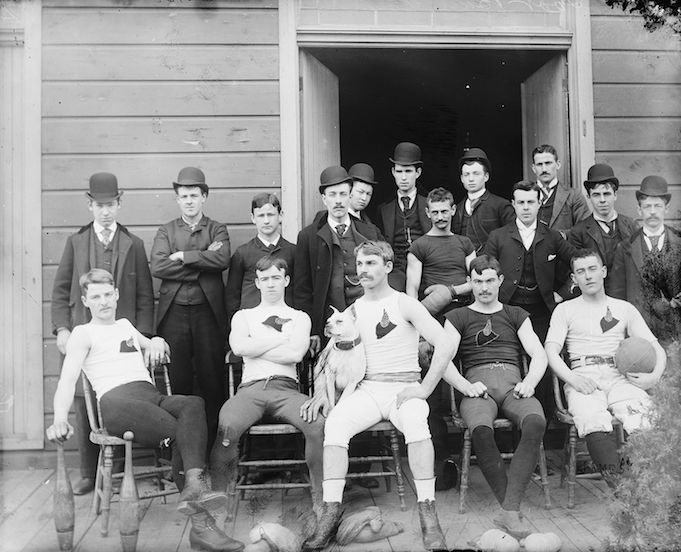
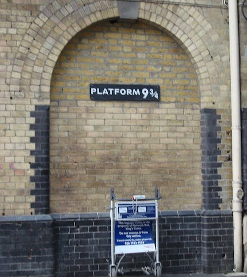
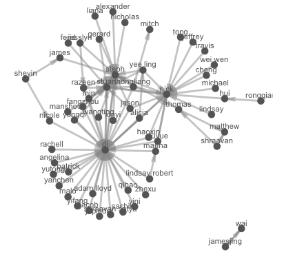

  
```{r titleslide, child="components/titleslide.Rmd"}
```


```{r setup, include=FALSE}
library(tidyverse)
library(knitr)
library(kableExtra)
library(emo)
library(ggraph)
library(igraph)
library(tidygraph)
library(knitr)
library(lubridate)
library(gridExtra)
library(plotly)
library(geomnet)
opts_chunk$set(echo = TRUE,   
               message = FALSE,
               warning = FALSE,
               collapse = TRUE,
               fig.height = 4,
               fig.width = 8,
               fig.retina = 2,
               out.width = "100%",
               fig.align = "center",
               cache = FALSE)

as_table <- function(...) knitr::kable(..., format='html', digits = 3)

library(geomnet)
data(madmen)
madmen_nodes <- as_tibble(madmen$vertices) %>% 
  mutate_all(as.character) %>% 
  rename(gender = Gender)
madmen_edges <- as_tibble(madmen$edges) %>% mutate_all(as.character)
```


---
# Announcements

- Project deadlines:
  - **Deadline 2 (22nd May) **:  Team members and team name, data description.
  - **Deadline 3 (29th May) **:  Electronic copy of your data, and a page of data description, and cleaning done, or needing to be done.
- Practical exam.

---
class: refresher

# recap: Last week on tidy text data

---
# Network analysis

**A description of phone calls**

- Johnny --> Liz
- Liz --> Anna
- Johnny -- > Dan
- Dan --> Liz
- Dan --> Lucy

---
# As a graph

```{r make-call-graph, echo = FALSE}
simple <- make_graph('bull')
V(simple)$name <- c('Johnny', 'Dan', 'Liz', 'Lucy', 'Anna')

example <- as_tbl_graph(simple)
ggraph(example, layout = 'graphopt') + 
    geom_edge_link(aes(start_cap = label_rect(node1.name),
                       end_cap = label_rect(node2.name)), 
                   arrow = arrow(length = unit(4, 'mm'))) + 
    geom_node_text(aes(label = name))

```

---
class: transition

# And as an association matrix

[DEMO]

---
# Why care about these relationships?

- **Telephone exchanges**: Nodes are the phone numbers. Edges would indicate a call was made betwen two numbers.
- **Book or movie plots**: Nodes are the characters. Edges would indicate whether they appear together in a scene, or chapter. If they speak to each other, various ways we might measure the association.
- **Social media**: nodes would be the people who post on facebook, including comments. Edges would measure who  comments on who's posts.

---
# Drawing these relationships out:

One way to describe these relationships is to provide association matrix between many objects. 

```{r draw-association, echo = FALSE, out.width = "80%"}
include_graphics("images/network_data.png")
```

(Image created by Sam Tyner.) 
---
# Example: Madmen

```{r show-madmen-logo, echo = FALSE}
include_graphics("images/Mad-men-title-card.jpg")
```

*Source: [wikicommons](https://en.wikipedia.org/wiki/Mad_Men#/media/File:Mad-men-title-card.jpg)*

---
# Generate a network view

- Create a layout (in 2D) which places nodes which are most related close,
- Plot the nodes as points, connect the appropriate lines
- Overlaying other aspects, e.g. gender

---
# introducing `madmen` data

```{r make-madmen-graph}
glimpse(madmen)
```

---
# Nodes and edges?

Netword data can be thought of as two related tables, **nodes** and **edges**:

- **nodes** are connection points
- **edges** are the connections between points

---
# Example: Mad Men. (Nodes = characters from the series)

```{r mm-nodes}
madmen_nodes
```

---
# Example: Mad Men. (Edges = how they are associated)

```{r mm-edges}
madmen_edges
```

---
# Let's get the madmen data into the right shape

```{r}
madmen_edges %>%
  rename(from_id = Name1, to_id = Name2) 
```

---
# Let's get the madmen data into the right shape

```{r}
madmen_net <- madmen_edges %>%
  rename(from_id = Name1, to_id = Name2) %>%
  full_join(madmen_nodes,  #<<
            by = c("from_id" = "label")) #<<

madmen_net
```

---
# Full join?

```{r full-join-gif, echo = FALSE, out.width = "60%"}
include_graphics("gifs/full-join.gif")
```

---
# Plotting the data with `geomnet`

```{r ggraph-madmen, echo = FALSE, fig.width = 10, fig.height = 5}
# create plot
set.seed(5556677)
ggplot(data = madmen_net, aes(from_id = from_id, to_id = to_id)) +
  geom_net(aes(colour = gender), layout.alg = "kamadakawai",
    size = 2, labelon = TRUE, vjust = -0.6, ecolour = "grey60",
    directed =FALSE, fontsize = 3, ealpha = 0.5) +
    scale_colour_manual(values = c("#FF69B4", "#0099ff")) +
    xlim(c(-0.05, 1.05)) +
    theme_net() +
    theme(legend.position = "bottom")

```

---
# Aside: Installing `geomnet`

This is the code you will need to use to install it:

```{r eval = FALSE}
install.packages("remotes")
library(remotes)
install_github("sctyner/geomnet")
```

---
# How to plot

.left-code[
```{r graph-step-1, eval = FALSE}
set.seed(5556677)
ggplot(data = madmen_net, 
       aes(from_id = from_id, 
           to_id = to_id)) +
  geom_net(aes(colour = gender)) 

```  
]

.right-plot[
```{r graph-step-1-out, ref.label = 'graph-step-1', echo = FALSE, out.width = "100%"}

```
]

---
# How to plot: specify the layout algorithm

.left-code[
```{r graph-plot-2, eval = FALSE}
set.seed(5556677)
ggplot(data = madmen_net, 
       aes(from_id = from_id, 
           to_id = to_id)) +
  geom_net(aes(colour = gender), 
           layout.alg = "kamadakawai") 
```  
]

.right-plot[
```{r graph-plot-2-out, ref.label = 'graph-plot-2', echo = FALSE, out.width = "100%"}

```
]

---
# How to plot: Try different layout algorithms

Follow links in `?geom_net` for more examples:

.left-code[
```{r graph-plot-alg, eval = FALSE}
set.seed(5556677)
ggplot(data = madmen_net, 
       aes(from_id = from_id, 
           to_id = to_id)) +
  geom_net(aes(colour = gender), 
           layout.alg = "fruchtermanreingold")  #<<
```  
]

.right-plot[
```{r graph-plot-alg-out, ref.label = 'graph-plot-alg', echo = FALSE, out.width = "100%"}

```
]

---
# How to plot: Try different layout algorithms

Follow links in `?geom_net` for more examples:

.left-code[
```{r graph-plot-alg-2, eval = FALSE}
set.seed(5556677)
ggplot(data = madmen_net, 
       aes(from_id = from_id, 
           to_id = to_id)) +
  geom_net(aes(colour = gender), 
           layout.alg = "target")  #<<
```  
]

.right-plot[
```{r graph-plot-alg-out-2, ref.label = 'graph-plot-alg-2', echo = FALSE, out.width = "100%"}

```
]

---
# How to plot: Try different layout algorithms

Follow links in `?geom_net` for more examples:

.left-code[
```{r graph-plot-alg-3, eval = FALSE}
set.seed(5556677)
ggplot(data = madmen_net, 
       aes(from_id = from_id, 
           to_id = to_id)) +
  geom_net(aes(colour = gender), 
           layout.alg = "circle")  #<<
```  
]

.right-plot[
```{r graph-plot-alg-out-3, ref.label = 'graph-plot-alg-3', echo = FALSE, out.width = "100%"}

```
]

---
# How to plot: Add some labs and decrease font

.left-code[
```{r graph-plot-3, eval = FALSE}
set.seed(5556677)
ggplot(data = madmen_net, 
       aes(from_id = from_id, 
           to_id = to_id)) +
  geom_net(aes(colour = gender), 
           layout.alg = "kamadakawai",
           directed = FALSE, #<<
           labelon = TRUE, #<<
           fontsize = 3)  #<<
```  
]

.right-plot[
```{r graph-plot-3-out, ref.label = 'graph-plot-3', echo = FALSE, out.width = "100%"}

```
]

---
# How to plot: Change edge colour/size

.left-code[
```{r graph-plot-4, eval = FALSE}
set.seed(5556677)
ggplot(data = madmen_net, 
       aes(from_id = from_id, 
           to_id = to_id)) +
  geom_net(aes(colour = gender), 
           layout.alg = "kamadakawai",
           directed = FALSE,
           labelon = TRUE,
           fontsize = 3,
           size = 2, #<<
           vjust = -0.6, #<<
           ecolour = "grey60", #<<
           ealpha = 0.5) #<<
```  
]

.right-plot[
```{r graph-plot-4-out, ref.label = 'graph-plot-4', echo = FALSE, out.width = "100%"}

```
]

---
# How to plot: Add colours + theme

.left-code[
```{r graph-plot-5, eval = FALSE}
set.seed(5556677)
ggplot(data = madmen_net, 
       aes(from_id = from_id, 
           to_id = to_id)) +
  geom_net(aes(colour = gender), 
           layout.alg = "kamadakawai",
           directed = FALSE,
           labelon = TRUE,
           fontsize = 3,
           size = 2,
           vjust = -0.6,
           ecolour = "grey60",
           ealpha = 0.5) +
    scale_colour_manual(
      values = c("#FF69B4", "#0099ff") #<<
      )
```  
]

.right-plot[
```{r graph-plot-5-out, ref.label = 'graph-plot-5', echo = FALSE, out.width = "100%"}

```
]

---
# How to plot: Add theme + move legend

.left-code[
```{r graph-plot-6, eval = FALSE}
set.seed(5556677)
gg_madmen_net <-
ggplot(data = madmen_net, 
       aes(from_id = from_id, 
           to_id = to_id)) +
  geom_net(aes(colour = gender), 
           layout.alg = "kamadakawai",
           directed = FALSE,
           labelon = TRUE,
           fontsize = 3,
           size = 2,
           vjust = -0.6,
           ecolour = "grey60",
           ealpha = 0.5) +
    scale_colour_manual(values = c("#FF69B4", "#0099ff"))  +
  theme_net() + #<<
  theme(legend.position = "bottom") #<<
gg_madmen_net
```  
]

.right-plot[
```{r graph-plot-6-out, ref.label = 'graph-plot-6', echo = FALSE, out.width = "100%"}

```
]


---
# Which character was most connected?

```{r}
madmen_edges 
```


---
# Which character was most connected?

```{r}
madmen_edges %>% 
  pivot_longer(cols = c(Name1, Name2),
               names_to = "List",
               values_to = "Name") 
```

---
# Which character was most connected?

```{r}
madmen_edges %>% 
  pivot_longer(cols = c(Name1, Name2),
               names_to = "List",
               values_to = "Name") %>% 
  count(Name, sort = TRUE)
```

---

# Which character was most connected?

```{r echo = FALSE}
set.seed(5556677)
gg_madmen_net
```

---
# What do we learn?

- Joan Holloway had a lot of affairs, all with loyal partners except for his wife Betty, who had two affairs herself
- Followed by Woman at Clios party

---
# Your Turn:

- Open 9a-madmen.Rmd
- Replicate the plots used in the lecture
- Explore a few different layout algorithms

---
# Example: American college football

Early American football outfits were like Australian AFL today!

```{r show-football, echo = FALSE, out.width = "50%"}

```

*Source: [wikicommons](https://commons.wikimedia.org/wiki/File:Unknown_Early_American_Football_Team.jpg)*

---
# Example: American college football


Fall 2000 Season of [Division I college football](https://en.wikipedia.org/wiki/NCAA_Division_I). 
- Nodes are the teams, edges are the matches. 
- Teams are broken into "conferences" which are the primary competition, but they can play outside this group.

```{r write-football, echo = FALSE}
football_edges <- as_tibble(football$edges)
football_nodes <- as_tibble(football$vertices)
```


---
# American college football data: Edges

```{r}
football_edges
```

---
# American college football data: Nodes

```{r}
football_nodes
```

---
# American college football: joining the data

```{r  make-football-graph}
# data step: merge vertices and edges
ftnet <- full_join(football_edges, 
                   football_nodes,
                   by = c("from" = "label")) %>%
  mutate(schools = if_else(value == "Independents", from, ""))

ftnet
```

---
# American college football: Identify ndoes

```{r print-football, eval = FALSE}
ggplot(data = ftnet,
       aes(from_id = from, to_id = to)) + #<<
  geom_net(
    aes(colour = value, 
        group = value,
        linetype = factor(1-same.conf),
        label = schools),
    linewidth = 0.5,
    size = 5, 
    vjust = -0.75, 
    alpha = 0.3,
    layout.alg = 'fruchtermanreingold'
  ) +
  theme_net() +
  theme(legend.position = "bottom") +
  scale_colour_brewer("Conference", palette = "Paired")
```

---
# American college football: Add colours and linetypes

```{r print-football-2, eval = FALSE}
ggplot(data = ftnet,
       aes(from_id = from, to_id = to)) +
  geom_net(
    aes(colour = value,                  #<<
        group = value,                   #<< 
        linetype = factor(1-same.conf),  #<<
        label = schools),                #<<
    linewidth = 0.5,
    size = 5, 
    vjust = -0.75, 
    alpha = 0.3,
    layout.alg = 'fruchtermanreingold'
  ) +
  theme_net() +
  theme(legend.position = "bottom") +
  scale_colour_brewer("Conference", palette = "Paired")
```

---
# American college football: Line features

```{r print-football-3, eval = FALSE}
ggplot(data = ftnet,
       aes(from_id = from, to_id = to)) +
  geom_net(
    aes(colour = value, 
        group = value,
        linetype = factor(1-same.conf),
        label = schools),
    linewidth = 0.5,  #<<
    size = 5,  #<<
    vjust = -0.75,  #<<
    alpha = 0.3, #<<
    layout.alg = 'fruchtermanreingold'
  ) +
  theme_net() +
  theme(legend.position = "bottom") +
  scale_colour_brewer("Conference", palette = "Paired")
```

---
# American college football: Theme features and colours

```{r print-football-4, eval = FALSE}
ggplot(data = ftnet,
       aes(from_id = from, to_id = to)) +
  geom_net(
    aes(colour = value, 
        group = value,
        linetype = factor(1-same.conf),
        label = schools),
    linewidth = 0.5,  
    size = 5,  
    vjust = -0.75,  
    alpha = 0.3, 
    layout.alg = 'fruchtermanreingold' #<<
  ) +
  theme_net() + #<<
  theme(legend.position = "bottom") + #<<
  scale_colour_brewer("Conference", palette = "Paired") #<<
```

---
# American college football:

```{r print-gg-foot-graph, echo = FALSE, fig.width = 16, fig.height = 8, out.width = "100%", ref.label='print-football'}
# gg_foot_graph
```

---
# What do we learn?

- Remember layout is done to place nodes that are more similar close together in the display. 
- The colours indicate conference the team belongs too. For the most part, conferences are clustered, more similar to each other than other conferences. 
- There are some clusters of conference groups, eg Mid-American, Big East, and Atlantic Coast
- The Independents are independent
- Some teams play far afield from their conference.

---
# Our Turn: Harry Potter characters

.pull-left[
```{r show-hp-platform, echo = FALSE, out.width = "100%"}

```
]

.pull-right[
See "9a-harry-potter.Rmd"
]

*Source: [wikicommons](https://commons.wikimedia.org/wiki/File:Harry_Potter_Platform_Kings_Cross.jpg)*

---
# Example: Harry Potter characters

There is a connection between two students if one provides emotional support to the other at some point in the book. 
- Code to pull the data together is provided by Sam Tyner [here](https://github.com/sctyner/geomnet/blob/master/README.Rmd#harry-potter-peer-support-network).

```{r read-hp, echo=FALSE}
hp_chars <- read_csv(here::here("slides/data/hp_chars.csv"))
hp_edges <- read_csv(here::here("slides/data/hp_edges.csv"))

# for each book, expand the edges data and join it to characters
hp_all <- hp_edges %>%
  group_by(book) %>%
  group_map(~ full_join(.x, hp_chars, by = c("name1" = "name"))) %>%
  bind_rows(.id = "book") %>% 
  rename(from_id = name1, 
         to_id = name2)
```

---
# Harry potter data as nodes and edges

```{r print-hp}
hp_all
```

---
# Let's plot the characters

```{r plot-hp, echo=TRUE, eval = FALSE}
ggplot(data = hp_all, 
       aes(from_id = from_id, 
           to_id = to_id)) + 
  geom_net(aes(colour = house, group = house, shape = gender),
           fiteach=T, 
           directed = T, 
           size = 3, 
           linewidth = .5, 
           ealpha = .5, 
           labelon = T, 
           fontsize = 3, 
           repel = T, 
           labelcolour = "black", 
           arrowsize = .5, 
           singletons = FALSE) + 
  scale_colour_manual(values = c("#941B08","#F1F31C", "#071A80", "#154C07")) + 
  facet_wrap(~book, labeller = "label_both", ncol=3) + 
  theme_net() + 
  theme(panel.background = element_rect(colour = 'black'),
        legend.position="bottom")
```

---
# Some more questions

- In the first book, which characters had the most connections?
- How about the least connections?

---
# Let's plot the characters

```{r ggraph-hp-out, ref.label='plot-hp', echo = FALSE, fig.width = 20, fig.height = 12, out.width = "100%"}
```

---
# Summary

- To make a network analysis, you need:

- an association matrix, that describes how nodes (vertices) are connected to each other
- a layout algorithm to place the nodes optimally so that the fewest edges cross, or that the nodes that are most closely associated are near to each other.

---
class: transition
# Your turn: rstudio exercise

.pull-left[
- Complete  9a-class.Rmd
- Read in last semesters class data, which contains `s1_name` and `s2_name` are the first names of class members, and tutors, with the latter being the "go-to" person for the former. 
- Write the code to produce a class network that looks something like the plot on the right.
]

.pull-right[
```{r echo = FALSE}

```
]


