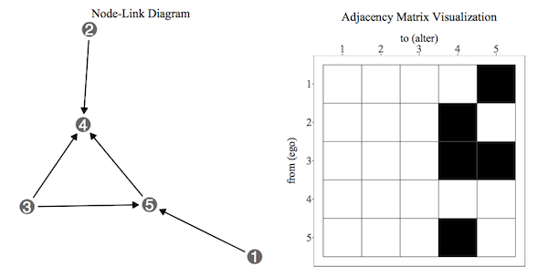

  
```{r titleslide, child="components/titleslide.Rmd"}
```


```{r setup, include=FALSE}
library(tidyverse)
library(knitr)
library(kableExtra)
library(countdown)
library(emo)
library(ggraph)
library(igraph)
library(tidygraph)
library(knitr)
library(lubridate)
library(gridExtra)
library(plotly)
opts_chunk$set(echo = TRUE,   
               message = FALSE,
               warning = FALSE,
               collapse = TRUE,
               fig.height = 4,
               fig.width = 8,
               fig.retina = 2,
               out.width = "100%",
               fig.align = "center",
               cache = FALSE)

as_table <- function(...) knitr::kable(..., format='html', digits = 3)
```

---

# Announcements

- Assignment ___ is due ___ at ___
- Project deadlines:
  - **Deadline 3 (DATE) **:  Electronic copy of your data, and a page of data description, and cleaning done, or needing to be done.
  - **Deadline 4 (DATE) **:  Final version of story board uploaded. 
- Guest Lecture: **DATE**: Dr. James McKeone 
- Practical exam: **DATE in class at TIME**
- Final Exam: I will provide a review of exam content

---
class: refresher
# recap: on network data

- To make a network analysis, you need:
    - an association matrix, that describes how nodes (vertices) are connected to each other
    - a layout algorithm to place the nodes optimally so that the fewest edges cross, or that the nodes that are most closely associated are near to each other.

---
class: refresher
# Quantitative association matrices

Previous association matrices were black and white: 

```{r show-network-data, out.width = "80%", echo = FALSE}

```

---
class: refresher
# Quantitative association matrices

- You could have the association between nodes described as real numbers.

--

- E.g., these are the number of times that these people called each other in the last week:

```{r show-n-times-ppl-called, echo = FALSE}
d <- matrix(c(0, 5, 4, 1, 1, 
              5, 0, 4, 2, 1,
              4, 4, 0, 0, 0,
              1, 2, 0, 0, 6,
              1, 1, 0, 6, 0), ncol=5, byrow=T)
colnames(d) <- c("Meg", "Tay", "Yat", "Zili", "Jess")
rownames(d) <- colnames(d)
kable(d)
```

---
# Quantitative association matrices

We would need to turn this into an edge data set:

```{r show-edges, echo=FALSE}
d_edges <- d %>% as_tibble() %>%
  mutate(from = rownames(d)) %>%
  gather(to, count, -from)
d_edges
```

---
# Quantitative association matrices

- We need to decide what corresponds to a "connection".
- Let's say they need to have called each other at least 4 times, to be considered connected.


```{r decide-connections, echo = TRUE}
d_edges_filter <- d_edges %>% filter(count > 3)
```

--

```{r decide-connections-print, echo = TRUE}
d_edges_filter
```

---
# Association matrices: Make the network diagram.

```{r geom-net-cals, eval = FALSE}
library(geomnet)
set.seed(2019-10-09)
ggplot(data = d_edges_filter, 
       aes(
         from_id = from, 
         to_id = to)) +
  geom_net(
    layout.alg = "kamadakawai",
    size = 2, 
    labelon = TRUE, 
    vjust = -0.6, 
    ecolour = "grey60",
    directed =FALSE, 
    fontsize = 3, 
    ealpha = 0.5
    ) +
    theme_net() 
```  


---
# Association matrices: Make the network diagram.

```{r geom-net-cals-out, ref.label = 'geom-net-cals', echo = FALSE, out.width = "100%"}

```


---
# Data:  Last 4 months of currency USD cross-rates

`r set.seed(7);emo::ji("shocked")` SO let's try this with cross-currency rates across the globe!

--

- Data extracted from http://openexchangerates.org/api/historical
- R packages `jsonlite`, processed with `tidyverse`, `lubridate`

---
# Data:  Last 4 months of currency USD cross-rates


```{r show-rates, echo=FALSE, fig.width=5, fig.height=5}
library(tidyverse)
library(lubridate)
library(gridExtra)
rates <- read_csv(here::here("slides/data/rates_new.csv"))
rates <- rates %>% arrange(date)
rates %>% head()
```

---
# Data:  Last 4 months of currency USD cross-rates

```{r plot-rates, echo=FALSE, out.width = "100%"}
p1 <- ggplot(rates, aes(x=date, y=AUD)) + geom_line()
p2 <- ggplot(rates, aes(x=date, y=EUR)) + geom_line()
p3 <- ggplot(rates, aes(x=date, y=JPY)) + geom_line()
p4 <- rates %>% select(date, AUD, EUR, JPY) %>%
  gather(curr, value, -date) %>%
  ggplot(aes(x=date, y=value, colour=curr, group=curr)) + 
    geom_line() + theme(legend.position="none") +
  scale_colour_brewer(palette="Dark2")
grid.arrange(p1, p2, p3, p4, ncol=2)
```

---
# Your turn: rstudio cloud

Make some plots (or google) to answer these questions

- Is the NZD more similar to AUD, EUR, or JPY? (What currency is NZD?)
- Is SGD more similar to AUD, EUR, or JPY? (What currency is SGD?)
- How many currencies are there in the British Isles? 

```{r cd-round-1, echo = FALSE}
countdown(minutes = 5)
```

---

```{r show-many-currencies, out.width = "100%", echo = FALSE}
p1 <- ggplot(rates, aes(x=date, y=AUD)) + geom_line()
p2 <- ggplot(rates, aes(x=date, y=EUR)) + geom_line()
p3 <- ggplot(rates, aes(x=date, y=JPY)) + geom_line()
p4 <- ggplot(rates, aes(x=date, y=SGD)) + geom_line()
grid.arrange(p1, p2, p3, p4, ncol=2)
```

---
# Pre-processing: Keep currencies that change

- Some currencies don't change very much. 
- These should be filtered from the analysis, because in a study of currency movement, if it doesn't move then there is nothing more to be said. 

---
# Pre-processing: Keep currencies that change

- To filter out these currencies we use a statistic called [coefficient of variation](https://en.wikipedia.org/wiki/Coefficient_of_variation):

$$
Coef Variation = \frac{\sigma}{\mu}
$$

--

- Measures standard deviation of currency relative to the mean. 
- For high means, we expect a currency to change more. 
- That is, relatively the standard deviation would be larger to consider it to be changing.

---

```{r}
cv <- function(x){
  sd(x)/mean(x)
}

rates %>% select(-date) %>%
  summarise_all(list(cv))
```

---

```{r}
cv <- function(x){
  sd(x)/mean(x)
}

rates %>% select(-date) %>%
  summarise_all(list(cv)) %>%
  gather(key = curr, 
         value = cv) 
```


---

```{r}
cv <- function(x){
  sd(x)/mean(x)
}

rates %>% select(-date) %>%
  summarise_all(list(cv)) %>%
  gather(key = curr, 
         value = cv) %>%
  filter(cv > 0.0027)
```


---

```{r fig.width=5, fig.height=5}
# Compute coefficient of variation. We will only analyse 
# currencies that have changes substantially over this time.
# Dates dropped
cv <- function(x){
  sd(x)/mean(x)
}

rates_sum <- rates %>% select(-date) %>%
  summarise_all(list(cv)) %>%
  gather(key = curr, 
         value = cv) %>%
  filter(cv > 0.0027)


rates_sub <- select(rates, rates_sum$curr)

head(rates_sub)
```

---
# Remove currencies that are not currencies

Some of the currencies ... aren't really currencies. Google these ones: XAG, XDR, XPT - what are they?

```{r cd-2, echo = FALSE}
countdown(minutes = 2)
```


```{r}
# Remove non-currencies
rates_dropped <- rates_sub %>% select(-ALL, -XAG, -XDR, -XPT)
```

???

XAG is Gold
XPT is Platinum
XDR is special drawing rights

---
# Standardize the currencies

To examine overall trend regardless of actual USD cross rate, standardise the values to have mean 0 and standard deviation 1.

```{r}
scale01 <- function(x) (x - mean(x)) / sd(x)
rates_scaled <-  rates_dropped %>%
  mutate_all(list(scale01))
```

---
# What is `mutate_all()`?

Instead of:

```{r show-reason-mutate-all, echo = TRUE, eval = FALSE}
rates_dropped %>%
  mutate(AFN = scale01(AFN),
         AMD = scale01(AMD),
         ANG = scale01(ANG),
         ...
         ...)
```

--

We can write:

```{r}
rates_scaled <-  rates_dropped %>%
  mutate_all(list(scale01))
```

---
# `scoped variants` - there are more:

- `*_if` = Do this thing **if** some condition is met
- `*_at` = Do this thing **at** these select variables
- `*_all` = Do this thing **for all** variables

---
# Example: `mutate_if()`

```{r}
iris %>% mutate_if(is.numeric, scale01)
```

---
# Example: `mutate_at()`

```{r}
iris %>% mutate_at(vars(Sepal.Width, Sepal.Length), scale01)
```

---
# Scoped Variants (**if**, **at**, *all**) for the 5 verbs:

- `mutate()`
- `filter()`
- `select()`
- `summarise()`
- `group_by()`


---
# Standardize the currencies

```{r currencies-standardized, out.width = "100%", echo = FALSE}
rates_scaled_date <- rates_scaled %>% mutate(date = rates$date)
p1 <- ggplot(rates_scaled_date, aes(x=date, y=AUD)) + geom_line()
p2 <- ggplot(rates_scaled_date, aes(x=date, y=EUR)) + geom_line()
p3 <- ggplot(rates_scaled_date, aes(x=date, y=JPY)) + geom_line()
p4 <- rates_scaled_date %>% select(date, AUD, EUR, JPY) %>%
  gather(curr, value, -date) %>%
  ggplot(aes(x=date, y=value, colour=curr, group=curr)) + 
    geom_line() + theme(legend.position="none") +
  scale_colour_brewer(palette="Dark2")
grid.arrange(p1, p2, p3, p4, ncol=2)
```

---
# Compute distances between all pairs of currencies

Euclidean distance is used to compute similarity between all pairs of currencies. 

$d_{ij} = \sqrt{\sum_{i=1}^{t}{(C_{1i}-C_{2i})^2}}$

---
# Compute distances between all pairs of currencies

```{r compute-dist}
# Compute distance between currencies
# Need to transpose! Turn matrix around, rows <--> columns
rates_dropped_t <- t(rates_dropped) %>% data.frame()

dates_dist <- as.matrix(dist(rates_dropped_t, 
                             diag = TRUE, 
                             upper = TRUE))

colnames(dates_dist) <- as.factor(colnames(rates_dropped))
rownames(dates_dist) <- as.factor(colnames(rates_dropped))
quantile(dates_dist, 
         probs = c(0, 0.25, 0.5, 0.75, 1))
```

---
# A note on distance matrices:

- A distance matrix is the inverse of an association matrix. 
- A distance matrix close to 0 means the pair are most similar. 
- For an association matrix far from zero means the pair are close. 
- Either can be used to generate a network. 

---
# Create network: Gather data into long form, filter based on similarity

Here only the pairs of currencies who are closer than "4" to each other are kept. 

```{r}
d_zero <- d
d_zero_tbl <- d_zero %>% 
  as_tibble() %>%
  mutate(curr1=rownames(d_zero)) %>%
  gather(curr2, dst, -curr1) %>%
  filter(dst<3) %>%
  filter(curr1 != curr2)
```

---
# Create network: Gather data into long form, filter based on similarity

Here only the pairs of currencies who are closer than "4" to each other are kept. 

```{r show-zero-tbl}
d_zero_tbl
```


---
# Network laid out

.left-code[
```{r currency-network, eval = FALSE}
# Make network
library(geomnet)
set.seed(10052016)
ggplot(data = d_zero_tbl, 
       aes(
         from_id = curr1, 
         to_id = curr2
         )) +
  geom_net(
    layout.alg = "kamadakawai",
    size = 2, 
    labelon = TRUE, 
    vjust = -0.6, 
    ecolour = "grey60",
    directed = FALSE, 
    fontsize = 3, 
    ealpha = 0.5
    ) +
    theme_net() +
    theme(
      legend.position = "bottom"
      )
```  
]

.right-plot[
```{r currency-network-out, ref.label = 'currency-network', echo = FALSE, out.width = "100%"}

```
]

---
# Adding the network vis

```{r}
dates_dist
```

---
class: transition

# Your turn

- Make a plot of the AUD vs the SGD (using the standardised units). Do they look like they are trending together as suggested by the network?
- Finish the rstudio cloud exercise
- Reamining time: Ask questions about project / assignment

---
  
```{r endslide, child="components/endslide.Rmd"}
```
